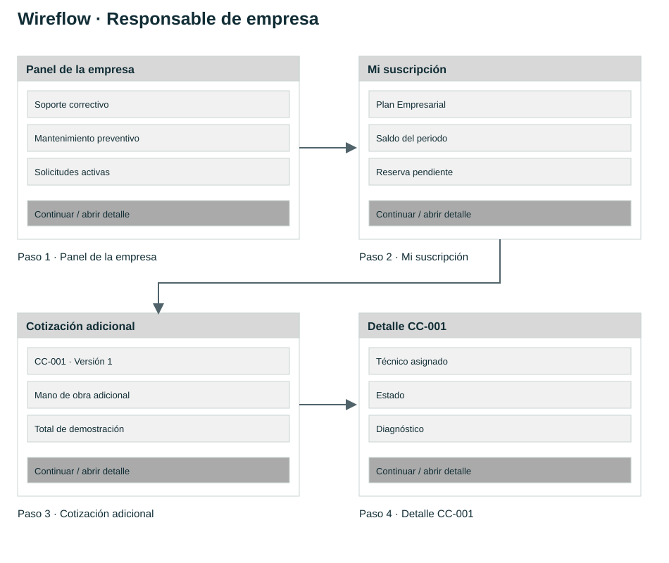
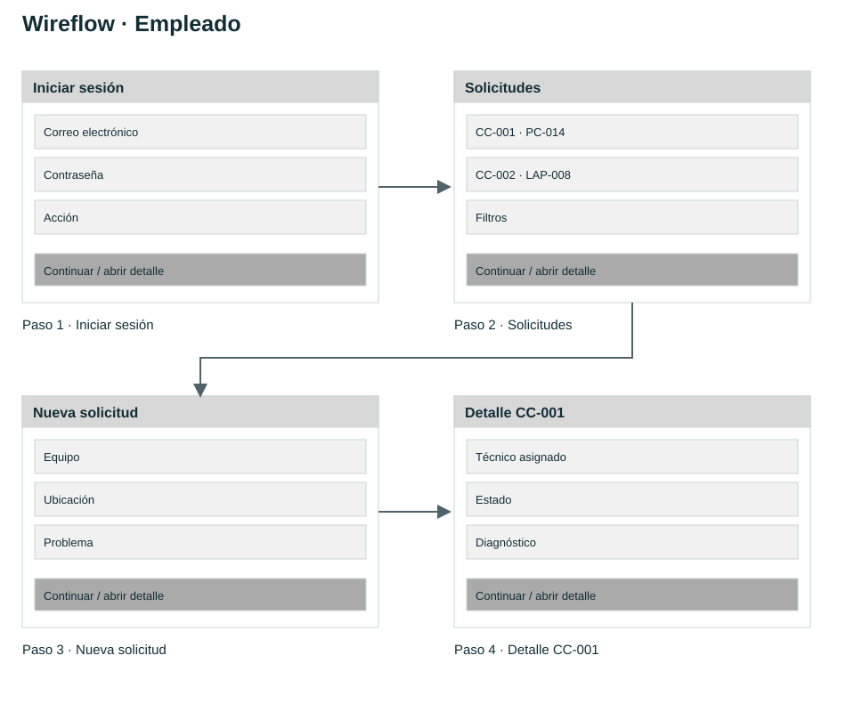
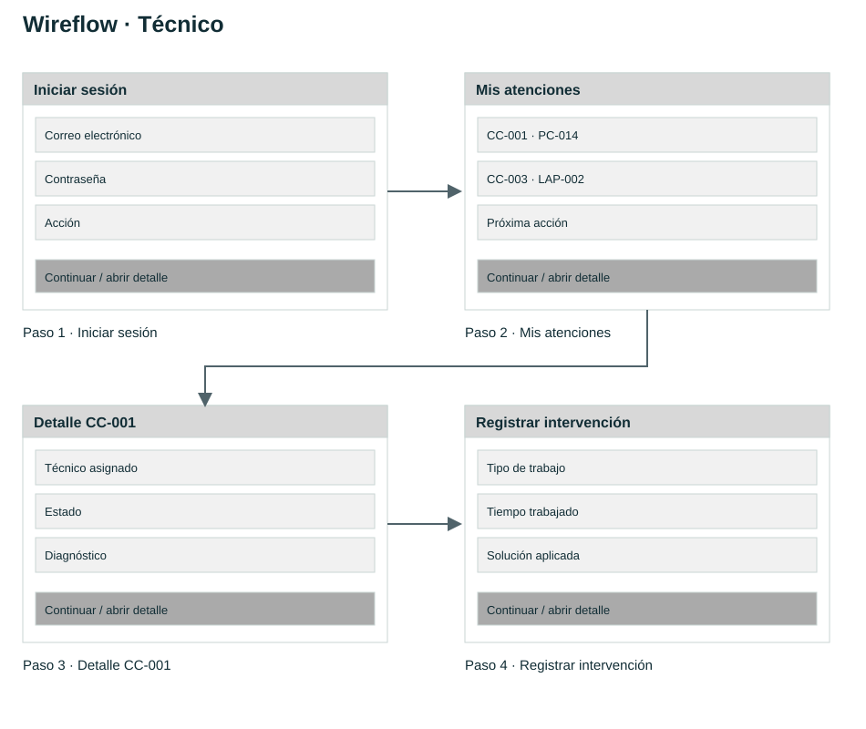
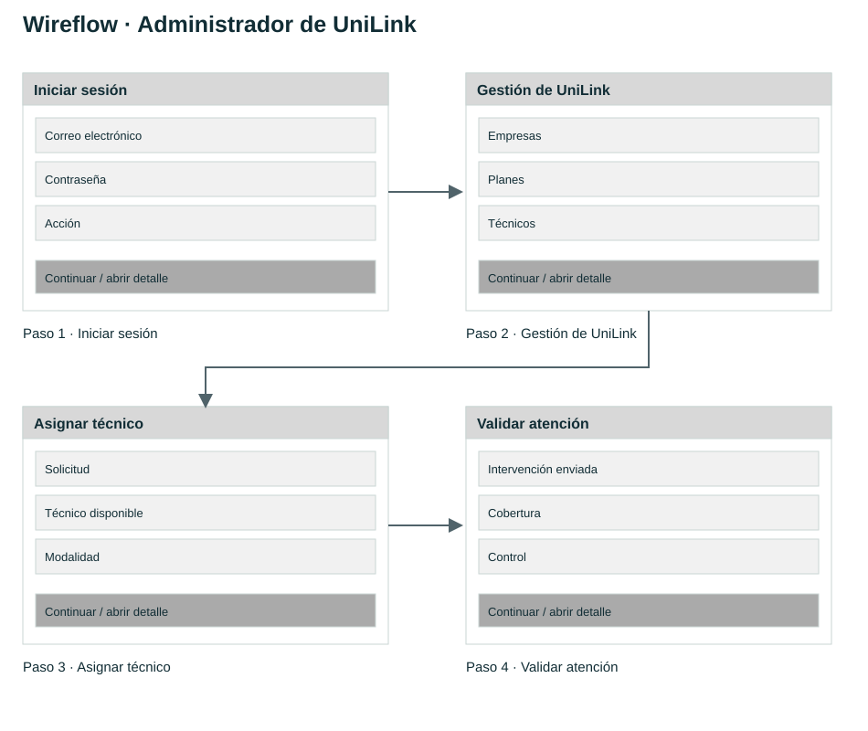
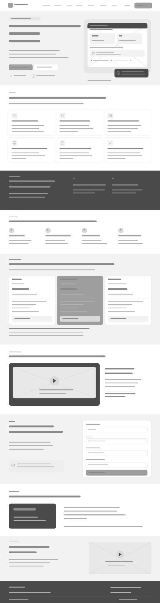
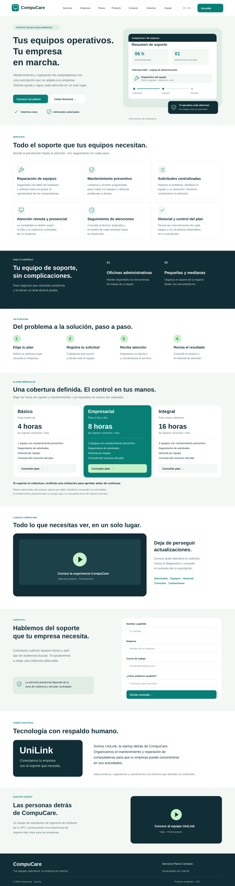
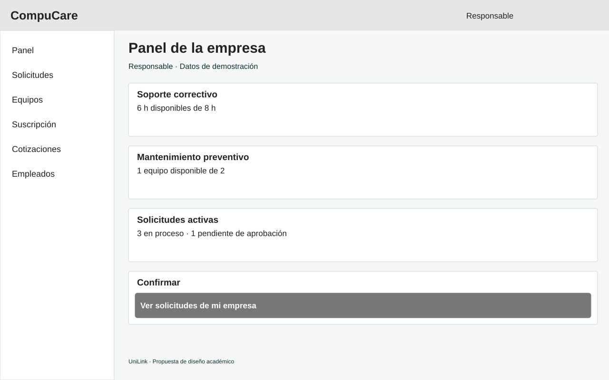
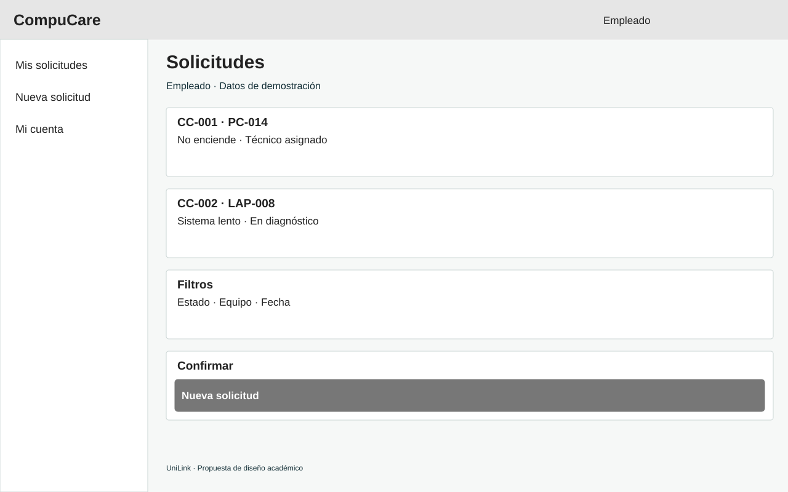
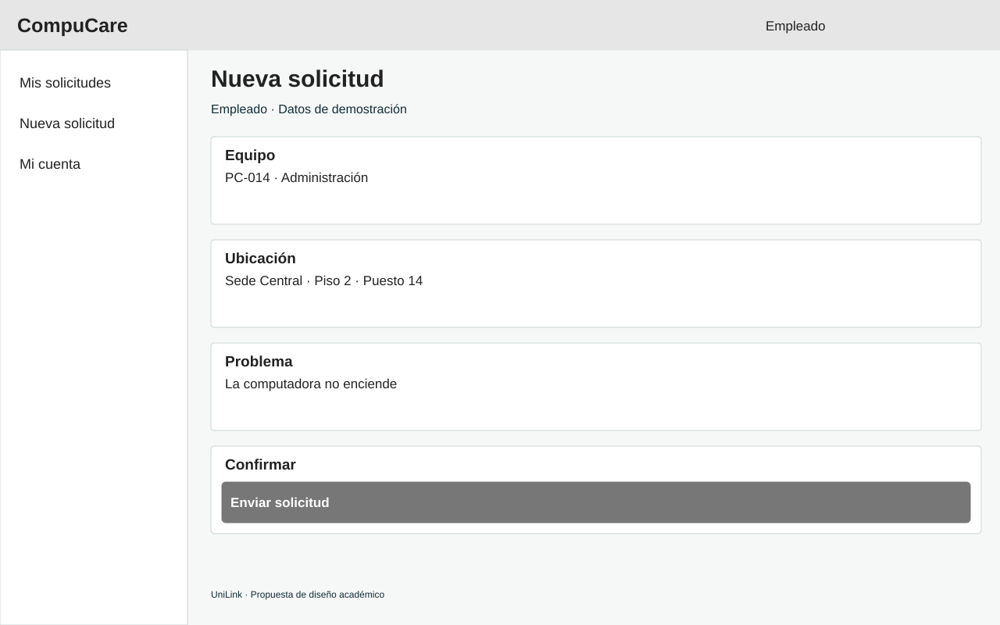
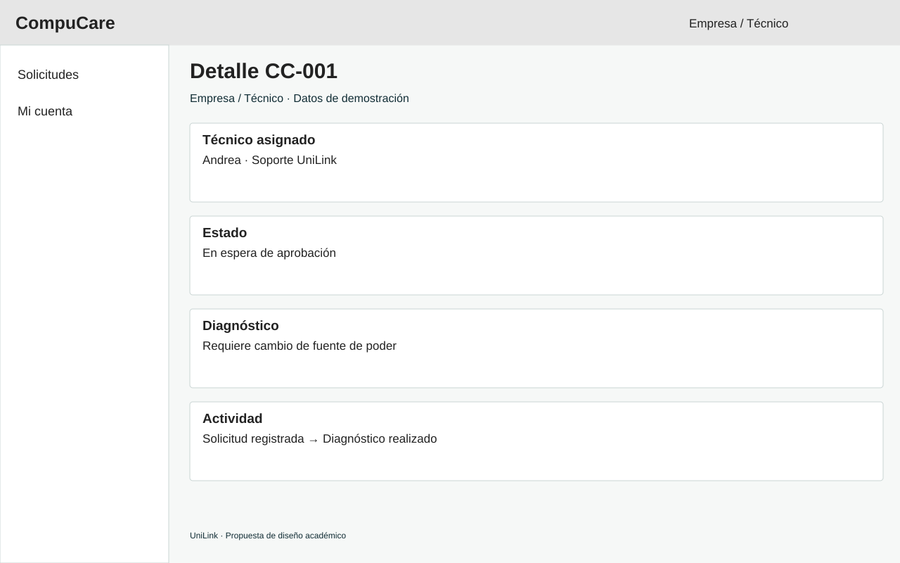

<div align="center">


Universidad Peruana de Ciencias Aplicadas

Carrera de Ingeniería de Software

### **1ASI0730**
### **Aplicaciones Web**

NRC

**1ASI0730**

### **Informe del Trabajo Final**

Docente

**Bautista Ubillús, Efrain Ricardo**

Equipo

**[nombre]**

Proyecto

**[nombre]**

#### **Integrantes**

</div>

<div align="center">
<table align="center" style="all: unset;">
<tr style="background: none !important; border: none !important;">
<td align="left" style="border: none !important; padding: 0 40px 0 0 !important; background: none !important;"><strong>Código</strong></td>
<td align="left" style="border: none !important; padding: 0 !important; background: none !important;"><strong>Apellidos y Nombres</strong></td>
</tr>
<tr style="background: none !important; border: none !important;">
<td align="left" style="border: none !important; padding: 0 40px 0 0 !important; background: none !important;">[codigo]</td>
<td align="left" style="border: none !important; padding: 0 !important; background: none !important;">[nombre]</td>
</tr>
<tr style="background: none !important; border: none !important;">
<td align="left" style="border: none !important; padding: 0 40px 0 0 !important; background: none !important;">[codigo]</td>
<td align="left" style="border: none !important; padding: 0 !important; background: none !important;">[nombre]</td>
</tr>
<tr style="background: none !important; border: none !important;">
<td align="left" style="border: none !important; padding: 0 40px 0 0 !important; background: none !important;">[codigo]</td>
<td align="left" style="border: none !important; padding: 0 !important; background: none !important;">nombre</td>
</tr>
<tr style="background: none !important; border: none !important;">
<td align="left" style="border: none !important; padding: 0 40px 0 0 !important; background: none !important;">U20231B331</td>
<td align="left" style="border: none !important; padding: 0 !important; background: none !important;">Miranda Romero, Sergio Luis</td>
</tr>
<tr style="background: none !important; border: none !important;">
<td align="left" style="border: none !important; padding: 0 40px 0 0 !important; background: none !important;">[codigo]</td>
<td align="left" style="border: none !important; padding: 0 !important; background: none !important;">nombre</td>
</tr>
</table>
</div>

<div align="center">

<br>

**Período 202620**

**Septiembre 2026**

</div>

---

# Registro de Versiones del Informe

| Versión | Fecha      | Autor                           | Descripción de modificación |
|---------|------------|---------------------------------|-----------------------------|

---

# Project Report Collaboration Insights

[Contenido correspondiente a Project Report Collaboration Insights]

---

# Contenido

## Tabla de Contenidos

- [Student Outcome](#student-outcome)

- [Capítulo I: Introducción](#capítulo-i-introducción)
    - [1.1. Startup Profile](#11-startup-profile)
        - [1.1.1. Descripción de la Startup](#111-descripción-de-la-startup)
        - [1.1.2. Perfiles de integrantes del equipo](#112-perfiles-de-integrantes-del-equipo)
    - [1.2. Solution Profile](#12-solution-profile)
        - [1.2.1. Antecedentes y problemática](#121-antecedentes-y-problemática)
        - [1.2.2. Lean UX Process](#122-lean-ux-process)
            - [1.2.2.1. Lean UX Problem Statements](#1221-lean-ux-problem-statements)
            - [1.2.2.2. Lean UX Assumptions](#1222-lean-ux-assumptions)
            - [1.2.2.3. Lean UX Hypothesis Statements](#1223-lean-ux-hypothesis-statements)
            - [1.2.2.4. Lean UX Canvas](#1224-lean-ux-canvas)
    - [1.3. Segmentos objetivo](#13-segmentos-objetivo)

- [Capítulo II: Requirements Elicitation & Analysis](#capítulo-ii-requirements-elicitation--analysis)
    - [2.1. Competidores](#21-competidores)
        - [2.1.1. Análisis competitivo](#211-análisis-competitivo)
        - [2.1.2. Estrategias y tácticas frente a competidores](#212-estrategias-y-tácticas-frente-a-competidores)
    - [2.2. Entrevistas](#22-entrevistas)
        - [2.2.1. Diseño de entrevistas](#221-diseño-de-entrevistas)
        - [2.2.2. Registro de entrevistas](#222-registro-de-entrevistas)
        - [2.2.3. Análisis de entrevistas](#223-análisis-de-entrevistas)
    - [2.3. Needfinding](#23-needfinding)
        - [2.3.1. User Personas](#231-user-personas)
        - [2.3.2. User Task Matrix](#232-user-task-matrix)
        - [2.3.3. User Journey Mapping](#233-user-journey-mapping)
        - [2.3.4. Empathy Mapping](#234-empathy-mapping)
    - [2.4. Big Picture Event Storming](#24-big-picture-event-storming)
    - [2.5. Ubiquitous Language](#25-ubiquitous-language)

- [Capítulo III: Requirements Specification](#capítulo-iii-requirements-specification)
    - [3.1. User Stories](#31-user-stories)
    - [3.2. Impact Mapping](#32-impact-mapping)
    - [3.3. Product Backlog](#33-product-backlog)

- [Capítulo IV: Product Design](#capítulo-iv-product-design)
    - [4.1. Style Guidelines](#41-style-guidelines)
        - [4.1.1. General Style Guidelines](#411-general-style-guidelines)
        - [4.1.2. Web Style Guidelines](#412-web-style-guidelines)
    - [4.2. Information Architecture](#42-information-architecture)
        - [4.2.1. Organization Systems](#421-organization-systems)
        - [4.2.2. Labeling Systems](#422-labeling-systems)
        - [4.2.3. SEO Tags and Meta Tags](#423-seo-tags-and-meta-tags)
        - [4.2.4. Searching Systems](#424-searching-systems)
        - [4.2.5. Navigation Systems](#425-navigation-systems)
    - [4.3. Landing Page UI Design](#43-landing-page-ui-design)
        - [4.3.1. Landing Page Wireframe](#431-landing-page-wireframe)
        - [4.3.2. Landing Page Mock-up](#432-landing-page-mock-up)
    - [4.4. Web Applications UX/UI Design](#44-web-applications-uxui-design)
        - [4.4.1. Web Applications Wireframes](#441-web-applications-wireframes)
        - [4.4.2. Web Applications Wireflow Diagrams](#442-web-applications-wireflow-diagrams)
        - [4.4.3. Web Applications Mock-ups](#443-web-applications-mock-ups)
        - [4.4.4. Web Applications User Flow Diagrams](#444-web-applications-user-flow-diagrams)
    - [4.5. Web Applications Prototyping](#45-web-applications-prototyping)
    - [4.6. Domain-Driven Software Architecture](#46-domain-driven-software-architecture)
        - [4.6.1. Design-Level Event Storming](#461-design-level-event-storming)
        - [4.6.2. Software Architecture Context Diagram](#462-software-architecture-context-diagram)
        - [4.6.3. Software Architecture Container Diagrams](#463-software-architecture-container-diagrams)
        - [4.6.4. Software Architecture Components Diagrams](#464-software-architecture-components-diagrams)
    - [4.7. Software Object-Oriented Design](#47-software-object-oriented-design)
        - [4.7.1. Class Diagrams](#471-class-diagrams)
    - [4.8. Database Design](#48-database-design)
        - [4.8.1. Database Diagrams](#481-database-diagrams)

- [Capítulo V: Product Implementation, Validation & Deployment](#capítulo-v-product-implementation-validation--deployment)
    - [5.1. Software Configuration Management](#51-software-configuration-management)
        - [5.1.1. Software Development Environment Configuration](#511-software-development-environment-configuration)
        - [5.1.2. Source Code Management](#512-source-code-management)
        - [5.1.3. Source Code Style Guide & Conventions](#513-source-code-style-guide--conventions)
        - [5.1.4. Software Deployment Configuration](#514-software-deployment-configuration)
    - [5.2. Landing Page, Services & Applications Implementation](#52-landing-page-services--applications-implementation)
        - [5.2.1. Sprint 1](#521-sprint-1)
            - [5.2.1.1. Sprint Planning 1](#5211-sprint-planning-1)
            - [5.2.1.2. Aspect Leaders and Collaborators](#5212-aspect-leaders-and-collaborators)
            - [5.2.1.3. Sprint Backlog 1](#5213-sprint-backlog-1)
            - [5.2.1.4. Development Evidence for Sprint Review](#5214-development-evidence-for-sprint-review)
            - [5.2.1.5. Execution Evidence for Sprint Review](#5215-execution-evidence-for-sprint-review)
            - [5.2.1.6. Services Documentation Evidence for Sprint Review](#5216-services-documentation-evidence-for-sprint-review)
            - [5.2.1.7. Software Deployment Evidence for Sprint Review](#5217-software-deployment-evidence-for-sprint-review)
            - [5.2.1.8. Team Collaboration Insights during Sprint](#5218-team-collaboration-insights-during-sprint)
        - [5.2.2. Sprint 2](#522-sprint-2)
            - [5.2.2.1. Sprint Planning 2](#5221-sprint-planning-2)
            - [5.2.2.2. Aspect Leaders and Collaborators](#5222-aspect-leaders-and-collaborators)
            - [5.2.2.3. Sprint Backlog 2](#5223-sprint-backlog-2)
            - [5.2.2.4. Development Evidence for Sprint Review](#5224-development-evidence-for-sprint-review)
            - [5.2.2.5. Execution Evidence for Sprint Review](#5225-execution-evidence-for-sprint-review)
            - [5.2.2.6. Services Documentation Evidence for Sprint Review](#5226-services-documentation-evidence-for-sprint-review)
            - [5.2.2.7. Software Deployment Evidence for Sprint Review](#5227-software-deployment-evidence-for-sprint-review)
            - [5.2.2.8. Team Collaboration Insights during Sprint](#5228-team-collaboration-insights-during-sprint)
    - [5.3. Validation Interviews](#53-validation-interviews)
        - [5.3.1. Diseño de Entrevistas](#531-diseño-de-entrevistas)
        - [5.3.2. Registro de Entrevistas](#532-registro-de-entrevistas)
        - [5.3.3. Evaluaciones según heurísticas](#533-evaluaciones-según-heurísticas)
    - [5.4. Video About-the-Product](#54-video-about-the-product)

- [Conclusiones](#conclusiones)
- [Conclusiones y recomendaciones](#conclusiones-y-recomendaciones)
- [Video About-the-Team](#video-about-the-team)
- [Bibliografía](#bibliografía)
- [Anexos](#anexos)

---

# Student Outcome

El curso contribuye al cumplimiento del Student Outcome ABET:

**ABET – EAC - Student Outcome 3**

**Criterio:**

*Capacidad de comunicarse efectivamente con un rango de audiencias. En el siguiente cuadro se describe las acciones realizadas y enunciados de conclusiones por parte del grupo, que permiten sustentar el haber alcanzado el logro del ABET – EAC - Student Outcome 3.*

| Criterio específico | Acciones realizadas | Conclusiones |
|---------------------|----------------------|--------------|

---

# Capítulo I: Introducción

## 1.1. Startup Profile

### 1.1.1. Descripción de la Startup

UniLink es una startup académica orientada al desarrollo de soluciones digitales que faciliten la gestión de servicios para empresas. Su propuesta actual se enfoca en el mantenimiento y reparación de computadoras mediante un modelo de suscripción mensual.

La startup propone centralizar la contratación y organización del soporte técnico a través de una aplicación web. Desde esta plataforma, las empresas podrán registrar solicitudes, consultar al técnico asignado, conocer el estado de las atenciones y acceder al historial de sus equipos.

UniLink se encargará de seleccionar, capacitar y coordinar a los técnicos responsables de brindar el servicio. Asimismo, gestionará su pago mediante los ingresos provenientes de las suscripciones y los servicios adicionales aprobados por las empresas.

*   **Misión:** Brindar a las empresas una forma organizada y accesible de gestionar el mantenimiento y reparación de sus computadoras, mediante una plataforma web que permita solicitar soporte técnico, dar seguimiento a las atenciones y conocer la cobertura de su suscripción.


*   **Visión:** Consolidarnos como una alternativa de soporte técnico empresarial que destaque por la transparencia de sus planes, la organización de sus atenciones y el seguimiento del estado de los equipos informáticos.

### 1.1.2. Perfiles de integrantes del equipo

<div align="left">
  
</div>

**nombre**
* **Código de estudiante:** codigo
* **Carrera:**

[contenido]

<br>

<div align="left">
  
</div>

**nombre**
* **Código de estudiante:**
* **Carrera:** Ingeniería de Software


[contenido]
<br>

<div align="left">
  
</div>

**nombre**
* **Código de estudiante:**
* **Carrera:** Ingeniería de Software

[contenido]
<br>

<div align="left">
  
</div>

**Miranda Romero, Sergio Luis**
* **Código de estudiante:** U20231B331
* **Carrera:** Ingeniería de Software

Estudiante de pregrado de la carrera de Ingeniería de Software en la Universidad Peruana de Ciencias Aplicadas (UPC). Posee conocimientos en desarrollo de software utilizando lenguajes de programación como C++, C# y JavaScript, así como en la gestión de bases de datos relacionales y no relacionales mediante MySQL y MongoDB. Cuenta con la certificación Scrum Fundamentals Certified, lo que le permite aplicar marcos de trabajo ágiles y gestionar el flujo de tareas del equipo. Aporta en el desarrollo de la solución, la estructuración de la base de datos y la organización del trabajo bajo metodologías ágiles.

<br>

<div align="left">
  
</div>

**nombre**
* **Código de estudiante:**
* **Carrera:** Ingeniería de Software


[contenido]

## 1.2. Solution Profile

### 1.2.1. Antecedentes y problemática

*   **Who? (¿Quién?):**
*   **What? (¿Qué?):**
*   **Where? (¿Dónde?):**
*   **When? (¿Cuándo?):**
*   **Why? (¿Por qué?):**
*   **How? (¿Cómo?):**
*   **How much? (¿Cuánto?):**

<br>

**Enunciado del problema:**

**Objetivo general:**

**Restricciones de alcance:**

### 1.2.2. Lean UX Process
[contenido]
#### 1.2.2.1. Lean UX Problem Statements

[contenido] DEL LEAN UX PROBLEM STATEMENTS

#### 1.2.2.2. Lean UX Assumptions

##### Business Assumptions
[contenido]

##### Business Outcome Assumptions
[contenido]

##### User Assumptions
[contenido]

##### User Outcome and Benefit Assumptions
[contenido]

##### Feature Assumptions
[contenido]

#### 1.2.2.3. Lean UX Hypothesis Statements

[contenido]

#### 1.2.2.4. Lean UX Canvas


[contenido]

## 1.3. Segmentos objetivo

[contenido]

# Capítulo II: Requirements Elicitation & Analysis

## 2.1. Competidores

[contenido]


### 2.1.1. Análisis competitivo

[contenido]

#### Competitive Analysis Landscape


[contenido]

### 2.1.2. Estrategias y tácticas frente a competidores

[contenido]


## 2.2. Entrevistas
### 2.2.1. Diseño de entrevistas

[contenido]

### 2.2.2. Registro de entrevistas

[contenido]


### 2.2.3. Análisis de entrevistas

[contenido]

## 2.3. Needfinding

[contenido]

### 2.3.1. User Personas

[contenido]

### 2.3.2. User Task Matrix

[contenido]
### 2.3.3. User Journey Mapping

[contenido]

### 2.3.4. Empathy Mapping


[contenido]


## 2.4. Big Picture Event Storming

[contenido]
### 2.4.1. Fase 1: Generación Abierta de Eventos (Open Space)

[contenido]


### 2.4.2. Fase 2: Exploración y Línea de Tiempo (Explore)

[contenido]


### 2.4.3. Fase 3: Consolidación y Definición de Triggers (Close Space)


[contenido]

### 2.4.4. Fase 4: Modelo Final del Dominio (Final Landscape)


[contenido]

### 2.5. Ubiquitous Language

[contenido]

# Capítulo III: Requirements Specification

## 3.1. User Stories
---

[contenido]

## 3.2. Impact Mapping


[Contenido]

## 3.3. Product Backlog

[Contenido]


# Capítulo IV: Product Design

En este capítulo se presenta el diseño del producto CompuCare, considerando los lineamientos visuales, la arquitectura de información, el diseño UX/UI de la Landing Page y la aplicación web, así como la arquitectura de software, diseño orientado a objetos y diseño de base de datos.

## 4.1. Style Guidelines

Los lineamientos de estilo de CompuCare permiten mantener una experiencia visual coherente entre la Landing Page y la aplicación web. Se busca transmitir confianza, claridad y profesionalismo, considerando que la solución está orientada principalmente a empresas que requieren gestionar el mantenimiento y soporte técnico de sus equipos.

### 4.1.1. General Style Guidelines

**Branding**

CompuCare es el producto desarrollado por UniLink para facilitar la gestión del mantenimiento y reparación de computadoras empresariales. Su identidad visual busca transmitir seguridad, organización y soporte tecnológico.

**Colors**

| Color | Código | Aplicación |
|---|---|---|
| Azul oscuro | `#112D35` | Encabezados, navegación y textos principales |
| Verde petróleo | `#087F75` | Botones principales y llamadas a la acción |
| Verde menta | `#C7F1C8` | Elementos secundarios y mensajes positivos |
| Blanco | `#FFFFFF` | Fondos y tarjetas |
| Gris claro | `#F6F8F7` | Fondos secundarios |
| Rojo oscuro | `#B42318` | Alertas y mensajes de error |

**Typography**

Se utiliza una tipografía sans-serif debido a su legibilidad en interfaces digitales. Los títulos presentan mayor tamaño y peso visual mientras que los textos secundarios mantienen una jerarquía clara.

| Elemento | Tamaño aproximado |
|---|---|
| Título principal | 48–56 px |
| Título de sección | 28–32 px |
| Subtítulo | 20–24 px |
| Texto general | 16 px |
| Texto secundario | 14 px |

**Spacing**

Se utiliza una escala de espaciado basada en múltiplos de 4 px y 8 px para mantener consistencia entre tarjetas, formularios, botones y secciones.

**Tone of Communication**

La comunicación de CompuCare es clara, profesional y directa. Se evita el uso innecesario de términos técnicos para que los usuarios puedan comprender fácilmente el estado de sus equipos y solicitudes.

### 4.1.2. Web Style Guidelines

La interfaz web de CompuCare se desarrolla bajo un enfoque responsive, permitiendo su correcta visualización tanto en computadoras como en dispositivos móviles.

Los principales criterios utilizados son:

- Diseño adaptable a diferentes tamaños de pantalla.
- Navegación simple y predecible.
- Botones claramente identificables.
- Formularios con etiquetas visibles.
- Uso consistente de colores y tipografía.
- Estados del sistema acompañados de texto y no únicamente de color.
- Contraste adecuado entre fondo y contenido.
- Retroalimentación visual después de realizar una acción.

Los botones principales se utilizan para acciones como solicitar soporte, registrar información o confirmar una operación, mientras que las acciones secundarias utilizan estilos menos destacados.

## 4.2. Information Architecture

La arquitectura de información de CompuCare organiza los contenidos y funcionalidades para que los usuarios puedan localizar rápidamente las acciones relacionadas con el soporte técnico, los equipos y las suscripciones.

### 4.2.1. Organization Systems

CompuCare utiliza principalmente una organización jerárquica y funcional.

En la Landing Page, la información se presenta de manera secuencial:

1. Presentación de CompuCare.
2. Propuesta de valor.
3. Beneficios.
4. Funcionamiento del servicio.
5. Planes disponibles.
6. Preguntas frecuentes.
7. Llamada a la acción.

En la aplicación web, el contenido se organiza mediante módulos como:

- Dashboard.
- Equipos.
- Solicitudes de soporte.
- Técnicos.
- Cotizaciones.
- Historial.
- Suscripción.
- Perfil.

### 4.2.2. Labeling Systems

Las etiquetas utilizadas buscan ser breves y fáciles de comprender.

Algunas de las etiquetas principales son:

- Inicio.
- Beneficios.
- Cómo funciona.
- Planes.
- Contacto.
- Mis equipos.
- Solicitudes.
- Técnicos.
- Cotizaciones.
- Historial.
- Suscripción.
- Perfil.

Para representar el estado de una solicitud se utilizan etiquetas como:

- Registrada.
- Asignada.
- En diagnóstico.
- Esperando aprobación.
- En atención.
- Resuelta.
- Cerrada.
- Cancelada.
- #### Responsible User Wireflow



#### Employee Wireflow



#### Technician Wireflow



#### Administrator Wireflow



### 4.2.3. SEO Tags and Meta Tags

La Landing Page utiliza etiquetas HTML orientadas a mejorar su identificación en motores de búsqueda y dispositivos.

Ejemplo:

```html
<title>CompuCare | Soporte técnico empresarial</title>

<meta
  name="description"
  content="CompuCare permite gestionar el mantenimiento y soporte técnico de computadoras empresariales."
>

<meta
  name="keywords"
  content="soporte técnico, mantenimiento de computadoras, soporte empresarial, CompuCare, UniLink"
>

<meta
  name="viewport"
  content="width=device-width, initial-scale=1.0"
>
  
### 4.2.4. Searching Systems
El sistema de búsqueda permite localizar información dentro de módulos que contienen varios registros.

Los principales criterios considerados son:

- Código de solicitud.
- Nombre o código del equipo.
- Estado de la solicitud.
- Técnico asignado.
- Fecha.
- Tipo de problema.

Cuando no existen coincidencias, el sistema informa al usuario y permite modificar los criterios utilizados.
  
### 4.2.5. Navigation Systems

La Landing Page utiliza una barra de navegación superior mediante la cual el usuario puede desplazarse entre las principales secciones.

La aplicación web utiliza una navegación lateral para acceder a los principales módulos.

En dispositivos móviles, esta navegación se adapta a un menú compacto.

También se utilizan botones de retorno y enlaces contextuales para facilitar el desplazamiento entre las diferentes pantallas.
## 4.3. Landing Page UI Design

La Landing Page de CompuCare tiene como objetivo presentar claramente la propuesta de valor del servicio y permitir que potenciales clientes conozcan sus principales características, beneficios y planes de suscripción.

La estructura visual busca guiar al usuario desde la presentación inicial del producto hasta una llamada a la acción, manteniendo una navegación simple y una jerarquía clara de información.
### 4.3.1. Landing Page Wireframe

El wireframe define la estructura inicial de la Landing Page antes de aplicar colores, imágenes y elementos visuales finales.

La estructura considera las siguientes secciones:

- Header con navegación principal.
- Hero Section con propuesta de valor.
- Beneficios principales.
- Explicación de cómo funciona el servicio.
- Planes disponibles.
- Preguntas frecuentes.
- Call to Action.
- Footer.

A continuación, se presenta el wireframe de escritorio elaborado para CompuCare.


### 4.3.2. Landing Page Mock-up

El mock-up representa la versión de alta fidelidad de la Landing Page de CompuCare.

En este diseño se aplican los colores, tipografía, botones, tarjetas y demás elementos visuales definidos en las Style Guidelines.

El mock-up permite visualizar la apariencia final de la página antes de iniciar su implementación.


**Landing Page desplegada:**  
https://upc-pre-202620-1asi0730-8093-unilink.github.io/landing/
## 4.4. Web Applications UX/UI Design

El diseño UX/UI de la aplicación web de CompuCare busca simplificar la gestión del soporte técnico y permitir que cada usuario encuentre rápidamente las funcionalidades relacionadas con su rol.

La interfaz prioriza la claridad de la información, la visibilidad de las acciones principales y la comprensión del estado de cada solicitud de soporte.
### 4.4.1. Web Applications Wireframes

Los wireframes de la aplicación web representan las principales pantallas y permiten definir la distribución de los elementos antes de desarrollar la versión visual definitiva.

Las principales vistas consideradas son:

- Inicio de sesión.
- Dashboard.
- Registro de equipos.
- Lista de equipos.
- Registro de solicitud de soporte.
- Seguimiento de solicitudes.
- Información del técnico.
- Cotizaciones.
- Historial de atención.
- Perfil del usuario.

Estos wireframes permiten validar la disposición de botones, formularios, tarjetas y elementos de navegación antes de aplicar el diseño visual definitivo.
### Dashboard Wireframe



### Support Requests Wireframe



### New Support Request Wireframe



### Support Request Detail Wireframe


### 4.4.2. Web Applications Wireflow Diagrams

Los Wireflow Diagrams representan la relación entre las diferentes pantallas y las acciones que realiza el usuario para completar una tarea.

Uno de los principales flujos corresponde al registro de una solicitud de soporte:

**Dashboard → Mis equipos → Seleccionar equipo → Solicitar soporte → Describir problema → Confirmar solicitud → Seguimiento.**

También se considera el flujo de revisión de una atención:

**Solicitudes → Seleccionar solicitud → Revisar estado → Ver técnico asignado → Revisar diagnóstico → Finalizar atención.**

Estos diagramas permiten identificar la secuencia de navegación y detectar posibles puntos de confusión antes de la implementación. 

### 4.4.3. Web Applications Mock-ups

Los mock-ups muestran las pantallas de CompuCare en alta fidelidad e incorporan los elementos definidos en las Style Guidelines.

Estos diseños permiten visualizar cómo será la experiencia final antes de iniciar la implementación de la aplicación web.

Los mock-ups mantienen una estructura consistente en navegación, tipografía, botones, formularios, tarjetas y estados visuales.
### 4.4.4. Web Applications User Flow Diagrams

Los User Flow Diagrams representan las decisiones que debe realizar el usuario para completar diferentes objetivos dentro de la plataforma.

Para solicitar soporte se considera el siguiente flujo:

**Inicio → Seleccionar equipo → Registrar problema → Validar información → Enviar solicitud → Confirmación → Seguimiento.**

Si la información ingresada es incorrecta o incompleta, el usuario permanece en el formulario hasta corregirla.

Otro flujo importante corresponde a la revisión de una solicitud:

**Inicio → Solicitudes → Seleccionar solicitud → Revisar estado → Revisar técnico asignado → Consultar diagnóstico → Finalizar proceso.**

Estos flujos ayudan a definir la lógica de navegación y las posibles decisiones del usuario.
## 4.5. Web Applications Prototyping

El prototipo de CompuCare fue desarrollado a partir de los wireframes y mock-ups elaborados previamente.

Su objetivo es representar de manera interactiva la navegación entre las principales pantallas de la aplicación antes de iniciar su implementación funcional.

El prototipo permite validar aspectos como:

- Comprensión de la navegación.
- Distribución de la información.
- Visibilidad de las acciones principales.
- Secuencia de los formularios.
- Comprensión de los estados de las solicitudes.
- Acceso a las funcionalidades principales según el rol del usuario.

Entre los principales flujos representados se encuentran el registro de equipos, creación de solicitudes de soporte, seguimiento de atenciones, revisión de técnicos asignados y consulta de cotizaciones.

La validación del prototipo permite detectar problemas de navegación o usabilidad antes de iniciar el desarrollo de la aplicación web.
**Prototipo desplegado:**  
https://upc-pre-202620-1asi0730-8093-unilink.github.io/landing/

## 4.6. Domain-Driven Software Architecture
La arquitectura de CompuCare se organiza tomando como referencia los principios de Domain-Driven Design (DDD).

Este enfoque permite separar las responsabilidades del sistema según los principales procesos de negocio y facilita la organización de las funcionalidades de la plataforma.

Los principales dominios identificados son:

- Gestión de usuarios.
- Gestión de empresas.
- Gestión de equipos.
- Gestión de solicitudes de soporte.
- Gestión de técnicos.
- Gestión de suscripciones.
- Gestión de cotizaciones.
- Gestión del historial de atenciones.

Cada dominio agrupa las entidades, reglas y operaciones relacionadas con una responsabilidad específica del sistema.
### 4.6.1. Design-Level Event Storming

El Design-Level Event Storming permite representar los principales eventos, comandos y actores que intervienen en los procesos de CompuCare.

A partir de los flujos principales de la plataforma se identificaron los siguientes comandos y eventos:

| Comando | Evento |
|---|---|
| Registrar empresa | Empresa registrada |
| Registrar usuario | Usuario registrado |
| Registrar equipo | Equipo registrado |
| Crear solicitud | Solicitud registrada |
| Asignar técnico | Técnico asignado |
| Registrar diagnóstico | Diagnóstico registrado |
| Generar cotización | Cotización generada |
| Aprobar cotización | Cotización aprobada |
| Actualizar estado | Estado de solicitud actualizado |
| Finalizar atención | Atención finalizada |

Por ejemplo, cuando un usuario registra una solicitud de soporte, el sistema genera el evento **Solicitud registrada**. Posteriormente, la asignación de un técnico genera el evento **Técnico asignado**.

Este modelado permite comprender la secuencia de acciones del sistema y las responsabilidades asociadas a cada proceso.

### 4.6.2. Software Architecture Context Diagram
El Software Architecture Context Diagram representa a CompuCare como el sistema central y muestra su interacción con los principales actores externos.

Los actores identificados son:

- **Cliente empresarial:** administra la información de su empresa y consulta los servicios contratados.
- **Empleado:** registra solicitudes de soporte relacionadas con los equipos que utiliza.
- **Técnico:** revisa solicitudes asignadas, registra diagnósticos y actualiza el estado de las atenciones.
- **Administrador de CompuCare:** gestiona usuarios, técnicos, empresas, planes y operaciones generales del sistema.

Todos estos actores interactúan con la plataforma web de CompuCare para realizar las operaciones correspondientes a su rol.
### 4.6.3. Software Architecture Container Diagrams

El Container Diagram divide la solución CompuCare en sus principales componentes tecnológicos.

Los contenedores considerados son:

- **Landing Page:** presenta la propuesta de valor, beneficios, funcionamiento y planes de CompuCare.
- **Web Application:** interfaz principal utilizada por clientes, empleados, técnicos y administradores.
- **Backend / REST API:** procesa las reglas de negocio y las solicitudes enviadas desde la aplicación web.
- **Database:** almacena la información persistente relacionada con usuarios, empresas, equipos, solicitudes, técnicos y suscripciones.

La Web Application se comunica con el Backend mediante solicitudes HTTP. El Backend procesa la lógica de negocio y consulta o modifica la información almacenada en la base de datos.

Esta separación facilita el mantenimiento, escalabilidad y evolución de la plataforma.

### 4.6.4. Software Architecture Components Diagrams

El Components Diagram representa con mayor detalle la organización interna del Backend de CompuCare.

Entre los principales componentes se consideran:

- **Controllers:** reciben las solicitudes provenientes de la aplicación web.
- **Application Services:** coordinan los casos de uso del sistema.
- **Domain Services:** contienen reglas relacionadas con el negocio.
- **Repositories:** gestionan el acceso a la información almacenada.
- **Entities:** representan los principales objetos del dominio.
- **Persistence:** permite almacenar y recuperar información de la base de datos.

Por ejemplo, una solicitud para registrar un nuevo soporte es recibida por un Controller, procesada por el servicio correspondiente y almacenada mediante un Repository.

Esta organización permite mantener separadas las responsabilidades del sistema y reducir el acoplamiento entre sus componentes.
## 4.7. Software Object-Oriented Design
El diseño orientado a objetos de CompuCare representa las principales entidades del dominio y las relaciones existentes entre ellas.

Este enfoque permite organizar la lógica del sistema mediante clases con responsabilidades claramente definidas, facilitando el mantenimiento, reutilización y extensión del software.

Las principales entidades identificadas están relacionadas con usuarios, empresas, equipos, solicitudes de soporte, técnicos, suscripciones, planes, cotizaciones e historial de servicios.

### 4.7.1. Class Diagrams

El Class Diagram representa la estructura principal del dominio de CompuCare.

Entre las clases consideradas se encuentran:

- **User:** representa a los usuarios registrados en la plataforma.
- **Company:** representa a las empresas que utilizan el servicio.
- **Equipment:** representa los equipos informáticos registrados por una empresa.
- **SupportRequest:** representa una solicitud de soporte técnico.
- **Technician:** representa al técnico encargado de una atención.
- **Subscription:** representa la suscripción activa de una empresa.
- **Plan:** representa los diferentes planes disponibles.
- **Quote:** representa una cotización adicional relacionada con una atención.
- **ServiceHistory:** almacena el historial de servicios realizados sobre un equipo.

Algunas relaciones principales son:

- Una empresa puede tener varios usuarios.
- Una empresa puede registrar varios equipos.
- Un equipo puede tener múltiples solicitudes de soporte.
- Una solicitud puede estar asociada a un técnico.
- Una empresa puede contar con una suscripción activa.
- Una solicitud puede generar una cotización.
- Cada atención finalizada puede formar parte del historial del equipo.

El diagrama permite visualizar las relaciones y responsabilidades principales antes de implementar las clases del sistema.
## 4.8. Database Design

El diseño de la base de datos de CompuCare permite almacenar de forma estructurada la información necesaria para el funcionamiento de la plataforma.

Se utiliza un modelo relacional en el que las entidades principales se representan mediante tablas vinculadas por claves primarias y claves foráneas.

El diseño busca evitar duplicidad de información, mantener la integridad de los datos y facilitar las consultas relacionadas con empresas, equipos, solicitudes y servicios.
### 4.8.1. Database Diagrams

El Database Diagram representa las principales tablas y relaciones de la plataforma CompuCare.

Las tablas principales consideradas son:

- **Users**
- **Companies**
- **Equipments**
- **SupportRequests**
- **Technicians**
- **Subscriptions**
- **Plans**
- **Quotes**
- **ServiceHistories**

Entre las relaciones principales se consideran:

- Una empresa puede tener múltiples usuarios.
- Una empresa puede registrar múltiples equipos.
- Cada equipo pertenece a una empresa.
- Un equipo puede tener múltiples solicitudes de soporte.
- Cada solicitud pertenece a un equipo.
- Una solicitud puede tener un técnico asignado.
- Una empresa puede tener una suscripción.
- Una suscripción se encuentra asociada a un plan.
- Una solicitud puede generar una o más cotizaciones.
- Las atenciones realizadas forman parte del historial de servicio de cada equipo.

El uso de claves foráneas permite mantener la relación entre las tablas y asegurar la consistencia de la información almacenada.

# Capítulo V: Product Implementation, Validation & Deployment

## 5.1. Software Configuration Management

[Contenido]

### 5.1.1. Software Development Environment Configuration

[Contenido]

### 5.1.2. Source Code Management

[Contenido]

### 5.1.3. Source Code Style Guide & Conventions

[Contenido]

### 5.1.4. Software Deployment Configuration

[Contenido]

## 5.2. Landing Page, Services & Applications Implementation

[Contenido]

### 5.2.1. Sprint 1

[Contenido]

#### 5.2.1.1. Sprint Planning 1

[Contenido]

#### 5.2.1.2. Aspect Leaders and Collaborators

[Contenido]

#### 5.2.1.3. Sprint Backlog 1

[Contenido]

#### 5.2.1.4. Development Evidence for Sprint Review

[Contenido]

#### 5.2.1.5. Execution Evidence for Sprint Review

[Contenido]

#### 5.2.1.6. Services Documentation Evidence for Sprint Review

[Contenido]

#### 5.2.1.7. Software Deployment Evidence for Sprint Review

[Contenido]

#### 5.2.1.8. Team Collaboration Insights during Sprint

[Contenido]

### 5.2.2. Sprint 2

[Contenido]

#### 5.2.2.1. Sprint Planning 2

[Contenido]

#### 5.2.2.2. Aspect Leaders and Collaborators

[Contenido]

#### 5.2.2.3. Sprint Backlog 2

[Contenido]

#### 5.2.2.4. Development Evidence for Sprint Review

[Contenido]

#### 5.2.2.5. Execution Evidence for Sprint Review

[Contenido]

#### 5.2.2.6. Services Documentation Evidence for Sprint Review

[Contenido]

#### 5.2.2.7. Software Deployment Evidence for Sprint Review

[Contenido]

#### 5.2.2.8. Team Collaboration Insights during Sprint

[Contenido]

## 5.3. Validation Interviews

[Contenido]

### 5.3.1. Diseño de Entrevistas

[Contenido]

### 5.3.2. Registro de Entrevistas

[Contenido]

### 5.3.3. Evaluaciones según heurísticas

[Contenido]

## 5.4. Video About-the-Product

[Contenido]

---

# Conclusiones

[Contenido]

# Conclusiones y recomendaciones

[Contenido]

# Video About-the-Team

[Contenido]

# Bibliografía

[Contenido]

# Anexos

[Contenido]
