<div align="center">


Universidad Peruana de Ciencias Aplicadas

Carrera de Ingeniería de Software

### **1ASI0730**

### **Aplicaciones Web**

NRC

**1ASI0730**

### **Informe del Trabajo Final**

Docente

**Bautista Ubillús, Efrain Ricardo**

Equipo

### **UniLink**

Proyecto

### **CompuCare**
<br>

#### **Integrantes**

</div>

<div align="center">
<table align="center" style="all: unset;">
<tr style="background: none !important; border: none !important;">
<td align="left" style="border: none !important; padding: 0 40px 0 0 !important; background: none !important;"><strong>Código</strong></td>
<td align="left" style="border: none !important; padding: 0 !important; background: none !important;"><strong>Apellidos y Nombres</strong></td>
</tr>
<tr style="background: none !important; border: none !important;">
<td align="left" style="border: none !important; padding: 0 40px 0 0 !important; background: none !important;">[U202419311]</td>
<td align="left" style="border: none !important; padding: 0 !important; background: none !important;">[Matthew Shinko Okuhama Diaz]</td>
</tr>
<tr style="background: none !important; border: none !important;">
<td align="left" style="border: none !important; padding: 0 40px 0 0 !important; background: none !important;">U202214499</td>
<td align="left" style="border: none !important; padding: 0 !important; background: none !important;">Yauri Barrios, Antony David</td>
</tr>
<tr style="background: none !important; border: none !important;">
<td align="left" style="border: none !important; padding: 0 40px 0 0 !important; background: none !important;">U202411324</td>
<td align="left" style="border: none !important; padding: 0 !important; background: none !important;">Condezo Pacheco, Fernando André</td>
</tr>
<tr style="background: none !important; border: none !important;">
<td align="left" style="border: none !important; padding: 0 40px 0 0 !important; background: none !important;">U20231B331</td>
<td align="left" style="border: none !important; padding: 0 !important; background: none !important;">Miranda Romero, Sergio Luis</td>
</tr>
<tr style="background: none !important; border: none !important;">
<td align="left" style="border: none !important; padding: 0 40px 0 0 !important; background: none !important;">U20201F051</td>
<td align="left" style="border: none !important; padding: 0 !important; background: none !important;">Ramos Aguirre, Aldair Joaquin</td>
</tr>
</table>
</div>

<div align="center">

<br>

**Período 202620**

**Septiembre 2026**

</div>

---

# Registro de Versiones del Informe

| Versión | Fecha | Autor | Descripción de modificación |
| :---: | :---: | :--- | :--- |
| **1.0** | 20/09/2026 | Ramos, Aldair | Elaboración de la sección 1.2.1 (Antecedentes y problemática, 5W2H, Objetivos y Restricciones) enfocada exclusivamente en la aplicación web.  Desarrollo de la sección 1.2.2 (Lean UX Process: Problem Statements, Assumptions, Hypothesis y Canvas v2). Definición de la sección 1.3 (Segmentos objetivo) sintetizando los roles clave del proyecto. Elaboración de la matriz de evaluación del Student Outcome 5 de ABET para el Avance 1 (AV1).|
| **1.0** | 20/09/2026 | Condezo, Fernando | Elaboración del Capítulo 5 (Product Implementation, Validation & Deployment). Configuración de la Gestión de Configuración de Software (SCM), definición de repositorios en GitHub con GitFlow y Conventional Commits. Documentación técnica del Sprint 1, incluyendo Sprint Planning, configuración inicial del backend en ASP.NET Core mediante JetBrains Rider, y evidencias de despliegue y colaboración de equipo. |

---

# Project Report Collaboration Insights

[Contenido correspondiente a Project Report Collaboration Insights]

---

# Contenido

## Tabla de Contenidos

- [Student Outcome](#student-outcome)

- [Capítulo I: Introducción](#capítulo-i-introducción)
    - [1.1. Startup Profile](#11-startup-profile)
        - [1.1.1. Descripción de la Startup](#111-descripción-de-la-startup)
        - [1.1.2. Perfiles de integrantes del equipo](#112-perfiles-de-integrantes-del-equipo)
    - [1.2. Solution Profile](#12-solution-profile)
        - [1.2.1. Antecedentes y problemática](#121-antecedentes-y-problemática)
        - [1.2.2. Lean UX Process](#122-lean-ux-process)
            - [1.2.2.1. Lean UX Problem Statements](#1221-lean-ux-problem-statements)
            - [1.2.2.2. Lean UX Assumptions](#1222-lean-ux-assumptions)
            - [1.2.2.3. Lean UX Hypothesis Statements](#1223-lean-ux-hypothesis-statements)
            - [1.2.2.4. Lean UX Canvas](#1224-lean-ux-canvas)
    - [1.3. Segmentos objetivo](#13-segmentos-objetivo)

- [Capítulo II: Requirements Elicitation & Analysis](#capítulo-ii-requirements-elicitation--analysis)
    - [2.1. Competidores](#21-competidores)
        - [2.1.1. Análisis competitivo](#211-análisis-competitivo)
        - [2.1.2. Estrategias y tácticas frente a competidores](#212-estrategias-y-tácticas-frente-a-competidores)
    - [2.2. Entrevistas](#22-entrevistas)
        - [2.2.1. Diseño de entrevistas](#221-diseño-de-entrevistas)
        - [2.2.2. Registro de entrevistas](#222-registro-de-entrevistas)
        - [2.2.3. Análisis de entrevistas](#223-análisis-de-entrevistas)
    - [2.3. Needfinding](#23-needfinding)
        - [2.3.1. User Personas](#231-user-personas)
        - [2.3.2. User Task Matrix](#232-user-task-matrix)
        - [2.3.3. User Journey Mapping](#233-user-journey-mapping)
        - [2.3.4. Empathy Mapping](#234-empathy-mapping)
    - [2.4. Big Picture Event Storming](#24-big-picture-event-storming)
    - [2.5. Ubiquitous Language](#25-ubiquitous-language)

- [Capítulo III: Requirements Specification](#capítulo-iii-requirements-specification)
    - [3.1. User Stories](#31-user-stories)
    - [3.2. Impact Mapping](#32-impact-mapping)
    - [3.3. Product Backlog](#33-product-backlog)

- [Capítulo IV: Product Design](#capítulo-iv-product-design)
    - [4.1. Style Guidelines](#41-style-guidelines)
        - [4.1.1. General Style Guidelines](#411-general-style-guidelines)
        - [4.1.2. Web Style Guidelines](#412-web-style-guidelines)
    - [4.2. Information Architecture](#42-information-architecture)
        - [4.2.1. Organization Systems](#421-organization-systems)
        - [4.2.2. Labeling Systems](#422-labeling-systems)
        - [4.2.3. SEO Tags and Meta Tags](#423-seo-tags-and-meta-tags)
        - [4.2.4. Searching Systems](#424-searching-systems)
        - [4.2.5. Navigation Systems](#425-navigation-systems)
    - [4.3. Landing Page UI Design](#43-landing-page-ui-design)
        - [4.3.1. Landing Page Wireframe](#431-landing-page-wireframe)
        - [4.3.2. Landing Page Mock-up](#432-landing-page-mock-up)
    - [4.4. Web Applications UX/UI Design](#44-web-applications-uxui-design)
        - [4.4.1. Web Applications Wireframes](#441-web-applications-wireframes)
        - [4.4.2. Web Applications Wireflow Diagrams](#442-web-applications-wireflow-diagrams)
        - [4.4.3. Web Applications Mock-ups](#443-web-applications-mock-ups)
        - [4.4.4. Web Applications User Flow Diagrams](#444-web-applications-user-flow-diagrams)
    - [4.5. Web Applications Prototyping](#45-web-applications-prototyping)
    - [4.6. Domain-Driven Software Architecture](#46-domain-driven-software-architecture)
        - [4.6.1. Design-Level Event Storming](#461-design-level-event-storming)
        - [4.6.2. Software Architecture Context Diagram](#462-software-architecture-context-diagram)
        - [4.6.3. Software Architecture Container Diagrams](#463-software-architecture-container-diagrams)
        - [4.6.4. Software Architecture Components Diagrams](#464-software-architecture-components-diagrams)
    - [4.7. Software Object-Oriented Design](#47-software-object-oriented-design)
        - [4.7.1. Class Diagrams](#471-class-diagrams)
    - [4.8. Database Design](#48-database-design)
        - [4.8.1. Database Diagrams](#481-database-diagrams)

- [Capítulo V: Product Implementation, Validation & Deployment](#capítulo-v-product-implementation-validation--deployment)
    - [5.1. Software Configuration Management](#51-software-configuration-management)
        - [5.1.1. Software Development Environment Configuration](#511-software-development-environment-configuration)
        - [5.1.2. Source Code Management](#512-source-code-management)
        - [5.1.3. Source Code Style Guide & Conventions](#513-source-code-style-guide--conventions)
        - [5.1.4. Software Deployment Configuration](#514-software-deployment-configuration)
    - [5.2. Landing Page, Services & Applications Implementation](#52-landing-page-services--applications-implementation)
        - [5.2.1. Sprint 1](#521-sprint-1)
            - [5.2.1.1. Sprint Planning 1](#5211-sprint-planning-1)
            - [5.2.1.2. Aspect Leaders and Collaborators](#5212-aspect-leaders-and-collaborators)
            - [5.2.1.3. Sprint Backlog 1](#5213-sprint-backlog-1)
            - [5.2.1.4. Development Evidence for Sprint Review](#5214-development-evidence-for-sprint-review)
            - [5.2.1.5. Execution Evidence for Sprint Review](#5215-execution-evidence-for-sprint-review)
            - [5.2.1.6. Services Documentation Evidence for Sprint Review](#5216-services-documentation-evidence-for-sprint-review)
            - [5.2.1.7. Software Deployment Evidence for Sprint Review](#5217-software-deployment-evidence-for-sprint-review)
            - [5.2.1.8. Team Collaboration Insights during Sprint](#5218-team-collaboration-insights-during-sprint)
        - [5.2.2. Sprint 2](#522-sprint-2)
            - [5.2.2.1. Sprint Planning 2](#5221-sprint-planning-2)
            - [5.2.2.2. Aspect Leaders and Collaborators](#5222-aspect-leaders-and-collaborators)
            - [5.2.2.3. Sprint Backlog 2](#5223-sprint-backlog-2)
            - [5.2.2.4. Development Evidence for Sprint Review](#5224-development-evidence-for-sprint-review)
            - [5.2.2.5. Execution Evidence for Sprint Review](#5225-execution-evidence-for-sprint-review)
            - [5.2.2.6. Services Documentation Evidence for Sprint Review](#5226-services-documentation-evidence-for-sprint-review)
            - [5.2.2.7. Software Deployment Evidence for Sprint Review](#5227-software-deployment-evidence-for-sprint-review)
            - [5.2.2.8. Team Collaboration Insights during Sprint](#5228-team-collaboration-insights-during-sprint)
    - [5.3. Validation Interviews](#53-validation-interviews)
        - [5.3.1. Diseño de Entrevistas](#531-diseño-de-entrevistas)
        - [5.3.2. Registro de Entrevistas](#532-registro-de-entrevistas)
        - [5.3.3. Evaluaciones según heurísticas](#533-evaluaciones-según-heurísticas)
    - [5.4. Video About-the-Product](#54-video-about-the-product)

- [Conclusiones](#conclusiones)
- [Conclusiones y recomendaciones](#conclusiones-y-recomendaciones)
- [Video About-the-Team](#video-about-the-team)
- [Bibliografía](#bibliografía)
- [Anexos](#anexos)

---

# Student Outcome

El curso contribuye al cumplimiento del Student Outcome ABET:

**ABET – EAC - Student Outcome 5**

**Criterio:** La capacidad de funcionar efectivamente en un equipo cuyos miembros juntos proporcionan liderazgo, crean un entorno de colaboración e inclusivo, establecen objetivos, planifican tareas y cumplen objetivos. En el siguiente cuadro se describe las acciones realizadas y enunciados de conclusiones por parte del grupo, que permiten sustentar el haber alcanzado el logro del ABET – EAC - Student Outcome 5.

| Criterio específico | Acciones realizadas | Conclusiones |
| :--- | :--- | :--- |
| **Trabaja en equipo para proporcionar liderazgo en forma conjunta** | **Ramos, Aldair**<br>*AV1*<br>• Coordinó la definición del problema de TI en PYMEs y redactó el análisis 5W2H.<br>• Delimitó el alcance exclusivo para la aplicación web eliminando componentes móviles o pasarelas.<br><br>**Yauri, Antony**<br>*AV1*<br>• Participó en la definición y organización del análisis de competidores.<br>• Contribuyó en la elaboración de los apartados de entrevistas, needfinding y herramientas de análisis UX.<br>• Coordinó con el equipo la organización de la información y evidencias del Capítulo 2.<br><br>**Condezo, Fernando**<br>*AV1*<br>• Asumió el rol de Aspect Leader en la configuración de repositorios y automatización de despliegues del Sprint 1.<br>• Lideró la definición de convenciones de control de versiones y la estructura arquitectónica inicial del API en JetBrains Rider. | • El liderazgo compartido permitió acotar el proyecto a un MVP web enfocado y viable.<br><br>• La distribución de responsabilidades técnicas aseguró una base de integración continua sólida desde el primer Sprint. |
| **Crea un entorno colaborativo e inclusivo, establece metas, planifica tareas y cumple objetivos.** | **Ramos, Aldair**<br>*AV1*<br>• Planificó las entregas del Cap 1 y guió la elaboración de los supuestos e hipótesis Lean UX.<br>• Consolidó el Lean UX Canvas v2 priorizando los 2 segmentos de usuario clave.<br><br>**Yauri, Antony**<br>*AV1*<br>• Organizó y desarrolló contenido correspondiente a competidores, entrevistas y needfinding.<br>• Elaboró herramientas de análisis como User Personas, User Task Matrix, User Journey Mapping y Empathy Mapping.<br>• Coordinó la integración de los resultados obtenidos en las diferentes actividades del Capítulo 2.<br><br>**Condezo, Fernando**<br>*AV1*<br>• Estructuró y documentó las tareas del Sprint Backlog 1, organizando las evidencias de ejecución y colaboración.<br>• Facilitó el trabajo paralelo del equipo mediante la correcta implementación de GitFlow y la gestión de permisos en GitHub. | • La gestión de tareas garantizó el cumplimiento total de los entregables del Avance 1.<br><br>• La estandarización temprana de los entornos de desarrollo facilitó el cumplimiento de las metas técnicas sin conflictos de código. |

---

# Capítulo I: Introducción

## 1.1. Startup Profile

### 1.1.1. Descripción de la Startup

UniLink es una startup académica orientada al desarrollo de soluciones digitales que faciliten la gestión de servicios
para empresas. Su propuesta actual se enfoca en el mantenimiento y reparación de computadoras mediante un modelo de
suscripción mensual.

La startup propone centralizar la contratación y organización del soporte técnico a través de una aplicación web. Desde
esta plataforma, las empresas podrán registrar solicitudes, consultar al técnico asignado, conocer el estado de las
atenciones y acceder al historial de sus equipos.

UniLink se encargará de seleccionar, capacitar y coordinar a los técnicos responsables de brindar el servicio. Asimismo,
gestionará su pago mediante los ingresos provenientes de las suscripciones y los servicios adicionales aprobados por las
empresas.

* **Misión:** Brindar a las empresas una forma organizada y accesible de gestionar el mantenimiento y reparación de sus
  computadoras, mediante una plataforma web que permita solicitar soporte técnico, dar seguimiento a las atenciones y
  conocer la cobertura de su suscripción.


* **Visión:** Consolidarnos como una alternativa de soporte técnico empresarial que destaque por la transparencia de sus
  planes, la organización de sus atenciones y el seguimiento del estado de los equipos informáticos.

### 1.1.2. Perfiles de integrantes del equipo

<div align="left">
  
</div>

**Matthew Shinko Okuhama Diaz**

* **Código de estudiante:** U202419311
* **Carrera:** Ingeniería de Software

Estudiante de pregrado de la carrera de Ingeniería de Software en la Universidad Peruana de Ciencias Aplicadas (UPC). Posee conocimientos en programación con C++, desarrollo web, bases de datos y herramientas de diseño y documentación como Figma, GitHub y PlantUML. Cuenta con experiencia en atención al cliente y trabajo en equipos, además de manejo del idioma inglés. En el proyecto CompuCare, participa en el diseño UX/UI, elaboración de wireframes, mockups, diagramas de arquitectura y documentación técnica del producto.

<br>

<div align="left">
  
</div>

**Condezo Pacheco, Fernando André**

* **Código de estudiante:** U202411324
* **Carrera:** Ingeniería de Software

Estudiante de pregrado de la carrera de Ingeniería de Software en la Universidad Peruana de Ciencias Aplicadas (UPC), que equilibra su formación académica con experiencia laboral a tiempo parcial, demostrando una alta capacidad de organización y compromiso. Posee sólidos conocimientos en el desarrollo de software y lenguajes como C++ y TypeScript, así como en el modelado de arquitecturas limpias basadas en Domain-Driven Design (DDD). Cuenta con experiencia práctica utilizando herramientas profesionales como JetBrains Rider, Visual Studio Code, Figma, PlantUML, Hackolade y MongoDB Compass para el diseño y construcción de productos digitales. Al igual que otros miembros del equipo, posee la credencial Scrum Fundamentals Certified otorgada por SCRUMstudy, lo que le permite colaborar eficientemente bajo marcos de trabajo ágiles. En el proyecto, aporta liderando la configuración del entorno de desarrollo y control de versiones (SCM, GitFlow), la automatización de despliegues y la construcción técnica del RESTful API backend.
<br>

**Yauri Barrios, Antony David**

* **Código de estudiante:** U202214499
* **Carrera:** Ingeniería de Software

Estudiante de Ingeniería de Software en la Universidad Peruana de Ciencias Aplicadas (UPC), Tiene 22 años y trabaja con
los stacks MERN y PERN. Le gusta trabajar en equipo, compartir conocimientos y seguir aprendiendo de sus compañeros para
mejorar constantemente.
<br>

<div align="left">
  
</div>

**Aldair Joaquin Ramos Aguirre**
* **Código de estudiante:U20201F051**
* **Carrera:** Ingeniería de Software

Estudiante de pregrado de la carrera de Ingeniería de Software en la Universidad Peruana de Ciencias Aplicadas (UPC), con formación complementaria en finanzas. Posee conocimientos en desarrollo de software utilizando lenguajes de programación como Java, Python, JavaScript y TypeScript, así como en el desarrollo de aplicaciones backend con Spring Boot y Spring Security (JWT) y de interfaces web con React, Angular y Vue. Maneja bases de datos relacionales mediante SQL, además de herramientas como Git, Docker y Jira para el control de versiones, la contenerización y la gestión de tareas del equipo. Aporta en el desarrollo de la solución, la construcción de APIs seguras y la organización del trabajo colaborativo, con interés en incorporarse como Junior Software Engineer en equipos remotos internacionales.

<br>

<div align="left">
  
</div>

**Miranda Romero, Sergio Luis**

* **Código de estudiante:** U20231B331
* **Carrera:** Ingeniería de Software

Estudiante de pregrado de la carrera de Ingeniería de Software en la Universidad Peruana de Ciencias Aplicadas (UPC).
Posee conocimientos en desarrollo de software utilizando lenguajes de programación como C++, C# y JavaScript, así como
en la gestión de bases de datos relacionales y no relacionales mediante MySQL y MongoDB. Cuenta con la certificación
Scrum Fundamentals Certified, lo que le permite aplicar marcos de trabajo ágiles y gestionar el flujo de tareas del
equipo. Aporta en el desarrollo de la solución, la estructuración de la base de datos y la organización del trabajo bajo
metodologías ágiles.

<br>

<div align="left">
  
</div>


## 1.2. Solution Profile

### 1.2.1. Antecedentes y problemática

#### Análisis 5W2H

* **Who? (¿Quién?):** Pequeñas y medianas empresas en sectores administrativos, contables y de servicios que cuentan con entre 5 y 50 estaciones de trabajo informáticas  y que carecen de un departamento o personal interno dedicado a la gestión de infraestructura TI.
* **What? (¿Qué?):** Interrupción prolongada de las operaciones empresariales derivada de fallas no planificadas de hardware y software, acompañada de una falta de trazabilidad sobre las intervenciones realizadas, opacidad en la facturación de servicios/repuestos e ineficiencia en el mantenimiento preventivo de los equipos.
* **Where? (¿Dónde?):** En las sedes u oficinas operativas de las PYMEs donde se ubican los equipos físicos, gestionando todo el flujo de interacción de manera centralizada mediante una plataforma web.
* **When? (¿Cuándo?):** Ocurre de forma reactiva ante incidencias críticas que paralizan las funciones de un empleado, y de forma programada al requerir mantenimientos preventivos periódicos para mitigar el deterioro del hardware.
* **Why? (¿Por qué?):** Por la alta dependencia de servicios técnicos informales o eventuales, los cuales operan sin Acuerdos de Nivel de Servicio definidos, carecen de un registro histórico unificado por equipo y aplican esquemas de cobro no estandarizados ni auditables.
* **How? (¿Cómo?):** La gestión actual se realiza mediante canales desestructurados hacia técnicos independientes, lo que imposibilita monitorear el estado de la atención, validar las horas de trabajo reales o fiscalizar la necesidad de reemplazo de componentes.
* **How much? (¿Cuánto?):** Incurrimiento en sobrecostos directos por reparaciones no estandarizadas, gastos imprevistos en repuestos sin cotización previa y pérdidas económicas indirectas asociadas a las horas de inactividad laboral del personal afectado.

<br>

**Enunciado del problema:**

Las pequeñas y medianas empresas (PYMEs) que dependen de infraestructura informática sufren pérdidas de productividad y sobrecostos debido a la ausencia de un sistema centralizado e integral para gestionar el soporte técnico y mantenimiento de sus computadoras. Actualmente, la falta de visibilidad sobre los estados de atención, la ausencia de un historial por equipo y la informalidad en la cotización de repuestos generan desconfianza e ineficiencia operativa.

**Objetivo general:**

Desarrollar e implementar una aplicación web multi-rol que permita a las PYMEs gestionar el mantenimiento preventivo y correctivo de sus computadoras bajo un modelo de suscripción mensual, garantizando el seguimiento en tiempo real de las solicitudes, la transparencia en el consumo de bolsa de horas y la validación de cotizaciones adicionales.

**Restricciones de alcance:**

* **Exclusividad del Canal Web:** La solución tecnológica del proyecto se limita de forma estricta al desarrollo de una aplicación web responsiva accesible desde navegadores modernos. Se excluye el desarrollo de aplicaciones móviles nativas (Android/iOS) o de escritorio.
* **Atención en Horario Operativo:** No se ofrecerá soporte técnico ininterrumpido 24/7 en la versión inicial.
* **Delimitación Geográfica:** El soporte presencial estará restringido a una zona urbana de cobertura predefinida por la startup.
* **Procesamiento de Planillas:** La automatización de pagos salariales internos a los técnicos queda fuera del alcance funcional del software web.


### 1.2.2. Lean UX Process
#### 1.2.2.1. Lean UX Problem Statements

Las pequeñas y medianas empresas enfrentan una baja productividad y costos imprevistos debido a la falta de trazabilidad y organización en el soporte técnico de sus computadoras. Hemos observado que los administradores no cuentan con visibilidad sobre el estado de sus reparaciones ni sobre el consumo exacto del plan contratado.

#### 1.2.2.2. Lean UX Assumptions

##### Business Assumptions
* Las PYMEs prefieren pagar una tarifa fija mensual por soporte técnico en lugar de asumir costos variables e imprevistos por emergencias.
* El modelo de bolsa de horas y mantenimientos preventivos empaquetados operado mediante una aplicación web permite mantener la rentabilidad del negocio.
* Las empresas están dispuestas a aprobar cotizaciones adicionales a través de la web si se les detalla con transparencia el diagnóstico y costo de componentes.

##### Business Outcome Assumptions
* Incrementar en un 25% la tasa de renovación mensual de suscripciones.
* Reducir en un 40% el tiempo promedio entre la emisión de una cotización adicional y su aprobación o rechazo por parte del cliente a través del panel web.

##### User Assumptions
* Los administradores de las empresas necesitan conocer con exactitud desde un panel web cuántas horas de soporte e intervenciones preventivas les quedan en el mes.
* Los empleados necesitan un portal web accesible y simple para reportar fallas en sus equipos indicando su ubicación y el problema observado.
* Los técnicos de soporte requieren una interfaz web clara para revisar solicitudes asignadas, registrar tiempos de trabajo y emitir diagnósticos técnicos.

##### User Outcome and Benefit Assumptions
* Los administradores reducen el tiempo dedicado a coordinar reparaciones con técnicos independientes gracias al autocontrol que ofrece la plataforma web.
* Los empleados minimizan el tiempo de inactividad de sus estaciones de trabajo al agilizar los reportes desde su navegador web.

##### Feature Assumptions
* **Landing Page y Panel de presentación:** Informa sobre los planes y permite el registro e inicio de sesión de las empresas.
* **Panel de control de consumo (Web Dashboard):** Muestra dinámicamente en tiempo real las horas y mantenimientos disponibles del plan contratado.
* **Módulo web de cotizaciones adicionales:** Permite revisar, aprobar o rechazar gastos de repuestos antes de ejecutar el trabajo.
* **Historial por equipo en entorno web:** Permite consultar las intervenciones pasadas asociadas al código o serie de cada computadora.

#### 1.2.2.3. Lean UX Hypothesis Statements

* **Hypothesis 1 :**
  * <b> We </b>  believe we will achieve a 25% increase in the monthly subscription renewal rate.   
  * <b> If </b> company administrators   
  * <b> Attain</b>  the ability to learn about the support plans and complete their registration and login processes seamlessly
  * <b>With</b> a Landing Page and Presentation Panel.
* **Hypothesis 2:**
  * <b> We </b> believe we will achieve higher customer retention and maintain business profitability through service transparency.
  * <b>If</b> company administrators   
  * <b>Attain</b> exact, real-time knowledge of how many support hours and preventive maintenance sessions they have left in their month 
  * <b>With</b> a Consumption Control Panel (Web Dashboard).
* **Hypothesis 3:**
  * <b>We</b> believe we will achieve a 40% reduction in the average time between the issuance of an additional quote and its approval or rejection by the client.   
  * <b>If</b> company administrators   
  * <b>Attain</b> the ability to transparently review, approve, or reject spare parts expenses before the technical work is executed   
  * <b>With</b> an additional quotes web module.
* **Hypothesis 4:**
    * <b>We</b> believe we will achieve faster technical support and higher satisfaction to drive monthly renewals.   
    * <b>If</b> support technicians and company administrators   
    * <b>Attain</b> the ability to consult past interventions associated with the code or serial number of each computer without having to explain the issues from scratch   
    * <b>With</b> a Web-based per-equipment history.
#### 1.2.2.4. Lean UX Canvas

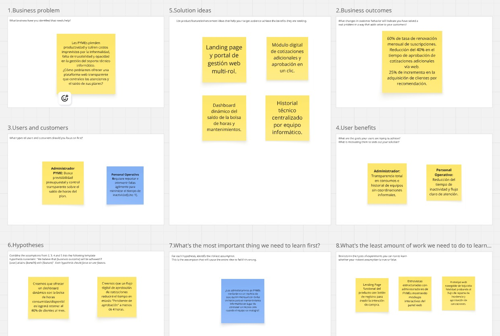

## 1.3. Segmentos objetivo

1. **Empresas Suscriptoras (Clientes - Rol Responsable/Administrador):**
   * **Perfil:** Pequeñas y medianas empresas (estudios contables, agencias de marketing, consultoras, oficinas administrativas) que disponen de entre 5 y 50 computadoras o laptops y no poseen departamento de TI propio.
   * **Necesidad:** Garantizar la operatividad de sus equipos con un costo mensual predecible y soporte técnico confiable, gestionando todo desde el panel web de su empresa.

2. **Empleados de las Empresas (Usuarios Finales):**
   * **Perfil:** Personal operativo de las empresas suscritas que utiliza diariamente un equipo informático para cumplir con sus funciones.
   * **Necesidad:** Reportar fallas de hardware o software de manera rápida ingresando a la aplicación web de UniLink para retomar sus labores lo antes posible.

# Capítulo II: Requirements Elicitation & Analysis

## 2.1. Competidores

Para validar nuestra propuesta de valor enfocada en la tercerización y gestión de soporte técnico B2B, hemos
identificado a tres competidores (directos e indirectos) que resuelven parcial o totalmente el problema del
mantenimiento informático para las empresas.

1. Zendesk / Plataformas SaaS de HelpDesk (Competidor Indirecto): Es un software de gestión de tickets a nivel mundial.
   Representa a los competidores puramente de software que ofrecen la plataforma tecnológica, pero no proveen el
   personal técnico físico para realizar las reparaciones.
2. Agencias Tradicionales de Outsourcing TI (Competidor Directo): Empresas locales consolidadas que proveen técnicos y
   contratos de soporte a otras empresas. Su principal debilidad es la carencia de un producto digital transparente
   (SaaS) para que el cliente final autogestione sus horas.
3. HelloTech / Plataformas On-Demand (Competidor Indirecto): Plataformas digitales tipo Uber para técnicos informáticos.
   Se enfocan principalmente en el consumidor final (B2C) o en reparaciones por evento único, careciendo de un modelo
   robusto de suscripciones mensuales y mantenimientos preventivos para empresas.

### 2.1.1. Análisis competitivo

A continuación, presentamos el Landscape Competitivo siguiendo la estructura exigida para analizar el posicionamiento de
nuestra startup UniLink (producto TechSustain) frente al mercado.
<table>
  <tr>
    <th colspan="6">Competitive Analysis Landscape</th>
  </tr>
  <tr>
    <th>¿Por qué llevar acabo este análisis?</th>
    <td colspan="5">Entender cómo las MYPES solucionan actualmente sus problemas informáticos, identificando brechas entre la oferta de software puro (SaaS) y el servicio técnico tradicional, para posicionar a TechSustain como la solución híbrida ideal.</td>
  </tr>
  <tr>
    <th colspan="2"></th>
    <td align="center"></td>
    <td align="center"></td>
    <td align="center"></td>
    <td align="center"></td>
  </tr>
 <tr>
    <th rowspan="2">Perfil</th>
    <th>Overview</th>
    <td align="center"><b>TechSustain (Nuestra Startup)</b><br>Es una startup académica orientada al desarrollo de soluciones digitales para facilitar la gestión de servicios empresariales, enfocándose actualmente en el mantenimiento y reparación de computadoras mediante una plataforma web y un modelo de suscripción mensual.</td>
    <td align="center"><b>Zendesk (HelpDesk SaaS)</b><br>Plataforma SaaS de atención al cliente que permite gestionar tickets, consultas, agentes y canales de soporte desde un solo lugar.</td>
    <td align="center"><b>Agencias Tradicionales de Outsourcing TI</b><br>Empresas que brindan servicios tecnológicos a otras organizaciones, como desarrollo de software, soporte técnico, infraestructura y mantenimiento, mediante equipos especializados externos.</td>
    <td align="center"><b>HelloTech / Apps On-Demand</b><br>Plataformas que conectan clientes con técnicos de TI disponibles bajo demanda para realizar servicios como soporte, reparación, instalación y mantenimiento tecnológico.</td>
</tr>
<tr>
    <th>Ventaja competitiva ¿Qué valor ofrece a los clientes?</th>
    <td align="center">Solución híbrida: Plataforma web transparente integrada con una red de técnicos calificados. Centralizar la solicitud de soporte, el control de horas consumidas y la aprobación de cotizaciones en un solo portal web.</td>
    <td align="center">Software de clase mundial, altamente personalizable e integrado con múltiples canales. Ordenar las solicitudes internas de soporte mediante la creación de tickets digitales.</td>
    <td align="center">Cuentan con personal técnico en planilla y atienden problemas físicos de hardware. Delegar completamente la responsabilidad del área de TI a una empresa externa.</td>
    <td align="center">Red amplia de técnicos independientes disponibles inmediatamente. Encontrar un técnico rápido para resolver una emergencia informática puntual.</td>
</tr>
<tr>
    <th rowspan="2">Perfil de Marketing</th>
    <th>Mercado objetivo</th>
    <td align="center">Oficinas, estudios y agencias (MYPES) que usan computadoras, pero no tienen área de TI.</td>
    <td align="center">Desde MYPES hasta corporaciones transnacionales con departamento de TI propio.</td>
    <td align="center">Medianas y grandes empresas con presupuesto para contratos corporativos anuales.</td>
    <td align="center">Consumidores domésticos (B2C) y microempresarios.</td>
</tr>
<tr>
    <th>Estrategias de marketing</th>
    <td align="center">Ventas B2B consultivas, demostrando el ahorro de costos al prevenir paralizaciones operativas.</td>
    <td align="center">Inbound marketing corporativo, webinars, y pruebas gratuitas del software.</td>
    <td align="center">Ventas relacionales B2B, recomendaciones de boca a boca y contratos a largo plazo.</td>
    <td align="center">Publicidad en redes sociales, cupones de descuento y marketing digital enfocado en emergencias.</td>

</tr>
<tr>
    <th rowspan="3">Perfil de Producto</th>
    <th>Productos & Servicios</th>
    <td align="center">Aplicación web B2B de suscripción mensual con bolsas de horas y mantenimientos preventivos.</td>
    <td align="center">Sistema SaaS de ticketing, base de conocimientos y atención omnicanal.</td>
    <td align="center">Contratos de pólizas de soporte, visitas presenciales y mesa de ayuda telefónica.</td>
    <td align="center">Aplicación móvil/web para agendar la visita de un técnico a domicilio.</td>
</tr>
<tr>
    <th>Precios & Costos</th>
    <td align="center">Suscripción mensual escalonada (Planes Básico, Empresarial, Integral) con costos claros.</td>
    <td align="center">Pago mensual o anual por "agente" (usuario que atiende tickets).</td>
    <td align="center">Contratos fijos mensuales muy elevados, generalmente opacos en el conteo de horas.</td>
    <td align="center">Pago único por intervención (Pay-as-you-go), tarifas variables.</td>
</tr>
<tr>
    <th>Canales de distribución(Web y/o Móvil)</th>
    <td align="center">Aplicación Web (Cloud) responsiva, accesible para administradores y empleados.</td>
    <td align="center">Plataforma Web (Cloud) y aplicaciones móviles para agentes.</td>
    <td align="center">Canal tradicional (teléfono, correo electrónico, visitas presenciales).</td>
    <td align="center">Aplicación web y app móvil nativa.</td>
</tr>
<tr>
    <th rowspan="4">Análisis SWOT</th>
    <th>Fortalezas</th>
    <td align="center">Modelo transparente: el cliente sabe exactamente qué consume y aprueba repuestos antes de pagar.</td>
    <td align="center">Ecosistema maduro, escalable y con una interfaz de usuario impecable.</td>
    <td align="center">Experiencia técnica comprobada y resolución física de problemas de hardware.</td>
    <td align="center">Rapidez de atención y cobertura geográfica amplia debido al modelo gig economy.</td>
</tr>
<tr>
    <th>Debilidades</th>
    <td align="center">Al ser una startup nueva, existe el reto de reclutar, capacitar y fidelizar a la flota de técnicos.</td>
    <td align="center">No proveen técnicos. La empresa cliente debe contratar a su propio personal para usar el software.</td>
    <td align="center">Procesos manuales. El cliente no tiene un portal para ver su saldo de horas en tiempo real.</td>
    <td align="center">Ausencia de un historial clínico a largo plazo del hardware. No ofrecen mantenimiento preventivo continuo.</td>
</tr>
<tr>
    <th>Oportunidades</th>
    <td align="center">La gran mayoría de MYPES terceriza el soporte de forma informal y busca formalizarlo a bajo costo.</td>
    <td align="center">Transformación digital corporativa que exige a las empresas formalizar su mesa de ayuda.</td>
    <td align="center">Demanda constante de soporte presencial ante fallas físicas que no se pueden resolver remoto.</td>
    <td align="center">El auge del teletrabajo incrementa la necesidad de soporte técnico descentralizado.</td>
</tr>
<tr>
    <th>Amenazas</th>
    <td align="center">Resistencia al cambio tecnológico por parte de dueños de empresas acostumbrados a llamar técnicos informales.</td>
    <td align="center">Surgimiento de software de tickets gratuito u open-source.</td>
    <td align="center">Pérdida de clientes frente a alternativas más económicas y tecnológicas.</td>
    <td align="center">Riesgo legal y de calidad al depender de técnicos independientes sin capacitación estandarizada.</td>
</tr>
</table>

### 2.1.2. Estrategias y tácticas frente a competidores

Frente a la competencia actual en el sector de soporte y mantenimiento informático, TechSustain implementará las siguientes estrategias para capitalizar las debilidades del mercado:
1. Frente al software puro (Zendesk) - Estrategia de Servicio Integral: Mientras que las plataformas SaaS tradicionales solo otorgan la herramienta digital, obligando a la MYPE a contratar a sus propios ingenieros, TechSustain ofrecerá la solución completa. Nuestra táctica será promocionarnos como un "Departamento de TI as a Service", donde la plataforma web ya viene integrada con nuestra red de técnicos listos para ser asignados, ahorrándole a la empresa el costo de planillas de personal tecnológico.


2. Frente a las Agencias Tradicionales - Estrategia de Transparencia Absoluta: El mayor dolor al contratar una agencia de outsourcing tradicional es la falta de visibilidad ("¿Cuántas horas de soporte me quedan?" o "¿Por qué me facturan este repuesto?"). Nuestra táctica será convertir esta debilidad en nuestra mayor fortaleza: el panel del administrador en nuestra aplicación web mostrará el consumo de la bolsa de horas en tiempo real y bloqueará cualquier reparación extra hasta que el cliente apruebe explícitamente la cotización del repuesto en la plataforma.


3. Frente al mercado on-demand e informal - Estrategia de Prevención e Historial: A diferencia de contratar a un técnico informal solo cuando la computadora "ya no prende", TechSustain fomenta una cultura preventiva. Nuestra táctica será ofrecer mantenimientos preventivos fijos mensuales incluidos en los planes de suscripción (ej. Plan Empresarial incluye 2 equipos al mes). Además, la plataforma registrará el historial de intervenciones de cada máquina, agregando un valor corporativo a largo plazo que las apps on-demand no ofrecen.


## 2.2. Entrevistas

### 2.2.1. Diseño de entrevistas

Para asegurar la recolección de información cualitativa de alto valor que nos permita construir nuestros User Personas (perfiles, comportamientos, frustraciones, habilidades, marcas e influencias) y validar nuestras hipótesis de negocio, hemos diseñado una batería de preguntas. Estas se dividen en un bloque general y bloques específicos adaptados a la realidad de nuestros dos segmentos objetivo (Responsables de Empresa y Empleados de Oficina).

**Preguntas Generales (Demografía, Tecnología, Marcas y Contexto): Estas preguntas aplican a los dos segmentos para perfilar el arquetipo del usuario.**
1. Demografía y Familia: ¿Cuál es tu nombre, edad, distrito de residencia, y con quién vives actualmente?


2. Perfil y Ocupación: ¿Cuál es tu rol actual en la empresa, cuánto tiempo llevas en él y cuál es tu formación profesional?


3. Tecnología y Canales: ¿Qué dispositivos utilizas más en tu trabajo diario (laptop, desktop, smartphone), y cuáles son tus canales favoritos para comunicarte y buscar servicios?


4. Marcas e Influencias: En tu vida profesional o personal, ¿qué marcas de tecnología o servicios admiras por su eficiencia y por qué?


5. Contexto: Descríbeme brevemente cómo es un día normal de trabajo para ti y qué tan indispensable es tu computadora para lograr tus metas.

**Preguntas de Problema y Competencia (Core del Negocio): Estas preguntas buscan validar la necesidad de soporte técnico centralizado.**


6. Dolor: Actualmente, cuando una computadora o equipo falla en la oficina, ¿cuál es el proceso exacto que siguen para repararlo?


7. Dolor: ¿Cuál es el mayor dolor de cabeza o problema que enfrentan al tratar con técnicos informáticos independientes o al no tener un área de TI?


8. Competencia: ¿Alguna vez han contratado pólizas de soporte mensuales o plataformas de tickets? Si es así, ¿qué les funcionó y qué no?


9. Expectativa ("Varita Mágica"): Si pudieras tener una solución ideal para gestionar las fallas informáticas de la oficina, ¿cómo te gustaría que funcionara?


10. Validación: Si te presentamos una plataforma web donde pagas una suscripción mensual fija, ves tus horas de soporte disponibles en tiempo real y gestionas mantenimientos preventivos, ¿estarías dispuesto a probarla?

**Preguntas Específicas por Segmento (Enfoque en Roles):**

**Para el Segmento 1 (Responsables de la Empresa: Dueños, Administradores, Gerentes):**


11. (Finanzas y Control): ¿Te ha pasado que apruebas la reparación de un equipo y al final te cobran repuestos o sobrecostos que no esperabas?


12. (Trazabilidad): ¿Llevas algún registro o historial clínico de cuántas veces se ha malogrado una misma laptop en el año para decidir si es mejor comprar una nueva?


13. (Productividad): ¿Cuánto dinero o tiempo calculas que pierde tu empresa cuando un empleado se queda sin computadora por varios días?

**Para el Segmento 2 (Empleados / Usuarios Afectados):**

14. (Carga operativa): Cuando tu equipo falla, ¿te resulta frustrante o burocrático tener que avisarle a tu jefe y esperar a que él consiga un técnico?


15. (Trazabilidad): ¿Sientes que cuando el técnico finalmente llega, tienes que volver a explicarle todo el problema desde cero porque la información se perdió en el camino?


#### 2.2.2. Registro de entrevistas

**Entrevista 1: Hikari (Técnica de Soporte de Computadoras)**
* **Segmento objetivo:** Proveedor de Servicios / Técnico de Soporte.
* **Enlace de la entrevista:** (https://drive.google.com/file/d/168aU_BrOYqF49c9xDDXBlJQ7F55Ue7dY/view?usp=drive_link)
* **Resumen descriptivo:** Hikari se dedica al mantenimiento y reparación de laptops y computadoras de escritorio para pequeñas empresas (realiza diagnósticos de lentitud, fallas de sistema, cambios de componentes y mantenimientos preventivos). 
* **Principales Dolores (Pain Points) Identificados:**
    * **Canales de comunicación ineficientes:** Los clientes suelen contactarla por WhatsApp, pero la comunicación es desordenada y, a menudo, no saben explicar bien el problema ("solo me dicen que la computadora no funciona").
    * **Pérdida de tiempo por intermediarios:** Frecuentemente la contacta un intermediario de la empresa y luego la derivan al usuario final, obligándola a recopilar la información de la falla desde cero varias veces.
    * **Proceso de cotización manual:** Tiene que realizar el diagnóstico, enviar la cotización de manera informal y esperar la aprobación del responsable antes de poder realizar el trabajo o comprar los repuestos.
    * **Falta de historial clínico:** Guarda sus registros en anotaciones personales y chats de WhatsApp, pero no están organizados por equipo, lo que dificulta identificar problemas recurrentes en una misma computadora.

#### 2.2.3. Análisis de entrevistas

A partir de la entrevista realizada con nuestro segmento de Técnicos de Soporte, hemos podido validar que la informalidad del soporte técnico actual no solo afecta a las empresas, sino que también genera graves cuellos de botella para quienes proveen el servicio.

**Hallazgos principales:**
1. **El uso de WhatsApp no es escalable:** Gestionar incidencias a través de chats genera pérdida de información y retrasos. Esto valida la necesidad principal de **CompuCare**: un sistema de *ticketing* centralizado donde el usuario final describa el problema exacto y el técnico lo reciba sin intermediarios.
2. **Necesidad de formalizar cotizaciones:** El técnico pierde mucho tiempo esperando aprobaciones informales para comprar repuestos. Esto confirma que el módulo de "Aprobación de Cotizaciones Adicionales" en nuestra plataforma será una función clave para agilizar el trabajo.
3. **Historial de equipos (Inventario):** La falta de registro de mantenimientos previos complica los diagnósticos. La plataforma aportará gran valor al crear un "historial clínico" automático por cada computadora registrada en el sistema.

## 2.3. Needfinding

En esta fase de Needfinding, hemos traducido los datos crudos y estadísticos obtenidos en nuestras entrevistas en artefactos de empatía y mapeo. Esto nos permite visualizar a nuestros usuarios objetivo, entender su día a día y alinear las funcionalidades de TechSustain con sus necesidades reales antes de iniciar el diseño de interfaces o la programación de la plataforma.

A continuación, presentamos nuestros User Personas, el User Task Matrix, los User Journey Maps y los Empathy Maps.


### 2.3.1. User Personas

Con base en el análisis de las 6 entrevistas, hemos construido dos arquetipos (User Personas) que representan fielmente a nuestros dos segmentos objetivo. Hemos considerado características demográficas, personalidad, canales digitales, frustraciones y metas. Estos perfiles serán el centro de todas las decisiones de diseño y arquitectura de información de CompuCare.

**User Persona 1: Martín Cárdenas - El "Administrador Sin Control" (Segmento 1: Responsables de Empresa)**
* UXPressia:


* **Quote (Frase):** "Pagaría lo que sea por un servicio que me diga exactamente en qué se gastan las horas de soporte técnico de mi oficina."


* **Demografía:** 45 años, casado, 2 hijos. Reside en San Isidro, Lima. 


* **Ocupación:** Administrador de un estudio contable (MYPE). 


* **Personalidad y Habilidades:** Pragmático, orientado a los números y al control de presupuestos. Nivel tecnológico medio-alto (gestiona software contable y plataformas bancarias). 


* **Tecnología y Dispositivos:** Laptop Lenovo con Windows (trabajo pesado) y Smartphone Android (comunicación ágil). 


* **Canales y Marcas:** Se informa por LinkedIn y diarios financieros (Gestión). Admira marcas de software corporativo seguro como Microsoft y SAP. 


* **Gains (Metas/Objetivos):** Quiere tener visibilidad de su bolsa de horas de soporte, asegurar que todos los equipos reciban mantenimiento preventivo y aprobar digitalmente la compra de cualquier repuesto extra. 


* **Pains (Frustraciones):** Sufre cuando llegan facturas sorpresa de técnicos informales. Le frustra perder tiempo buscando un técnico de confianza cada vez que falla una computadora.

**User Persona 2: Camila Torres - La "Empleada Paralizada" (Segmento 2: Empleados / Usuarios Afectados)**
* UXPressia:


* **Quote (Frase):** "Mi computadora es mi única herramienta de trabajo. Si se malogra y el técnico tarda tres días, mi semana se arruina."


* **Demografía:** 28 años, convive con su pareja, sin hijos. Reside en Surquillo, Lima.


* **Ocupación:** Diseñadora Gráfica / Empleada de agencia.


* **Personalidad y Habilidades:** Creativa, visual e impaciente ante la burocracia. Nivel tecnológico alto (nativa digital).


* **Tecnología y Dispositivos:** Utiliza una iMac en la oficina y un iPhone personal.


* **Canales y Marcas:** Consume contenido en Instagram y Behance. Confía en el ecosistema Apple y Adobe.


* **Gains (Metas/Objetivos):** Desea un sistema simple donde pueda reportar el problema de su computadora, indicar su ubicación en la oficina y ver en qué estado está su solicitud sin tener que preguntarle a su jefe.


* **Pains (Frustraciones):** La burocracia de la empresa para llamar a un técnico. Tener que volver a explicar el problema técnico desde cero cuando el reparador llega a su escritorio.


### 2.3.2. User Task Matrix

A continuación, presentamos la matriz de tareas de los usuarios. Aquí evaluamos las tareas clave que nuestros User Personas (Martín y Camila) realizan actualmente cuando enfrentan problemas informáticos en su empresa, independientemente de la existencia de CompuCare.

<table>
  <tr>
    <th colspan="1" rowspan="2">Tareas(User Tasks)</th>
    <th colspan="2">User Persona 1: Martín (Administrador)</th>
    <th colspan="2">User Persona 2: Camila (Empleada)</th>
  </tr>
  <tr>
    <th>Frecuencia</th>
    <th>Importancia</th>
    <th>Frecuencia</th>
    <th>Importancia</th>
  </tr>
  <tr>
    <th>1. Reportar falla de un equipo informático</th>
    <td align="center">Baja (Solo de su equipo)</td>
    <td align="center">Alta</td>
    <td align="center">Alta</td>
    <td align="center">Alta</td>
  </tr>
  <tr>
    <th>2. Buscar un técnico de confianza disponible</th>
    <td align="center">Media (Ante emergencias)</td>
    <td align="center">Alta</td>
    <td align="center">Rara vez (Depende de su jefe)</td>
    <td align="center">Baja</td>
  </tr>
  <tr>
    <th>3. Autorizar/Aprobar gastos de repuestos</th>
    <td align="center">Alta</td>
    <td align="center">Alta</td>
    <td align="center">Nula</td>
    <td align="center">Nula</td>
  </tr>
  <tr>
    <th>4. Preguntar por el estado de una reparación</th>
    <td align="center">Media</td>
    <td align="center">Media</td>
    <td align="center">Alta</td>
    <td align="center">Alta</td>
  </tr>
  <tr>
    <th>5. Programar mantenimientos preventivos</th>
    <td align="center">Baja (Suele olvidarlo)</td>
    <td align="center">Alta</td>
    <td align="center">Nula</td>
    <td align="center">Baja</td>
  </tr>
  <tr>
    <th>6. Revisar el presupuesto de gastos TI</th>
    <td align="center">Alta (Mensual)</td>
    <td align="center">Alta</td>
    <td align="center">Nula</td>
    <td align="center">Nula</td>
  </tr>
</table>

**Análisis del User Task Matrix:**

Al analizar la matriz, resaltan diferencias marcadas que guiarán la arquitectura de CompuCare:
* **Diferencias operativas:** La tarea más crítica y frecuente para Camila es "Reportar la falla" y "Preguntar por el estado de la reparación". Para Martín, estas tareas son de baja frecuencia; sin embargo, las tareas de "Buscar técnico", "Autorizar gastos" y "Revisar presupuestos" son de altísima importancia para él. Esto justifica interfaces radicalmente distintas: Camila necesita un formulario de tickets rápido e intuitivo, mientras que Martín requiere un Dashboard financiero donde vea su suscripción, sus horas y un panel de aprobación de cotizaciones.


* **Oportunidad de Mantenimiento Preventivo:** Ambos coinciden en que programar mantenimientos preventivos es importante, pero actualmente la frecuencia de esta tarea es bajísima (se olvida). Nuestra plataforma automatizará esta tarea consumiendo los cupos del plan mensual contratado.


### 2.3.3. User Journey Mapping

En esta sección presentamos los User Journey Maps en su versión "As-Is" (situación actual) para nuestros dos User Personas. El objetivo de estos diagramas es ilustrar el viaje de extremo a extremo que experimentan actualmente al enfrentar un problema informático sin CompuCare.

**User Journey Map 1: Martín Cárdenas (El "Administrador Sin Control")**
* **Escenario:** Una laptop importante de su equipo de contabilidad falla en pleno cierre de fin de mes.


* **Captura EXPressia:**


* **Fases del Journey (Para UXPressia):**
> 1. **Reporte del problema (Ansiedad):** Su empleada le avisa que la laptop no enciende. Martín se estresa porque tiene que detener su propio trabajo administrativo.

> 2. **Búsqueda (Frustración):** Revisa sus contactos de WhatsApp buscando a un técnico informal. El técnico demora en contestar y dice que recién puede ir mañana.

> 3. **Reparación y Cotización (Desconfianza):** El técnico llega, revisa y le dice verbalmente que tiene que comprar un disco duro nuevo. Martín no sabe si el precio es justo y no tiene cómo llevar un registro.

> 4. **Pago (Enojo):** Paga la mano de obra y el repuesto sin recibir una factura detallada. Siente que perdió dinero y tiempo valioso.


* **Oportunidad para TechSustain:** Un plan mensual fijo. Si una laptop falla, el técnico ya está asignado. Si necesita un disco duro, la plataforma genera una cotización digital clara que Martín aprueba con un clic.


**User Journey Map 2: Camila Torres (La "Empleada Paralizada")**
* **Escenario:** Su programa de diseño se cierra inesperadamente repetidas veces por falta de mantenimiento en su computadora.


* **Captura EXPressia:**


* **Fases del Journey (Para UXPressia):**
> 1. **La Falla (Bloqueo):** La computadora se congela. Camila se siente impotente porque tiene entregas urgentes para clientes.

> 2. **El Reporte (Burocracia):** Tiene que ir físicamente a la oficina del administrador para avisarle del problema.

> 3. **La Espera (Improductividad):** Pasan dos días hasta que llega un técnico. Durante ese tiempo, Camila no puede trabajar y se atrasa.

> 4. **La Explicación (Agotamiento):** Llega el técnico y Camila tiene que explicarle desde cero todo lo que pasó, repitiendo información.


* **Oportunidad para TechSustain:** Un panel donde Camila crea un ticket indicando su ubicación (ej. Escritorio 4) y el software que falla. El técnico llega con el contexto claro y ella puede ver el estado de su solicitud en tiempo real.


### 2.3.4. Empathy Mapping

Para profundizar en la psique de nuestros usuarios, realizamos una sesión de análisis basada en las entrevistas. Colocamos a cada User Persona al centro y respondimos preguntas clave sobre su entorno. A continuación, presentamos los Mapas de Empatía "As-Is".

**Empathy Map 1: Martín Cárdenas (Responsable de la Empresa)**
* **UXPressia:**


* **¿Con quién empatizamos y qué necesita hacer?:** Martín, 45 años. Necesita que los equipos de su empresa funcionen sin que esto se vuelva un hoyo negro financiero.


* **¿Qué ve?:** Ve facturas de técnicos informales, computadoras viejas que fallan constantemente y empleados inactivos.


* **¿Qué escucha?:** "Jefe, mi compu está lenta", "El técnico dice que va a costar el doble", "Se borró el archivo del cliente".


* **¿Qué dice y hace?:** "Busca en Google algún técnico que venga hoy mismo". Delega la reparación de forma informal porque no tiene área de TI.


* **¿Qué piensa y siente?:** "Siento que me estafan cuando compran repuestos". Siente desconfianza y estrés por la falta de un soporte formal.


* **Pains (Dolores):** Sobrecostos imprevistos, falta de facturación clara, interrupción de la productividad de su oficina.


* **Gains (Beneficios esperados):** Un presupuesto fijo mensual para TI, control total sobre las cotizaciones adicionales y técnicos pre-filtrados y confiables.


**Empathy Map 2: Camila Torres (Empleada de la Empresa)**
* **UXPressia:**


* **¿Con quién empatizamos y qué necesita hacer?:** Camila, 28 años. Necesita una computadora rápida para terminar su trabajo a tiempo.


* **¿Qué ve?:** Ve herramientas de diseño modernas, pero un hardware en su oficina que no recibe mantenimiento y se llena de polvo.


* **¿Qué escucha?:** "El técnico viene mañana, ten paciencia", "Trata de no abrir muchos programas a la vez".


* **¿Qué dice y hace?:** "Reiniciaré la máquina otra vez a ver si funciona". Se queja con sus compañeros por la lentitud tecnológica de su empresa.


* **¿Qué piensa y siente?:** "La empresa no valora mi tiempo si no me dan herramientas que sirvan". Siente frustración y atraso profesional.


* **Pains (Dolores):** Estar inactiva por fallas técnicas, la burocracia de tener que rogar por soporte, explicar la misma falla varias veces.


* **Gains (Beneficios esperados):** Poder reportar incidentes directamente desde un portal intuitivo y recibir mantenimientos preventivos constantes para no llegar al punto de quiebre.


## 2.4. Big Picture Event Storming

[contenido]

### 2.4.1. Fase 1: Generación Abierta de Eventos (Open Space)

[contenido]

### 2.4.2. Fase 2: Exploración y Línea de Tiempo (Explore)

[contenido]

### 2.4.3. Fase 3: Consolidación y Definición de Triggers (Close Space)

[contenido]

### 2.4.4. Fase 4: Modelo Final del Dominio (Final Landscape)

[contenido]

### 2.5. Ubiquitous Language

[contenido]

# Capítulo III: Requirements Specification

## 3.1. Product Backlog (Historias de Usuario Priorizadas)

| Epic / Story ID | Título | Descripción | Criterios de Aceptación | Relacionado con (Epic ID) |
| :--- | :--- | :--- | :--- | :--- |
| **EP01** | Identity and Access Management | Epic para la gestión de usuarios, autenticación, roles, sesiones y recuperación de credenciales. | N/A | N/A |
| **US-01** | Inicio de Sesión y Control de Acceso por Rol | **Como** Usuario registrado,<br>**Quiero** iniciar sesión con mi correo corporativo y contraseña,<br>**Para** ingresar al panel web correspondiente a mis permisos. | **Escenario 1: Inicio de sesión exitoso como Administrador**<br>- **Dado** que el usuario ingresa sus credenciales válidas de Administrador,<br>- **Cuando** presiona "Iniciar Sesión",<br>- **Entonces** el sistema lo redirige al Dashboard de Administrador.<br><br>**Escenario 2: Inicio de sesión exitoso como Empleado**<br>- **Dado** que el usuario ingresa sus credenciales válidas de Empleado,<br>- **Cuando** presiona "Iniciar Sesión",<br>- **Entonces** el sistema lo redirige a la vista de Mis Tickets. | EP01 |
| **US-02** | Registro de Administrador y Empresa | **Como** Administrador de MYPE,<br>**Quiero** crear mi cuenta y registrar mi empresa,<br>**Para** gestionar la suscripción y los servicios de soporte. | **Escenario 1: Registro exitoso**<br>- **Dado** que el usuario completa el formulario de registro con un RUC válido,<br>- **Cuando** presiona "Registrar Empresa",<br>- **Entonces** se crea la cuenta de empresa y se envía un correo de confirmación.<br><br>**Escenario 2: RUC duplicado**<br>- **Dado** que el usuario ingresa un RUC previamente registrado,<br>- **Cuando** envía el formulario,<br>- **Entonces** el sistema muestra un mensaje de error indicando la duplicidad. | EP01 |
| **US-03** | Recuperación de Contraseña | **Como** Usuario registrado,<br>**Quiero** solicitar el restablecimiento de mi contraseña,<br>**Para** recuperar el acceso a mi cuenta si la he olvidado. | **Escenario 1: Envío de enlace de recuperación**<br>- **Dado** que el usuario ingresa su correo registrado en el formulario de recuperación,<br>- **Cuando** presiona "Enviar enlace",<br>- **Entonces** el sistema envía un correo con un token temporal válido por 24 horas.<br><br>**Escenario 2: Correo no registrado**<br>- **Dado** que el usuario ingresa un correo inexistente,<br>- **Cuando** presiona "Enviar enlace",<br>- **Entonces** el sistema muestra un mensaje indicando que no se encontró la cuenta. | EP01 |
| **US-04** | Registro de Empleados por Administrador | **Como** Administrador de MYPE,<br>**Quiero** registrar a los empleados de mi empresa en la plataforma,<br>**Para** habilitarles el acceso al reporte de incidencias. | **Escenario 1: Creación de usuario empleado**<br>- **Dado** que el Administrador completa el nombre, correo y cargo del empleado,<br>- **Cuando** guarda el registro,<br>- **Entonces** el sistema crea la cuenta con rol "Empleado" y le envía una invitación por correo.<br><br>**Escenario 2: Correo institucional duplicado**<br>- **Dado** que el Administrador intenta registrar un correo ya existente,<br>- **Cuando** guarda el registro,<br>- **Entonces** el sistema bloquea la acción notificando que el correo ya está registrado. | EP01 |
| **US-05** | Gestión de Perfil de Usuario | **Como** Usuario registrado,<br>**Quiero** actualizar mis datos personales y contraseña,<br>**Para** mantener mi información de contacto actualizada. | **Escenario 1: Actualización exitosa**<br>- **Dado** que el usuario modifica su teléfono o nombre en el perfil,<br>- **Cuando** presiona "Guardar Cambios",<br>- **Entonces** el sistema actualiza la información y muestra una notificación de éxito.<br><br>**Escenario 2: Cambio de contraseña con clave actual incorrecta**<br>- **Dado** que el usuario ingresa una contraseña actual errónea,<br>- **Cuando** intenta actualizar su clave,<br>- **Entonces** el sistema deniega el cambio indicando que la clave actual no coincide. | EP01 |
| **US-06** | Endpoint para Autenticación JWT (API) | **Como** Developer,<br>**Quiero** implementar el endpoint `/api/v1/auth/login`,<br>**Para** emitir tokens JSON Web Tokens (JWT) seguros. | **Escenario 1: Emisión exitosa de JWT**<br>- **Dado** una petición POST con credenciales válidas en formato JSON,<br>- **Cuando** el API procesa la autenticación,<br>- **Entonces** responde con un código 200 OK y el token Bearer JWT con los claims de rol.<br><br>**Escenario 2: Credenciales inválidas**<br>- **Dado** una petición POST con contraseña incorrecta,<br>- **Cuando** el API procesa la autenticación,<br>- **Entonces** responde con un código 401 Unauthorized. | EP01 |
| **EP02** | Companies and Equipment Management | Epic para la gestión del inventario de equipos, ubicaciones de sede y fichas clínicas de hardware. | N/A | N/A |
| **US-07** | Registro de Equipos de la Oficina | **Como** Administrador de MYPE,<br>**Quiero** registrar los equipos indicando número de serie, tipo y ubicación,<br>**Para** mantener un inventario unificado de hardware bajo cobertura. | **Escenario 1: Registro exitoso de equipo**<br>- **Dado** que el Administrador completa la ficha del equipo con número de serie único,<br>- **Cuando** guarda el registro,<br>- **Entonces** el sistema asigna un código interno único y lo añade al inventario.<br><br>**Escenario 2: Validación de serie obligatorio**<br>- **Dado** que el usuario intenta guardar un equipo sin número de serie,<br>- **Cuando** envía el formulario,<br>- **Entonces** el sistema impide el guardado mostrando un mensaje de campo obligatorio. | EP02 |
| **US-08** | Asignación de Equipos a Empleados | **Como** Administrador de MYPE,<br>**Quiero** vincular un equipo registrado a un empleado específico,<br>**Para** que el colaborador reporte incidentes directamente sobre su estación de trabajo. | **Escenario 1: Vinculación exitosa**<br>- **Dado** que el Administrador selecciona un equipo del inventario y lo asigna a un empleado,<br>- **Cuando** confirma la operación,<br>- **Entonces** el equipo aparece precargado en la vista del empleado.<br><br>**Escenario 2: Reasignación de equipo**<br>- **Dado** que un equipo cambia de usuario responsable,<br>- **Cuando** el Administrador actualiza el empleado asignado,<br>- **Entonces** el sistema registra el cambio en el historial de asignaciones del equipo. | EP02 |
| **US-09** | Ficha Clínica e Historial Técnico por Equipo | **Como** Administrador de MYPE,<br>**Quiero** consultar la ficha técnica e historial de cada PC,<br>**Para** evaluar si un equipo requiere reemplazo por fallas recurrentes. | **Escenario 1: Consulta de historial completo**<br>- **Dado** que el Administrador selecciona un equipo en el inventario,<br>- **Cuando** accede a "Historial de Servicio",<br>- **Entonces** el sistema despliega la cronología con tickets pasados, mantenimientos y repuestos cambiados. | EP02 |
| **US-10** | Mapeo de Sedes y Ubicaciones de Escritorio | **Como** Administrador de MYPE,<br>**Quiero** registrar las sedes y puestos de trabajo de la oficina,<br>**Para** facilitar la localización de los equipos por parte de los técnicos. | **Escenario 1: Creación de nueva ubicación**<br>- **Dado** que el Administrador ingresa el nombre de la sede y el número de escritorio,<br>- **Cuando** guarda la ubicación,<br>- **Entonces** la ubicación queda disponible en las opciones de registro de equipos.<br><br>**Escenario 2: Desactivación de sede**<br>- **Dado** que una sede deja de operar,<br>- **Cuando** el Administrador la marca como inactiva,<br>- **Entonces** el sistema impide asociar nuevos equipos a dicha sede. | EP02 |
| **US-11** | Búsqueda y Filtrado de Inventario de Equipos | **Como** Administrador de MYPE,<br>**Quiero** filtrar la lista de equipos por estado, sede o tipo de máquina,<br>**Para** agilizar la localización de componentes en la oficina. | **Escenario 1: Filtrado por estado del equipo**<br>- **Dado** que el usuario selecciona el filtro "En Reparación",<br>- **Cuando** aplica el filtro,<br>- **Entonces** la tabla despliega únicamente los equipos con tickets abiertos.<br><br>**Escenario 2: Búsqueda por texto libre**<br>- **Dado** que el usuario ingresa la serie o nombre del equipo en el buscador,<br>- **Cuando** presiona enter,<br>- **Entonces** el sistema lista los registros coincidentes. | EP02 |
| **US-12** | Endpoint de Gestión de Inventario (API) | **Como** Developer,<br>**Quiero** implementar la ruta `/api/v1/equipments`,<br>**Para** permitir operaciones CRUD sobre los equipos de una empresa. | **Escenario 1: Obtención de inventario**<br>- **Dado** una petición GET autenticada con el ID de empresa,<br>- **Cuando** el API procesa la consulta,<br>- **Entonces** retorna un código 200 OK con el array JSON de equipos.<br><br>**Escenario 2: Creación de equipo inválida**<br>- **Dado** una petición POST con payload incompleto,<br>- **Cuando** el API valida la entidad,<br>- **Entonces** responde con un código 400 Bad Request y los detalles del error. | EP02 |
| **EP03** | Subscriptions and Coverage Management | Epic para la gestión de planes, suscripciones activas, bolsa de horas y agendamiento preventivo. | N/A | N/A |
| **US-13** | Selección y Contratación de Plan Mensual | **Como** Administrador de MYPE,<br>**Quiero** elegir un plan de suscripción mensual (Básico, Empresarial, Integral),<br>**Para** afiliar a mi empresa a los servicios de soporte de UniLink. | **Escenario 1: Selección de plan exitosa**<br>- **Dado** que el Administrador selecciona un plan e ingresa los datos de facturación,<br>- **Cuando** confirma la suscripción,<br>- **Entonces** la cuenta activa la bolsa de horas y cupos de mantenimiento del mes. | EP03 |
| **US-14** | Panel de Control de Bolsa de Horas | **Como** Administrador de MYPE,<br>**Quiero** visualizar en un Dashboard las horas consumidas y disponibles del mes,<br>**Para** mantener el control del presupuesto y uso del servicio. | **Escenario 1: Descuento dinámico de horas**<br>- **Dado** que un técnico cierra un ticket registrando 2 horas de trabajo,<br>- **Cuando** el Administrador consulta el Dashboard,<br>- **Entonces** el gráfico de saldo muestra automáticamente el descuento de las 2 horas. | EP03 |
| **US-15** | Agendamiento de Mantenimientos Preventivos | **Como** Administrador de MYPE,<br>**Quiero** programar las visitas preventivas incluidas en mi plan,<br>**Para** prevenir fallas operativas en las estaciones de trabajo. | **Escenario 1: Reserva de fecha en calendario**<br>- **Dado** que la empresa cuenta con cupos preventivos del mes,<br>- **Cuando** el Administrador selecciona fecha, hora y equipos en el calendario,<br>- **Entonces** la visita queda agendada y se descuenta un cupo preventivo del saldo. | EP03 |
| **US-16** | Renovación Automática de Suscripción | **Como** Administrador de MYPE,<br>**Quiero** gestionar la renovación periódica de mi plan,<br>**Para** garantizar la continuidad del soporte técnico sin interrupciones. | **Escenario 1: Reinicio mensual de horas**<br>- **Dado** que se cumple el ciclo de facturación de la suscripción,<br>- **Cuando** el sistema procesa el nuevo periodo,<br>- **Entonces** restablece el saldo de horas y cupos preventivos según el plan contratado. | EP03 |
| **US-17** | Alertas de Consumo Próximo al Límite | **Como** Administrador de MYPE,<br>**Quiero** recibir notificaciones al consumir el 80% de mi bolsa de horas,<br>**Para** evaluar la compra de un paquete adicional o upgrade de plan. | **Escenario 1: Disparo de alerta por consumo alto**<br>- **Dado** que la bolsa de horas alcanza el 80% de uso del saldo mensual,<br>- **Cuando** se registra el último ticket,<br>- **Entonces** el sistema envía un correo y muestra un aviso de alerta en el Dashboard. | EP03 |
| **US-18** | Endpoint de Saldos y Cobertura (API) | **Como** Developer,<br>**Quiero** implementar la ruta `/api/v1/subscriptions/balance`,<br>**Para** proveer los datos consumidos de la bolsa de horas a la aplicación web. | **Escenario 1: Consulta de saldo actual**<br>- **Dado** un token JWT válido de Administrador,<br>- **Cuando** solicita el balance de suscripción,<br>- **Entonces** responde 200 OK con el total de horas, horas usadas y cupos preventivos restantes. | EP03 |
| **EP04** | Service Requests Management | Epic para la creación de solicitudes de soporte, asignación de técnicos, diagnóstico y ciclo de vida del ticket. | N/A | N/A |
| **US-19** | Creación Directa de Tickets de Soporte | **Como** Empleada de Oficina,<br>**Quiero** reportar la falla de mi equipo seleccionando la categoría y problema,<br>**Para** solicitar atención técnica rápida sin intermediarios. | **Escenario 1: Registro exitoso de ticket**<br>- **Dado** que la empleada selecciona su equipo asignado y detalla la falla,<br>- **Cuando** presiona "Enviar Ticket",<br>- **Entonces** se genera la solicitud en estado "Pendiente de Asignación". | EP04 |
| **US-20** | Asignación de Técnico a Solicitud | **Como** Administrador del Sistema,<br>**Quiero** asignar un técnico disponible a una nueva solicitud de soporte,<br>**Para** dar inicio al diagnóstico y reparación de la computadora. | **Escenario 1: Asignación de técnico**<br>- **Dado** un ticket en estado "Pendiente de Asignación",<br>- **Cuando** el Administrador asigna a un técnico especialista,<br>- **Entonces** el ticket cambia a estado "Asignado" y se le notifica al técnico. | EP04 |
| **US-21** | Seguimiento del Estado del Ticket | **Como** Empleada de Oficina,<br>**Quiero** visualizar la línea de tiempo del avance de mi solicitud,<br>**Para** conocer cuándo seré atendida sin tener que hacer llamadas. | **Escenario 1: Visualización del estado actual**<br>- **Dado** que la empleada consulta la sección "Mis Solicitudes",<br>- **Cuando** selecciona un ticket activo,<br>- **Entonces** ve la línea de tiempo actualizada (Registrada, Asignada, En Diagnóstico, Resuelta). | EP04 |
| **US-22** | Registro de Diagnóstico e Intervención | **Como** Técnico de Soporte,<br>**Quiero** ingresar el diagnóstico, trabajo realizado y horas empleadas,<br>**Para** actualizar la ficha del servicio y descontar el tiempo de la bolsa de horas. | **Escenario 1: Cierre de ticket por el técnico**<br>- **Dado** que el técnico concluye la atención presencial o remota,<br>- **Cuando** registra el informe técnico y las horas de trabajo,<br>- **Entonces** el ticket pasa a estado "Atendido" y se descuentan las horas del plan. | EP04 |
| **US-23** | Cancelación o Descarte de Ticket | **Como** Empleada de Oficina,<br>**Quiero** cancelar una solicitud de soporte creada por error,<br>**Para** no generar visitas o consumo innecesario de horas. | **Escenario 1: Cancelación previa a asignación**<br>- **Dado** un ticket en estado "Pendiente",<br>- **Cuando** el usuario hace clic en "Cancelar Solicitud",<br>- **Entonces** el ticket cambia a estado "Cancelado" y no se consume saldo. | EP04 |
| **US-24** | Endpoint de Flujo de Tickets (API) | **Como** Developer,<br>**Quiero** desarrollar el endpoint POST `/api/v1/tickets`,<br>**Para** procesar el registro de incidencias desde la aplicación cliente. | **Escenario 1: Creación de ticket en API**<br>- **Dado** un payload válido con `equipmentId`, `category` y `description`,<br>- **Cuando** el API ejecuta el comando de creación,<br>- **Entonces** persiste la entidad y responde con status 201 Created y el ID del ticket. | EP04 |
| **EP05** | Quotations and Payments Management | Epic para la cotización de repuestos adicionales, aprobación por la empresa y simulación de pagos. | N/A | N/A |
| **US-25** | Generación de Cotización de Repuestos | **Como** Técnico de Soporte,<br>**Quiero** emitir una cotización detallada de componentes o repuestos extras,<br>**Para** solicitar la autorización de compra a la empresa antes de reparar. | **Escenario 1: Emisión de cotización adicional**<br>- **Dado** que la reparación requiere cambiar una pieza no cubierta por el plan,<br>- **Cuando** el técnico adjunta el detalle de la pieza y costo,<br>- **Entonces** la cotización pasa a estado "Pendiente de Aprobación". | EP05 |
| **US-26** | Aprobación/Rechazo Digital de Cotizaciones | **Como** Administrador de MYPE,<br>**Quiero** autorizar o rechazar digitalmente las cotizaciones de repuestos,<br>**Para** validar los sobrecostos antes de cualquier adquisición. | **Escenario 1: Aprobación de cotización**<br>- **Dado** que hay una cotización pendiente,<br>- **Cuando** el Administrador presiona "Aprobar",<br>- **Entonces** el sistema autoriza la compra y notifica al técnico para proceder.<br><br>**Escenario 2: Rechazo de cotización**<br>- **Dado** que la cotización supera el presupuesto,<br>- **Cuando** el Administrador presiona "Rechazar",<br>- **Entonces** la cotización se cancela y la orden queda pausada. | EP05 |
| **US-27** | Visualización de Desglose de Gastos Adicionales | **Como** Administrador de MYPE,<br>**Quiero** consultar un reporte detallado de cotizaciones aprobadas del mes,<br>**Para** auditar la facturación por repuestos y componentes extra. | **Escenario 1: Generación de resumen de gastos**<br>- **Dado** que el Administrador accede al módulo de Finanzas,<br>- **Cuando** selecciona el mes actual,<br>- **Entonces** ve el listado consolidado de repuestos aprobados con sus montos. | EP05 |
| **US-28** | Simulación de Pago de Servicios Adicionales | **Como** Administrador de MYPE,<br>**Quiero** registrar el pago simulado de una cotización aprobada,<br>**Para** cerrar el ciclo financiero del servicio adicional. | **Escenario 1: Confirmación de pago simulado**<br>- **Dado** que una cotización está autorizada,<br>- **Cuando** el usuario ingresa datos de tarjeta de prueba y confirma,<br>- **Entonces** el sistema emite el comprobante y cambia el estado a "Pagado". | EP05 |
| **US-29** | Pasarela de Pago para Landing Page (Suscripción) | **Como** Visitante / Administrador,<br>**Quiero** ingresar los datos de pago al seleccionar un plan en el Landing Page,<br>**Para** completar la afiliación inicial del servicio de forma digital. | **Escenario 1: Registro y pago inicial**<br>- **Dado** que el visitante selecciona el "Plan Empresarial" en la web,<br>- **Cuando** llena el formulario y procesa el pago simulado,<br>- **Entonces** la suscripción queda activa inmediatamente. | EP05 |
| **US-30** | Endpoint de Aprobación de Cotización (API) | **Como** Developer,<br>**Quiero** exponer el endpoint PUT `/api/v1/quotes/{id}/status`,<br>**Para** actualizar el estado de las cotizaciones desde el panel web de la empresa. | **Escenario 1: Actualización de estado en API**<br>- **Dado** una petición PUT con status `APPROVED` o `REJECTED`,<br>- **Cuando** se valida que el usuario pertenece a la empresa de la orden,<br>- **Entonces** el API actualiza la cotización y responde 200 OK. | EP05 |
| **EP06** | System Infrastructure & Technical Enablers | Epic técnico para la configuración de arquitectura base, despliegues (CI/CD), base de datos y documentación de API. | N/A | N/A |
| **TS-01** | Configuración de CI/CD Pipeline | **Como** Developer,<br>**Quiero** configurar un pipeline de CI/CD utilizando GitHub Actions,<br>**Para** automatizar las pruebas, compilación y despliegue del RESTful API. | **Escenario 1: Despliegue automático exitoso**<br>- **Dado** que se realiza un push a la rama `main` o `develop`,<br>- **Cuando** el pipeline de GitHub Actions se dispara,<br>- **Entonces** el código se compila sin errores, pasa las pruebas unitarias y se despliega en el servidor en la nube. | EP06 |
| **TS-02** | Configuración de Entity Framework Core | **Como** Developer,<br>**Quiero** implementar DbContext y gestionar las migraciones con Entity Framework Core,<br>**Para** mantener el esquema de la base de datos relacional (MySQL/PostgreSQL) versionado. | **Escenario 1: Generación de migración inicial**<br>- **Dado** que se han modelado las entidades principales del dominio en C#,<br>- **Cuando** se ejecuta el comando de creación de migración (`Add-Migration`),<br>- **Entonces** se genera el archivo de migración reflejando las tablas y relaciones correctas. | EP06 |
| **TS-03** | Documentación Automática con Swagger | **Como** Developer,<br>**Quiero** integrar Swagger (OpenAPI) en el proyecto ASP.NET Core,<br>**Para** generar y mantener actualizada la documentación interactiva de los endpoints. | **Escenario 1: Visualización de Swagger UI**<br>- **Dado** que el backend se encuentra en ejecución,<br>- **Cuando** el desarrollador navega a la ruta `/swagger`,<br>- **Entonces** se visualiza la interfaz gráfica con el listado de todos los controladores, esquemas y la opción para probar las peticiones. | EP06 |

## 3.2. Impact Mapping

**Segmento 1: Empresas Suscriptoras**


**Segmento 2: Empleados de las Empresas**


## 3.3. Product Backlog

| # Orden | User Story Id | Título | Descripción | Story Points (1 / 2 / 3 / 5 / 8) |
| :--- | :--- | :--- | :--- | :--- |
| 1 | US01 | Inicio de Sesión y Control de Acceso por Rol | Como Usuario registrado, quiero iniciar sesión con mi correo corporativo y contraseña, para ingresar al panel web correspondiente a mis permisos. | 3 |
| 2 | US03 | Registro y Mapeo de Equipos de la Oficina | Como Administrador de MYPE, quiero registrar los equipos indicando su número de serie y ubicación, para mantener un inventario unificado de hardware bajo cobertura. | 3 |
| 3 | US05 | Creación Directa de Tickets de Soporte | Como Empleada de Oficina, quiero reportar la falla de mi equipo seleccionando la categoría del problema, para solicitar atención técnica rápida sin intermediarios. | 5 |
| 4 | US07 | Panel de Control de Bolsa de Horas | Como Administrador de MYPE, quiero visualizar en un Dashboard las horas consumidas y disponibles, para mantener el control de los costos de soporte del mes. | 5 |
| 5 | US09 | Aprobación/Rechazo Digital de Cotizaciones | Como Administrador de MYPE, quiero revisar y autorizar digitalmente las cotizaciones de repuestos, para validar los sobrecostos antes de cualquier compra. | 3 |
| 6 | US02 | Registro de Empresa y Selección de Plan | Como Administrador de MYPE, quiero registrar mi empresa y elegir un plan mensual, para acceder a los servicios de soporte de UniLink. | 5 |
| 7 | US06 | Seguimiento del Estado del Ticket | Como Empleada de Oficina, quiero visualizar el avance de mi ticket, para saber cuándo seré atendida sin hacer llamadas. | 3 |
| 8 | US08 | Agendamiento de Mantenimientos Preventivos | Como Administrador de MYPE, quiero programar las visitas preventivas de mi suscripción, para prevenir fallas en los equipos antes de que afecten la operación. | 8 |
| 9 | US04 | Ficha Clínica e Historial Técnico por Equipo | Como Administrador de MYPE, quiero consultar la ficha técnica e historial de cada PC, para evaluar si un equipo requiere reemplazo por fallas recurrentes. | 3 |

# Capítulo IV: Product Design

En este capítulo se presenta el diseño del producto CompuCare, considerando los lineamientos visuales, la arquitectura de información, el diseño UX/UI de la Landing Page y la aplicación web, así como la arquitectura de software, diseño orientado a objetos y diseño de base de datos.

## 4.1. Style Guidelines

Los lineamientos de estilo de CompuCare permiten mantener una experiencia visual coherente entre la Landing Page y la aplicación web. Se busca transmitir confianza, claridad y profesionalismo, considerando que la solución está orientada principalmente a empresas que requieren gestionar el mantenimiento y soporte técnico de sus equipos.

### 4.1.1. General Style Guidelines

**Branding**

CompuCare es el producto desarrollado por UniLink para facilitar la gestión del mantenimiento y reparación de computadoras empresariales. Su identidad visual busca transmitir seguridad, organización y soporte tecnológico.

**Colors**

| Color | Código | Aplicación |
|---|---|---|
| Azul oscuro | `#112D35` | Encabezados, navegación y textos principales |
| Verde petróleo | `#087F75` | Botones principales y llamadas a la acción |
| Verde menta | `#C7F1C8` | Elementos secundarios y mensajes positivos |
| Blanco | `#FFFFFF` | Fondos y tarjetas |
| Gris claro | `#F6F8F7` | Fondos secundarios |
| Rojo oscuro | `#B42318` | Alertas y mensajes de error |

**Typography**

Se utiliza una tipografía sans-serif debido a su legibilidad en interfaces digitales. Los títulos presentan mayor tamaño y peso visual mientras que los textos secundarios mantienen una jerarquía clara.

| Elemento | Tamaño aproximado |
|---|---|
| Título principal | 48–56 px |
| Título de sección | 28–32 px |
| Subtítulo | 20–24 px |
| Texto general | 16 px |
| Texto secundario | 14 px |

**Spacing**

Se utiliza una escala de espaciado basada en múltiplos de 4 px y 8 px para mantener consistencia entre tarjetas, formularios, botones y secciones.

**Tone of Communication**

La comunicación de CompuCare es clara, profesional y directa. Se evita el uso innecesario de términos técnicos para que los usuarios puedan comprender fácilmente el estado de sus equipos y solicitudes.

### 4.1.2. Web Style Guidelines

La interfaz web de CompuCare se desarrolla bajo un enfoque responsive, permitiendo su correcta visualización tanto en computadoras como en dispositivos móviles.

Los principales criterios utilizados son:

- Diseño adaptable a diferentes tamaños de pantalla.
- Navegación simple y predecible.
- Botones claramente identificables.
- Formularios con etiquetas visibles.
- Uso consistente de colores y tipografía.
- Estados del sistema acompañados de texto y no únicamente de color.
- Contraste adecuado entre fondo y contenido.
- Retroalimentación visual después de realizar una acción.

Los botones principales se utilizan para acciones como solicitar soporte, registrar información o confirmar una operación, mientras que las acciones secundarias utilizan estilos menos destacados.

## 4.2. Information Architecture

La arquitectura de información de CompuCare organiza los contenidos y funcionalidades para que los usuarios puedan localizar rápidamente las acciones relacionadas con el soporte técnico, los equipos y las suscripciones.

### 4.2.1. Organization Systems

CompuCare utiliza principalmente una organización jerárquica y funcional.

En la Landing Page, la información se presenta de manera secuencial:

1. Presentación de CompuCare.
2. Propuesta de valor.
3. Beneficios.
4. Funcionamiento del servicio.
5. Planes disponibles.
6. Preguntas frecuentes.
7. Llamada a la acción.

En la aplicación web, el contenido se organiza mediante módulos como:

- Dashboard.
- Equipos.
- Solicitudes de soporte.
- Técnicos.
- Cotizaciones.
- Historial.
- Suscripción.
- Perfil.

### 4.2.2. Labeling Systems

Las etiquetas utilizadas buscan ser breves y fáciles de comprender.

Algunas de las etiquetas principales son:

- Inicio.
- Beneficios.
- Cómo funciona.
- Planes.
- Contacto.
- Mis equipos.
- Solicitudes.
- Técnicos.
- Cotizaciones.
- Historial.
- Suscripción.
- Perfil.

Para representar el estado de una solicitud se utilizan etiquetas como:

- Registrada.
- Asignada.
- En diagnóstico.
- Esperando aprobación.
- En atención.
- Resuelta.
- Cerrada.
- Cancelada.


### 4.2.3. SEO Tags and Meta Tags

La Landing Page utiliza etiquetas HTML orientadas a mejorar su identificación en motores de búsqueda y dispositivos.

Ejemplo:

```html
<title>CompuCare | Soporte técnico empresarial</title>

<meta
  name="description"
  content="CompuCare permite gestionar el mantenimiento y soporte técnico de computadoras empresariales."
>

<meta
  name="keywords"
  content="soporte técnico, mantenimiento de computadoras, soporte empresarial, CompuCare, UniLink"
>

<meta
  name="viewport"
  content="width=device-width, initial-scale=1.0"
>
```
  
### 4.2.4. Searching Systems
El sistema de búsqueda permite localizar información dentro de módulos que contienen varios registros.

Los principales criterios considerados son:

- Código de solicitud.
- Nombre o código del equipo.
- Estado de la solicitud.
- Técnico asignado.
- Fecha.
- Tipo de problema.

Cuando no existen coincidencias, el sistema informa al usuario y permite modificar los criterios utilizados.
  
### 4.2.5. Navigation Systems

La Landing Page utiliza una barra de navegación superior mediante la cual el usuario puede desplazarse entre las principales secciones.

La aplicación web utiliza una navegación lateral para acceder a los principales módulos.

En dispositivos móviles, esta navegación se adapta a un menú compacto.

También se utilizan botones de retorno y enlaces contextuales para facilitar el desplazamiento entre las diferentes pantallas.
## 4.3. Landing Page UI Design

La Landing Page de CompuCare tiene como objetivo presentar claramente la propuesta de valor del servicio y permitir que potenciales clientes conozcan sus principales características, beneficios y planes de suscripción.

La estructura visual busca guiar al usuario desde la presentación inicial del producto hasta una llamada a la acción, manteniendo una navegación simple y una jerarquía clara de información.
### 4.3.1. Landing Page Wireframe

El wireframe define la estructura inicial de la Landing Page antes de aplicar colores, imágenes y elementos visuales finales.

La estructura considera las siguientes secciones:

- Header con navegación principal.
- Hero Section con propuesta de valor.
- Beneficios principales.
- Explicación de cómo funciona el servicio.
- Planes disponibles.
- Preguntas frecuentes.
- Call to Action.
- Footer.

A continuación, se presenta el wireframe de escritorio elaborado para CompuCare.

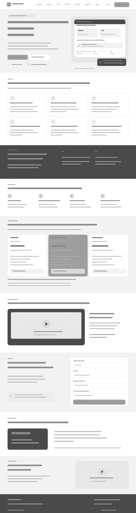
### 4.3.2. Landing Page Mock-up

El mock-up representa la versión de alta fidelidad de la Landing Page de CompuCare.

En este diseño se aplican los colores, tipografía, botones, tarjetas y demás elementos visuales definidos en las Style Guidelines.

El mock-up permite visualizar la apariencia final de la página antes de iniciar su implementación.

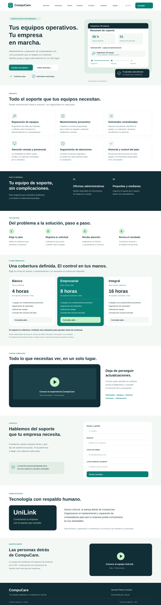
**Landing Page desplegada:**  
https://upc-pre-202620-1asi0730-8093-unilink.github.io/landing/
## 4.4. Web Applications UX/UI Design

El diseño UX/UI de la aplicación web de CompuCare busca simplificar la gestión del soporte técnico y permitir que cada usuario encuentre rápidamente las funcionalidades relacionadas con su rol.

La interfaz prioriza la claridad de la información, la visibilidad de las acciones principales y la comprensión del estado de cada solicitud de soporte.
### 4.4.1. Web Applications Wireframes

Los wireframes de la aplicación web representan las principales pantallas y permiten definir la distribución de los elementos antes de desarrollar la versión visual definitiva.

Las principales vistas consideradas son:

- Inicio de sesión.
- Dashboard.
- Registro de equipos.
- Lista de equipos.
- Registro de solicitud de soporte.
- Seguimiento de solicitudes.
- Información del técnico.
- Cotizaciones.
- Historial de atención.
- Perfil del usuario.

Estos wireframes permiten validar la disposición de botones, formularios, tarjetas y elementos de navegación antes de aplicar el diseño visual definitivo.
### Dashboard Wireframe

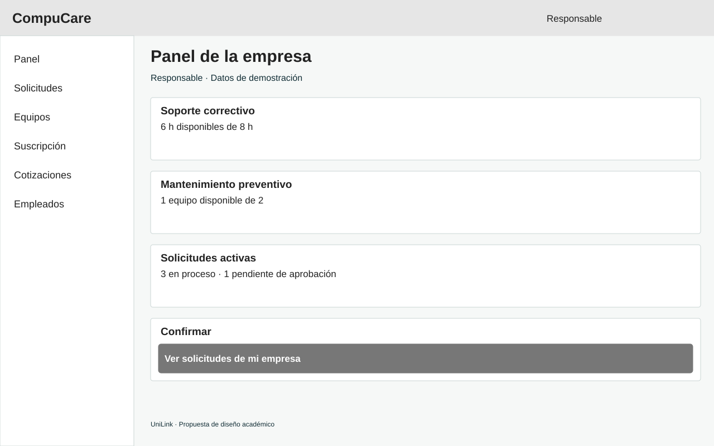

### Support Requests Wireframe

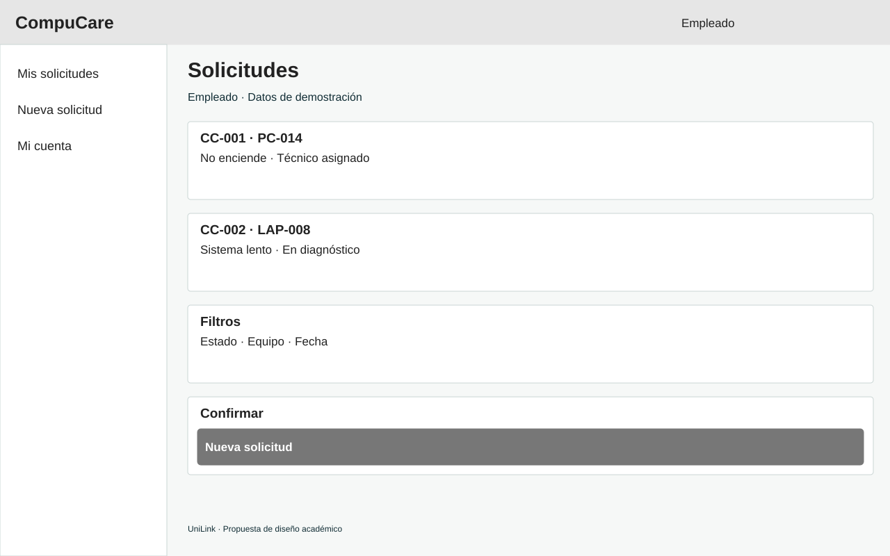

### New Support Request Wireframe

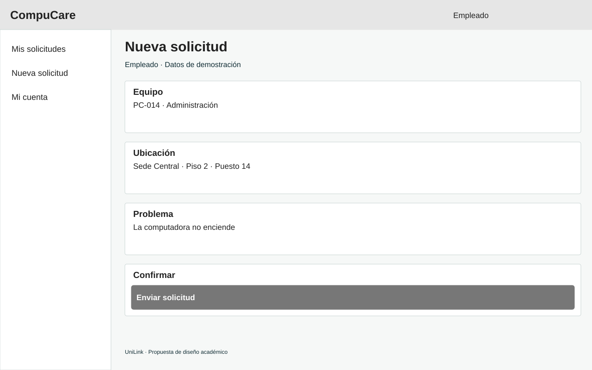

### Support Request Detail Wireframe

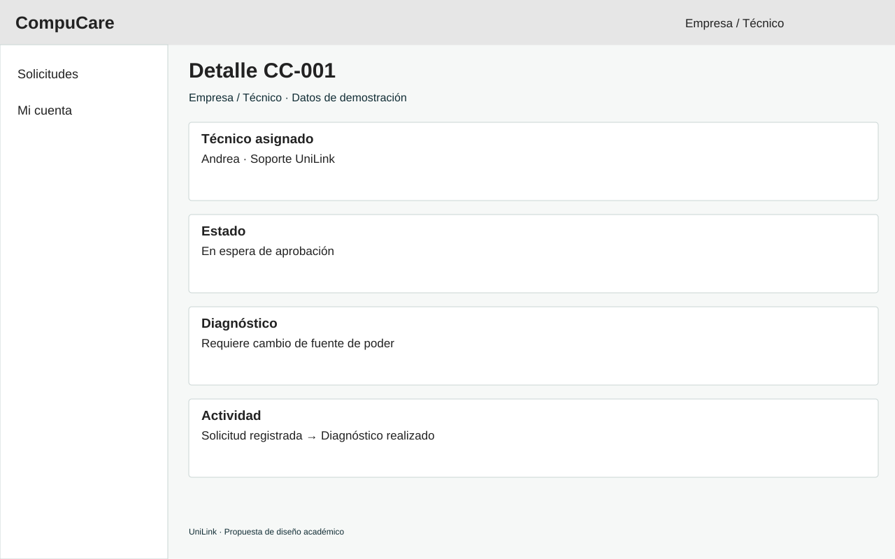
### 4.4.2. Web Applications Wireflow Diagrams

Los Wireflow Diagrams representan la relación entre las diferentes pantallas y las acciones que realiza el usuario para completar una tarea.

Uno de los principales flujos corresponde al registro de una solicitud de soporte:

**Dashboard → Mis equipos → Seleccionar equipo → Solicitar soporte → Describir problema → Confirmar solicitud → Seguimiento.**

También se considera el flujo de revisión de una atención:

**Solicitudes → Seleccionar solicitud → Revisar estado → Ver técnico asignado → Revisar diagnóstico → Finalizar atención.**

Estos diagramas permiten identificar la secuencia de navegación y detectar posibles puntos de confusión antes de la implementación.
#### Responsible User Wireflow

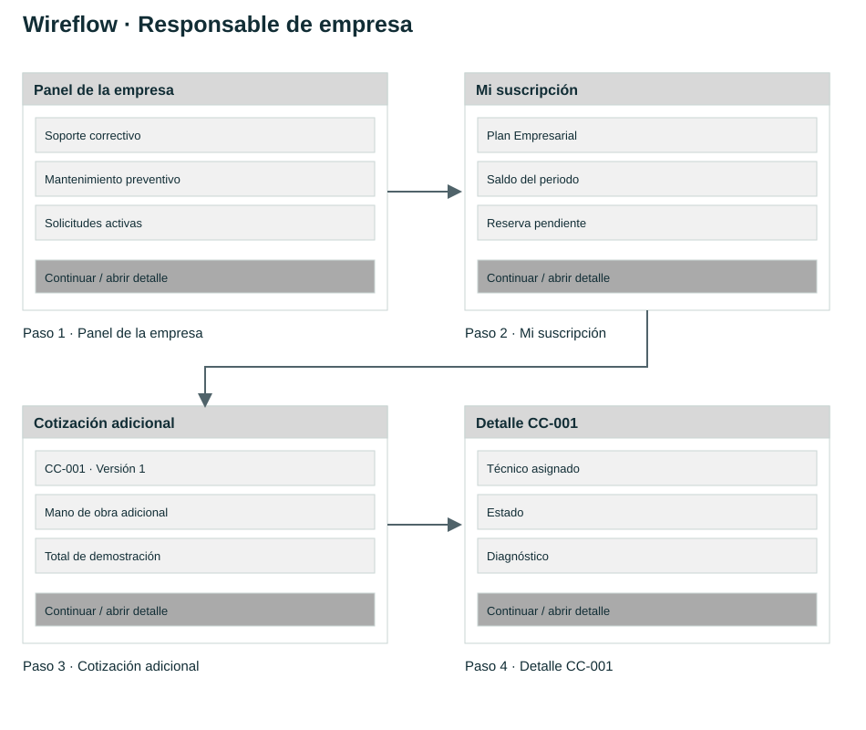

#### Employee Wireflow

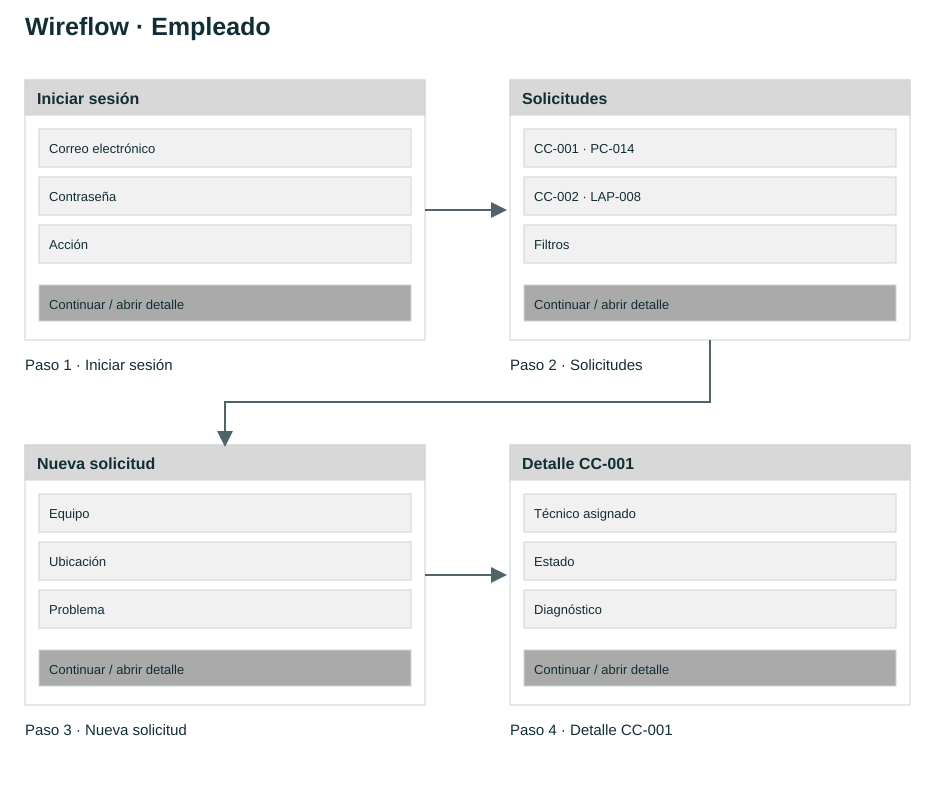

#### Technician Wireflow

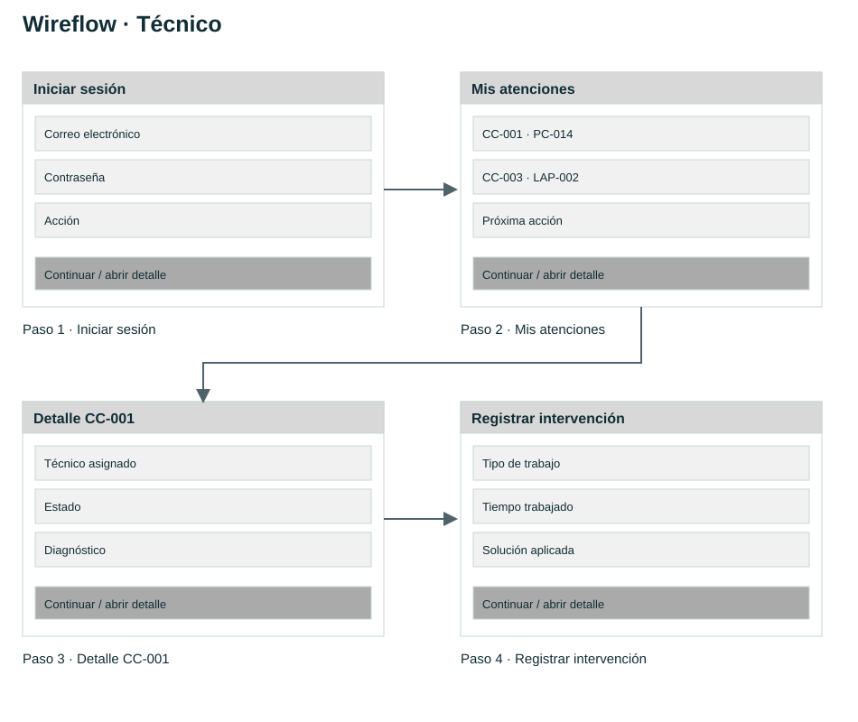

#### Administrator Wireflow

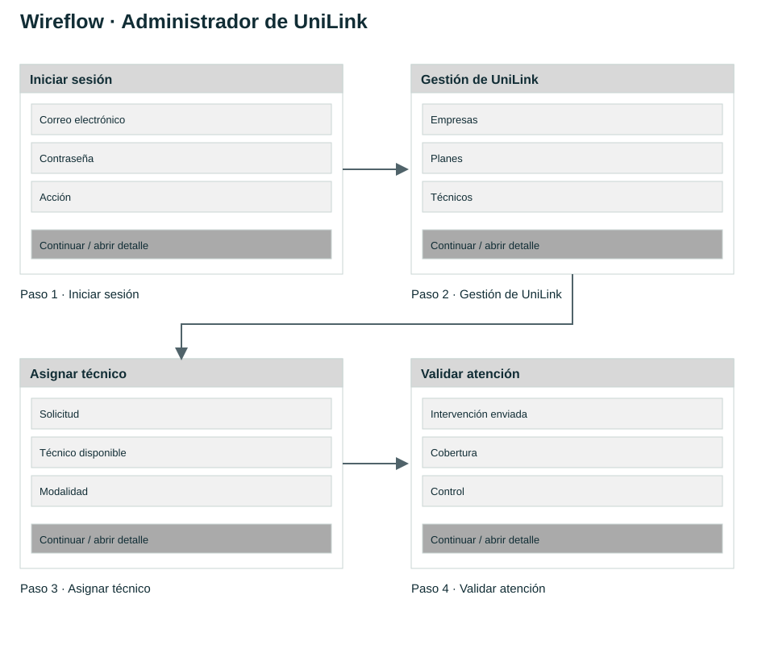

### 4.4.3. Web Applications Mock-ups

Los mock-ups muestran las pantallas de CompuCare en alta fidelidad e incorporan los elementos definidos en las Style Guidelines.

Estos diseños permiten visualizar cómo será la experiencia final antes de iniciar la implementación de la aplicación web.

Los mock-ups mantienen una estructura consistente en navegación, tipografía, botones, formularios, tarjetas y estados visuales.
#### Dashboard Mock-up

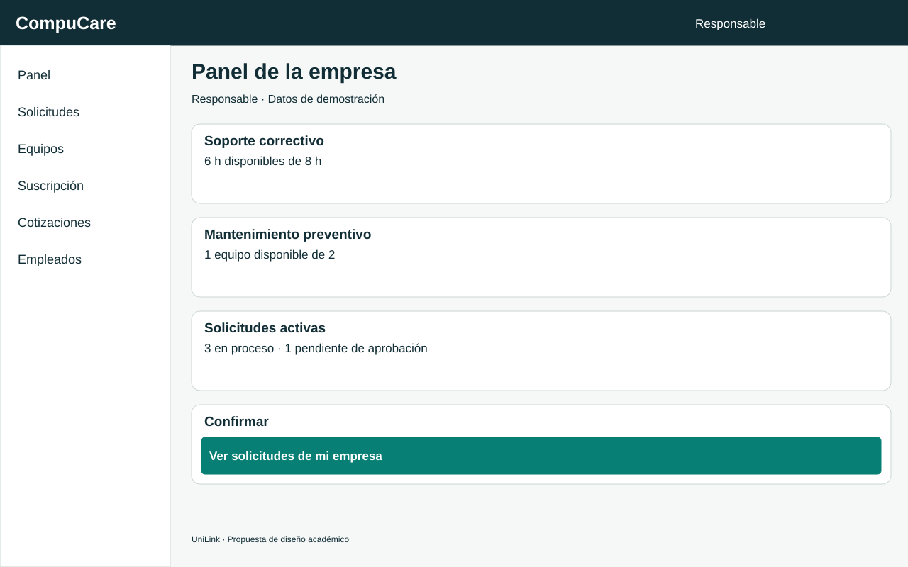

#### Support Requests Mock-up

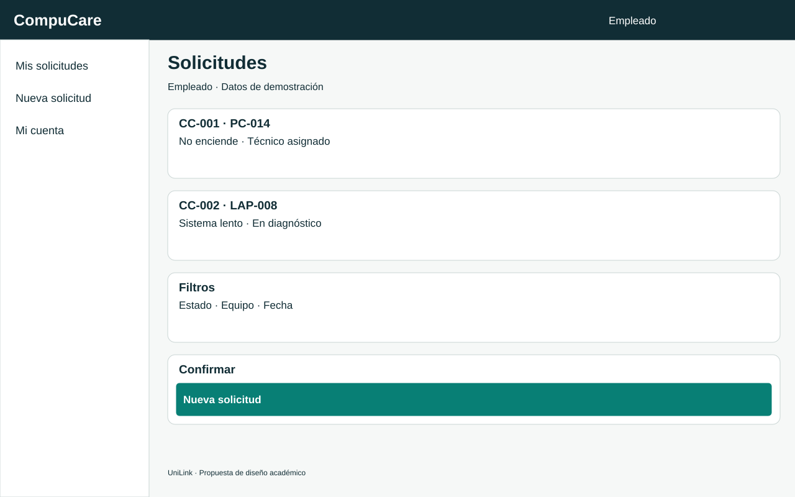

#### New Support Request Mock-up

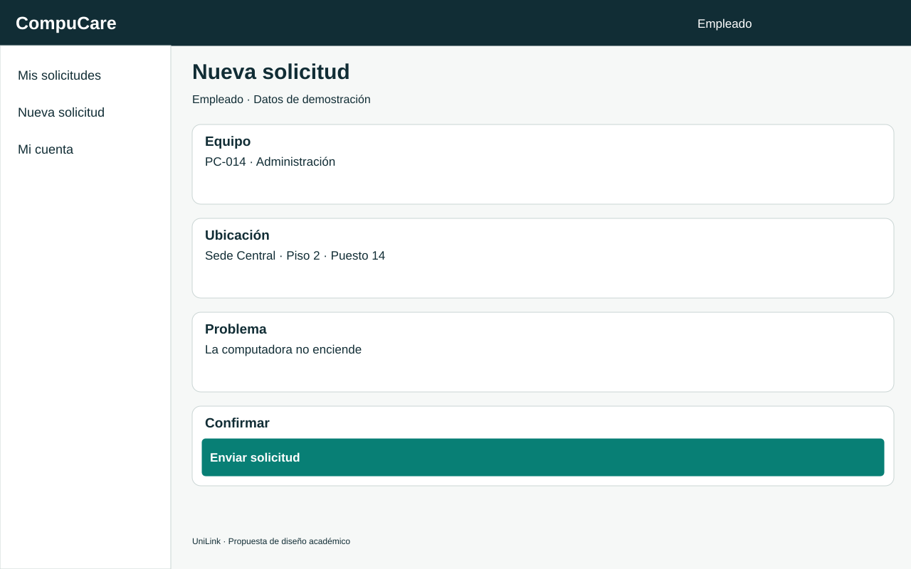

#### Support Request Detail Mock-up

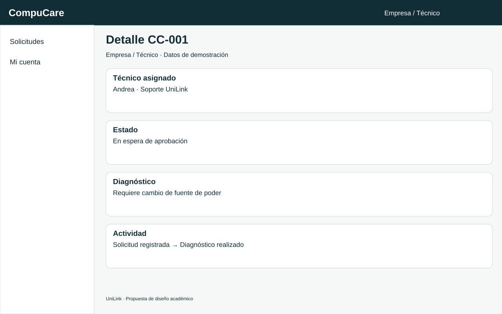
### 4.4.4. Web Applications User Flow Diagrams

Los User Flow Diagrams representan las decisiones que debe realizar el usuario para completar diferentes objetivos dentro de la plataforma.

Para solicitar soporte se considera el siguiente flujo:

**Inicio → Seleccionar equipo → Registrar problema → Validar información → Enviar solicitud → Confirmación → Seguimiento.**

Si la información ingresada es incorrecta o incompleta, el usuario permanece en el formulario hasta corregirla.

Otro flujo importante corresponde a la revisión de una solicitud:

**Inicio → Solicitudes → Seleccionar solicitud → Revisar estado → Revisar técnico asignado → Consultar diagnóstico → Finalizar proceso.**

Estos flujos ayudan a definir la lógica de navegación y las posibles decisiones del usuario.
#### Responsible User Flow

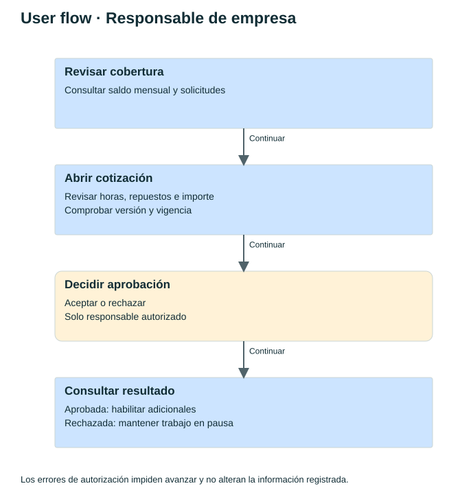

#### Employee User Flow

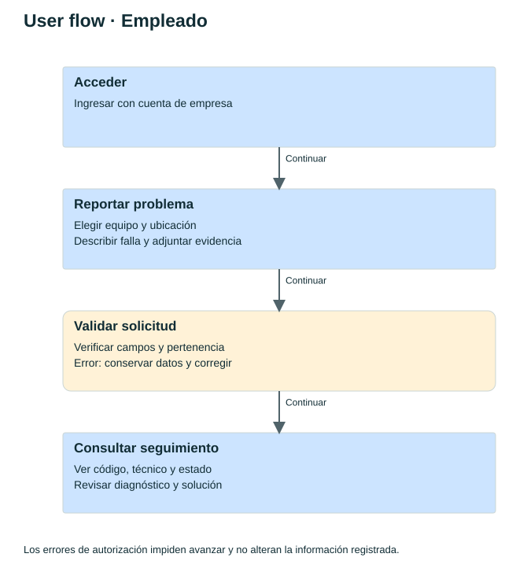

#### Technician User Flow

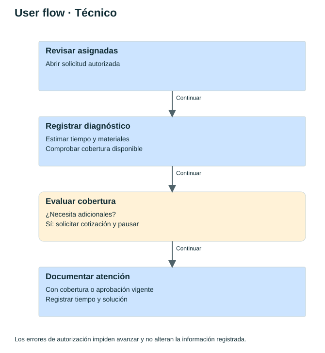

#### Administrator User Flow

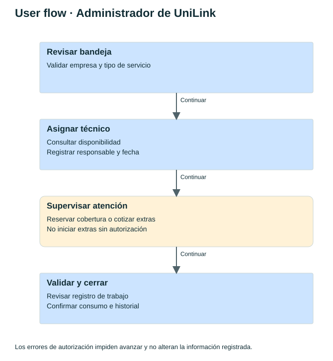
## 4.5. Web Applications Prototyping

El prototipo de CompuCare fue desarrollado a partir de los wireframes y mock-ups elaborados previamente.

Su objetivo es representar de manera interactiva la navegación entre las principales pantallas de la aplicación antes de iniciar su implementación funcional.

El prototipo permite validar aspectos como:

- Comprensión de la navegación.
- Distribución de la información.
- Visibilidad de las acciones principales.
- Secuencia de los formularios.
- Comprensión de los estados de las solicitudes.
- Acceso a las funcionalidades principales según el rol del usuario.

Entre los principales flujos representados se encuentran el registro de equipos, creación de solicitudes de soporte, seguimiento de atenciones, revisión de técnicos asignados y consulta de cotizaciones.

La validación del prototipo permite detectar problemas de navegación o usabilidad antes de iniciar el desarrollo de la aplicación web.
**Prototipo desplegado:**  
https://upc-pre-202620-1asi0730-8093-unilink.github.io/landing/

## 4.6. Domain-Driven Software Architecture
La arquitectura de CompuCare se organiza tomando como referencia los principios de Domain-Driven Design (DDD).

Este enfoque permite separar las responsabilidades del sistema según los principales procesos de negocio y facilita la organización de las funcionalidades de la plataforma.

Los principales dominios identificados son:

- Gestión de usuarios.
- Gestión de empresas.
- Gestión de equipos.
- Gestión de solicitudes de soporte.
- Gestión de técnicos.
- Gestión de suscripciones.
- Gestión de cotizaciones.
- Gestión del historial de atenciones.

Cada dominio agrupa las entidades, reglas y operaciones relacionadas con una responsabilidad específica del sistema.
### 4.6.1. Design-Level Event Storming

El Design-Level Event Storming permite representar los principales eventos, comandos y actores que intervienen en los procesos de CompuCare.

**Design-Level Event Storming: Companies and Equipment (BC02)**

A continuación, se detalla el flujo de eventos de este contexto, incluyendo las políticas de negocio aplicadas:

| Actor | Command (Azul) | Event (Naranja) | Policy (Morado / Lila) |
| :--- | :--- | :--- | :--- |
| Administrador MYPE | `RegisterCompany` | `CompanyRegistered` | **Política de Notificación de Bienvenida:** Siempre que una empresa es registrada, el sistema debe disparar un correo de bienvenida. |
| Administrador MYPE | `RegisterEquipment` | `EquipmentRegistered` | **Política de Límite de Inventario:** Siempre que se intente registrar un equipo, el sistema debe verificar que la cantidad actual no exceda el límite permitido por la suscripción activa. |
| Administrador MYPE | `UpdateEquipmentLocation` | `EquipmentLocationUpdated` | *(Sin política reactiva requerida)* |
| Empleado / Admin | `AddEmployee` | `EmployeeAdded` | **Política de Asignación Automática:** Si la empresa tiene dominio verificado, asociar automáticamente al empleado al *Tenant* de la *Company*. |

A partir de los flujos principales de la plataforma se identificaron los siguientes comandos y eventos:

| Comando | Evento |
|---|---|
| Registrar empresa | Empresa registrada |
| Registrar usuario | Usuario registrado |
| Registrar equipo | Equipo registrado |
| Crear solicitud | Solicitud registrada |
| Asignar técnico | Técnico asignado |
| Registrar diagnóstico | Diagnóstico registrado |
| Generar cotización | Cotización generada |
| Aprobar cotización | Cotización aprobada |
| Actualizar estado | Estado de solicitud actualizado |
| Finalizar atención | Atención finalizada |

Por ejemplo, cuando un usuario registra una solicitud de soporte, el sistema genera el evento **Solicitud registrada**. Posteriormente, la asignación de un técnico genera el evento **Técnico asignado**.

Este modelado permite comprender la secuencia de acciones del sistema y las responsabilidades asociadas a cada proceso.
#### Company Registration Event Storming

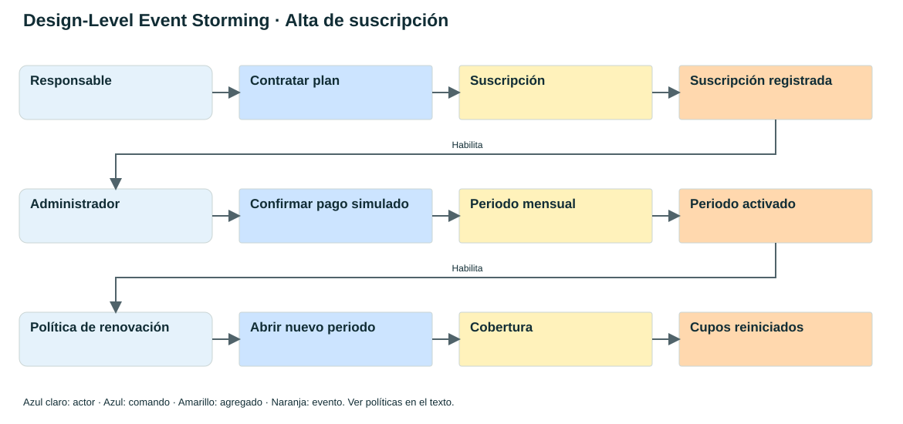

#### Support Attention Event Storming

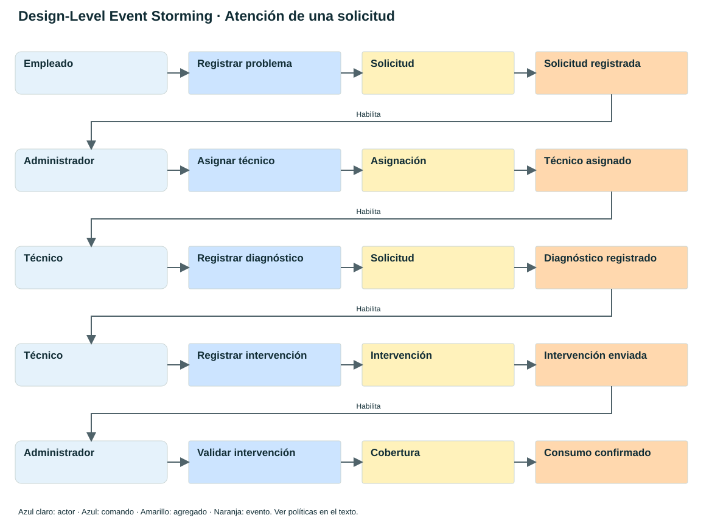

#### Additional Service Event Storming

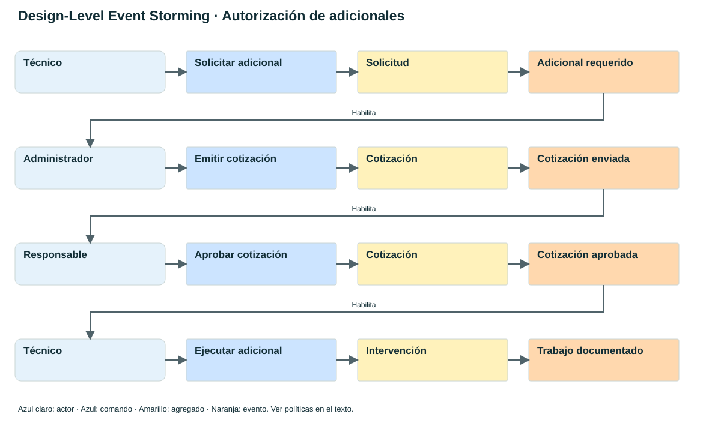

### 4.6.2. Software Architecture Context Diagram
El Software Architecture Context Diagram representa a CompuCare como el sistema central y muestra su interacción con los principales actores externos.

Los actores identificados son:

- **Cliente empresarial:** administra la información de su empresa y consulta los servicios contratados.
- **Empleado:** registra solicitudes de soporte relacionadas con los equipos que utiliza.
- **Técnico:** revisa solicitudes asignadas, registra diagnósticos y actualiza el estado de las atenciones.
- **Administrador de CompuCare:** gestiona usuarios, técnicos, empresas, planes y operaciones generales del sistema.

Todos estos actores interactúan con la plataforma web de CompuCare para realizar las operaciones correspondientes a su rol.
The following context diagram represents the main external actors and systems that interact with CompuCare.

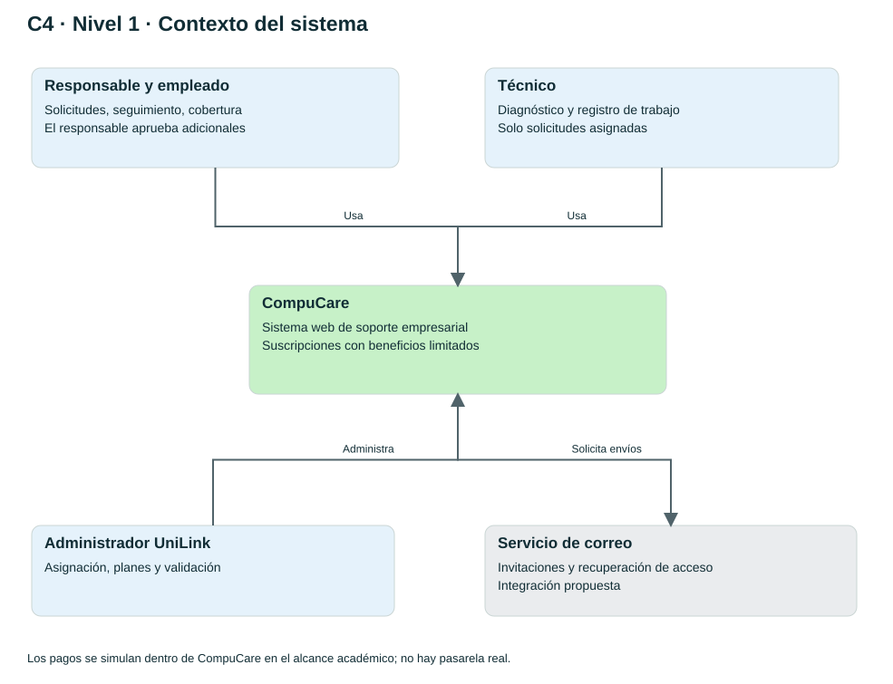
### 4.6.3. Software Architecture Container Diagrams

El Container Diagram divide la solución CompuCare en sus principales componentes tecnológicos.

Los contenedores considerados son:

- **Landing Page:** presenta la propuesta de valor, beneficios, funcionamiento y planes de CompuCare.
- **Web Application:** interfaz principal utilizada por clientes, empleados, técnicos y administradores.
- **Backend / REST API:** procesa las reglas de negocio y las solicitudes enviadas desde la aplicación web.
- **Database:** almacena la información persistente relacionada con usuarios, empresas, equipos, solicitudes, técnicos y suscripciones.

La Web Application se comunica con el Backend mediante solicitudes HTTP. El Backend procesa la lógica de negocio y consulta o modifica la información almacenada en la base de datos.

Esta separación facilita el mantenimiento, escalabilidad y evolución de la plataforma.
The following container diagram shows the main software containers that compose the CompuCare solution and how they interact with each other.


### 4.6.4. Software Architecture Components Diagrams

El Components Diagram representa con mayor detalle la organización interna del Backend de CompuCare.

Entre los principales componentes se consideran:

- **Controllers:** reciben las solicitudes provenientes de la aplicación web.
- **Application Services:** coordinan los casos de uso del sistema.
- **Domain Services:** contienen reglas relacionadas con el negocio.
- **Repositories:** gestionan el acceso a la información almacenada.
- **Entities:** representan los principales objetos del dominio.
- **Persistence:** permite almacenar y recuperar información de la base de datos.

Por ejemplo, una solicitud para registrar un nuevo soporte es recibida por un Controller, procesada por el servicio correspondiente y almacenada mediante un Repository.

Esta organización permite mantener separadas las responsabilidades del sistema y reducir el acoplamiento entre sus componentes.
The following component diagrams show the internal organization of the main CompuCare application components.

**Components Diagram: Companies and Equipment (BC02)**

La arquitectura interna del backend para este Bounded Context se ha alineado estrictamente a los principios de Domain-Driven Design (DDD), dividiendo los componentes en las siguientes 4 capas lógicas:

1. **Interfaces / Presentation Layer:** Contiene los controladores `CompanyController` y `EquipmentController`, encargados de recibir las peticiones HTTP desde la Web App (SPA).
2. **Application Layer:** Contiene los servicios de orquestación como `CompanyCommandService` y `EquipmentQueryService`, que coordinan los casos de uso sin contener lógica de negocio.
3. **Domain Layer:** Contiene el núcleo del negocio con las entidades `Company`, `Equipment` y `Employee`, además de las interfaces de los repositorios (`ICompanyRepository`).
4. **Infrastructure Layer:** Contiene los adaptadores tecnológicos como `CompanyRepository` y `EquipmentRepository`, encargados de la persistencia de datos mediante `DatabaseContext`.

#### Operations Components


#### Subscription Components


### Companies and Equipment


## 4.7. Software Object-Oriented Design
El diseño orientado a objetos de CompuCare representa las principales entidades del dominio y las relaciones existentes entre ellas.

Este enfoque permite organizar la lógica del sistema mediante clases con responsabilidades claramente definidas, facilitando el mantenimiento, reutilización y extensión del software.

Las principales entidades identificadas están relacionadas con usuarios, empresas, equipos, solicitudes de soporte, técnicos, suscripciones, planes, cotizaciones e historial de servicios.

### 4.7.1. Class Diagrams

El Class Diagram representa la estructura principal del dominio de CompuCare.

Entre las clases consideradas se encuentran:

- **User:** representa a los usuarios registrados en la plataforma.
- **Company:** representa a las empresas que utilizan el servicio.
- **Equipment:** representa los equipos informáticos registrados por una empresa.
- **SupportRequest:** representa una solicitud de soporte técnico.
- **Technician:** representa al técnico encargado de una atención.
- **Subscription:** representa la suscripción activa de una empresa.
- **Plan:** representa los diferentes planes disponibles.
- **Quote:** representa una cotización adicional relacionada con una atención.
- **ServiceHistory:** almacena el historial de servicios realizados sobre un equipo.

Algunas relaciones principales son:

- Una empresa puede tener varios usuarios.
- Una empresa puede registrar varios equipos.
- Un equipo puede tener múltiples solicitudes de soporte.
- Una solicitud puede estar asociada a un técnico.
- Una empresa puede contar con una suscripción activa.
- Una solicitud puede generar una cotización.
- Cada atención finalizada puede formar parte del historial del equipo.

El diagrama permite visualizar las relaciones y responsabilidades principales antes de implementar las clases del sistema.

**Software Object-Oriented Design: Companies and Equipment (BC02)**

En la capa de dominio de este contexto, se han definido las siguientes entidades principales en singular y utilizando identificadores numéricos (`int`) por eficiencia en base de datos relacional:

* **Entidad: `Company`**
  * `Id: int` *(PK Autoincremental)*
  * `Ruc: string`
  * `Name: string`
  * `Address: string`

* **Entidad: `Equipment`**
  * `Id: int` *(PK Autoincremental)*
  * `CompanyId: int` *(Foreign Key a Company)*
  * `SerialNumber: string`
  * `Location: string`

* **Entidad: `Employee`**
  * `Id: int` *(PK Autoincremental)*
  * `CompanyId: int` *(Foreign Key a Company)*
  * `FullName: string`
  * `CorporateEmail: string`

**Relaciones Estructurales del Contexto:**
* Una `Company` puede tener registrados múltiples `Equipment` (Relación 1 a N).
* Una `Company` puede tener múltiples `Employee` asociados (Relación 1 a N).
* Tanto `Equipment` como `Employee` tienen una dependencia estricta de existencia hacia una `Company` (Composición).
  
#### Identity and Access


#### Companies and Equipment


#### Subscriptions and Coverage


#### Service Requests


#### Quotations and Payments


## 4.8. Database Design

El diseño de la base de datos de CompuCare permite almacenar de forma estructurada la información necesaria para el funcionamiento de la plataforma.

Se utiliza un modelo relacional en el que las entidades principales se representan mediante tablas vinculadas por claves primarias y claves foráneas.

El diseño busca evitar duplicidad de información, mantener la integridad de los datos y facilitar las consultas relacionadas con empresas, equipos, solicitudes y servicios.
### 4.8.1. Database Diagrams

El Database Diagram representa las principales tablas y relaciones de la plataforma CompuCare.

Las tablas principales consideradas son:

- **Users**
- **Companies**
- **Equipments**
- **SupportRequests**
- **Technicians**
- **Subscriptions**
- **Plans**
- **Quotes**
- **ServiceHistories**

Entre las relaciones principales se consideran:

- Una empresa puede tener múltiples usuarios.
- Una empresa puede registrar múltiples equipos.
- Cada equipo pertenece a una empresa.
- Un equipo puede tener múltiples solicitudes de soporte.
- Cada solicitud pertenece a un equipo.
- Una solicitud puede tener un técnico asignado.
- Una empresa puede tener una suscripción.
- Una suscripción se encuentra asociada a un plan.
- Una solicitud puede generar una o más cotizaciones.
- Las atenciones realizadas forman parte del historial de servicio de cada equipo.

El uso de claves foráneas permite mantener la relación entre las tablas y asegurar la consistencia de la información almacenada.
#### Identity and Access Database

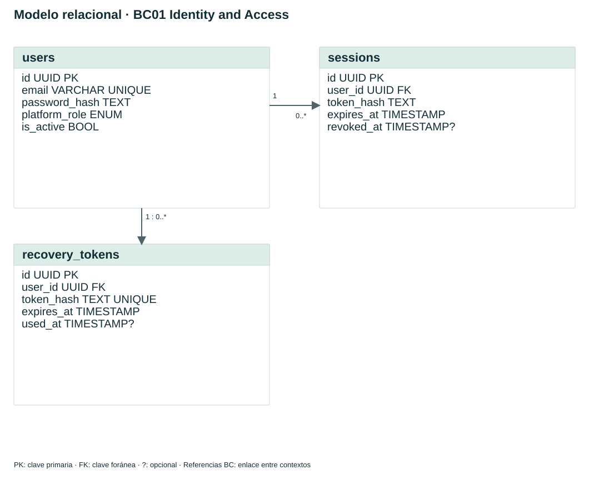

#### Companies and Equipment Database

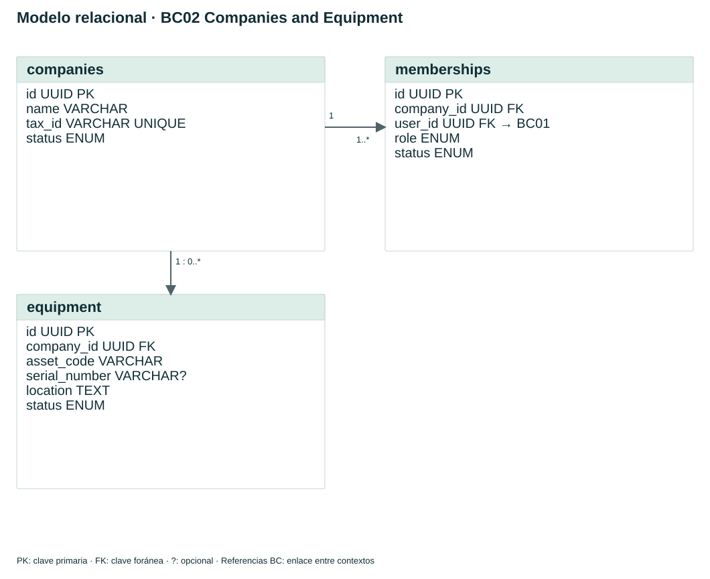

#### Subscriptions and Coverage Database

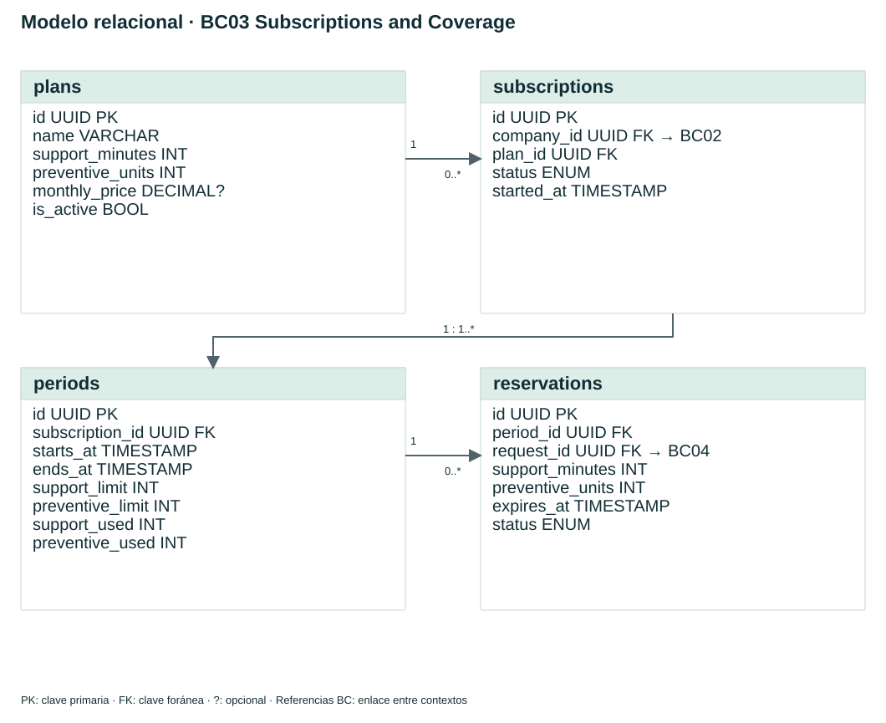

#### Service Requests Database

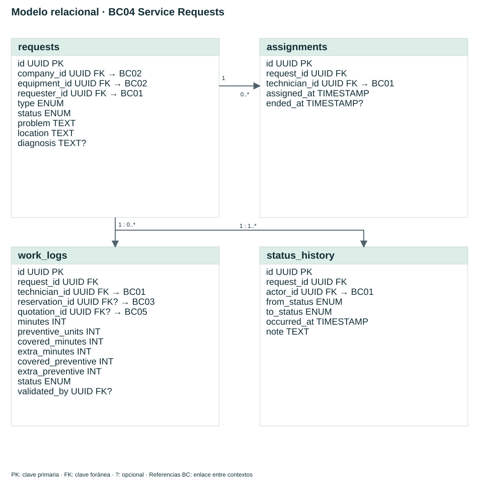

#### Quotations and Payments Database

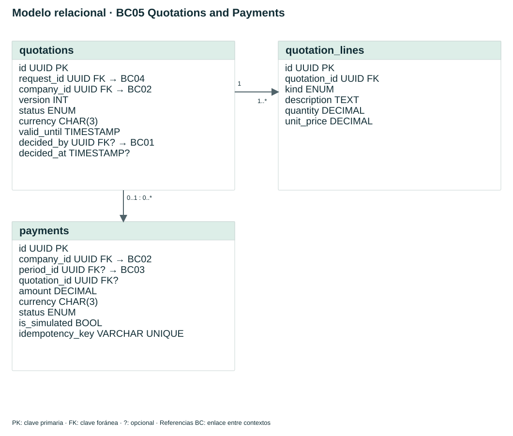

# Capítulo V: Product Implementation, Validation & Deployment

### 5.1. Software Configuration Management
La Gestión de Configuración de Software (SCM) comprende las prácticas utilizadas para identificar, controlar, versionar y mantener los diferentes componentes de software de **CompuCare** durante el ciclo de vida del proyecto. 

#### 5.1.1. Software Development Environment Configuration
Para el desarrollo de la solución se establecieron las siguientes herramientas orientadas a las actividades de gestión, diseño, desarrollo y despliegue:

| Herramienta / Producto | Propósito en el Proyecto |
| :--- | :--- |
| **UXPressia** | *Requirements Management & UX:* Elaboración de User Personas, Empathy Maps, Journey Maps e Impact Maps. |
| **Figma** | *Product UX/UI Design:* Creación de Wireframes, Mock-ups, Design Systems y prototipado interactivo. |
| **LucidChart / PlantUML** | *Software Architecture:* Elaboración de diagramas UML, C4 Model y Entity-Relationship Diagrams. |
| **YouTrack / Trello** | *Project Management:* Gestión del Product Backlog, Sprint Backlog y control de tareas (Kanban). |
| **GitHub** | *Source Code Management:* Alojamiento en la nube y control de versiones colaborativo. |
| **JetBrains Rider** | *Software Development:* IDE principal obligatorio del curso para el desarrollo de Backend y Frontend. |
| **ASP.NET Core & C#** | *Backend Development:* Framework y lenguaje de programación para el desarrollo del RESTful API. |
| **Vue.js & TypeScript** | *Frontend Development:* Framework utilizado para la Web Application (SPA) con PrimeVue. |
| **Swagger UI (OpenAPI)** | *Software Documentation:* Herramienta integrada en ASP.NET Core para la documentación automatizada de Endpoints. |

#### 5.1.2. Source Code Management
El equipo utiliza **GitHub** como plataforma de control de versiones. El proyecto mantiene repositorios independientes para los componentes principales:
*   **Landing Page:** (https://github.com/upc-pre-202620-1asi0730-8093-UniLink/landing)
*   **Web Application (Frontend):** `*(Placeholder: [URL del repositorio])*`
*   **RESTful API (Backend):** `*(Placeholder: [URL del repositorio])*`

**GitFlow Workflow:** Para gestionar la evolución del código sin interrupciones, aplicamos GitFlow:
*   `main`: Rama base que refleja el estado de producción.
*   `develop`: Rama de integración de los cambios durante el desarrollo.
*   `feature/*`: Ramas temporales para desarrollar funcionalidades aisladas (ej. `feature/ticket-registration`).

**Conventional Commits & Semantic Versioning:** Todo el equipo utiliza *Conventional Commits* (`feat:`, `fix:`, `docs:`, `style:`) en los mensajes de subida. Los lanzamientos en `main` se etiquetan bajo *Semantic Versioning*.

#### 5.1.3. Source Code Style Guide & Conventions
Para mantener un código legible y mantenible, aplicamos convenciones estrictas:
*   **C# & ASP.NET Core:** Se siguen las *C# Coding Conventions* y *Microsoft ASP.NET Core Coding Guidelines*[cite: 6]. Uso de PascalCase para clases y métodos, camelCase para variables locales.
*   **Vue.js & JavaScript/TypeScript:** Se sigue la *Vue Style Guide* y *Google JavaScript Style Guide*.
*   **HTML & CSS:** Se aplican los estándares de W3C, nombres de clases descriptivos y semántica web enfocada en accesibilidad (*a11y*).

#### 5.1.4. Software Deployment Configuration
El despliegue de CompuCare está automatizado de la siguiente manera:
1.  **Landing Page & Frontend Web App:** Desplegados en **Vercel** o **Netlify**. Conectado directamente a la rama `main` de GitHub para habilitar Integración Continua (CI/CD).
2.  **RESTful API & Base de Datos:** Backend publicado en **Azure** (o Render) utilizando contenedores. La base de datos relacional (MySQL/PostgreSQL) está alojada en la nube y conectada mediante variables de entorno seguras.

---

### 5.2. Landing Page, Services & Applications Implementation
Esta sección evidencia el trabajo iterativo e incremental del equipo organizado mediante la metodología Scrum.

#### 5.2.1. Sprint 1
El objetivo del Sprint 1 fue la construcción y despliegue del Landing Page para iniciar la validación comercial del modelo de suscripción, así como la configuración inicial de la arquitectura del Backend.

##### 5.2.1.1. Sprint Planning 1

| Sprint # | Sprint 1 |
| :--- | :--- |
| **Sprint Planning Background** | Durante esta reunión, el equipo revisó el Product Backlog y priorizó las historias de usuario relacionadas a la propuesta de valor y planes de suscripción. |
| **Date** | **2026-08-22** |
| **Time** | **09:30 AM** |
| **Location** | **Reunión Presencial UPC Monterrico** |
| **Prepared By** | Miranda Romero, Sergio Luis (Team Leader) |
| **Attendees (to planning meeting)** | Ramos Aguirre, Aldair / Condezo Pacheco, Fernando / Okuhama Diaz, Matthew / Miranda Romero, Sergio / Yauri Barrios, Antony |
| **Sprint 0 Review Summary** | N/A (Primer sprint). Se definieron los lineamientos iniciales de arquitectura en JetBrains Rider y configuración de repositorios. |
| **Sprint 0 Retrospective Summary** | N/A. Se establecieron acuerdos de comunicación interna y revisión de código (Pull Requests). |
| **Sprint 1 Goal** | **Our focus is on** launching the CompuCare Landing Page. <br>**We believe it delivers** a clear understanding of our B2B value proposition to SME administrators.<br>**This will be confirmed when** visitors can see our subscription plans and interact with the contact forms. |
| **Sprint 1 Velocity** | 15 Story Points |
| **Sum of Story Points** | 12 Story Points |

##### 5.2.1.2. Aspect Leaders and Collaborators
| Team Member (Last Name, First Name) | GitHub Username | Aspect: Landing Page UI/UX Leader (L) / Collaborator (C) | Aspect: Env & Repo Setup Leader (L) / Collaborator (C) | Aspect: API Setup Leader (L) / Collaborator (C) |
| :--- | :--- | :--- | :--- | :--- |
| Miranda Romero, Sergio Luis | @SergioM1r | L | C | C |
| Condezo Pacheco, Fernando André | @LEFEROX | C | L | C |
| Okuhama Diaz, Matthew Shinko | @okudiaz124 | C | C | L |
| Ramos Aguirre, Aldair Joaquin | @AldairRamos13 | C | C | C |
| Yauri Barrios, Antony David | @AntonyYauri | C | C | C |

##### 5.2.1.3. Sprint Backlog 1
| Sprint # | Sprint 1 | | | | | |
| :--- | :--- | :--- | :--- | :--- | :--- | :--- |
| **User Story Id** | **Story Title** | **Task Id** | **Task Title** | **Task Description** | **Estimation (Hours)** | **Assigned To** |
| US01 | Visualización de Planes | T01.1 | Maquetar HTML5/CSS3 | Estructurar Hero Section y Tabla de Planes. | 4 | Okuhama Diaz, Matthew |
| US01 | Visualización de Planes | T01.2 | Implementar Responsividad | Adaptar vistas a Mobile y Tablets. | 3 | Miranda Romero, Sergio |
| TSK01 | Configuración Backend | T00.1 | Init ASP.NET Core Project | Configurar arquitectura DDD en Rider. | 3 | Condezo Pacheco, Fernando |

##### 5.2.1.4. Development Evidence for Sprint Review
| Repository | Branch | Commit Id | Commit Message | Commit Message Body | Commited on (Date) |
| :--- | :--- | :--- | :--- | :--- | :--- |
| compucare-landing | feature/hero-section | 1a2b3c4 | feat: add hero section and plans | Estructura inicial del Landing y planes. | 2026-09-20 |
| compucare-api | chore/init-project | 5d6e7f8 | chore: init asp.net core web api | Estructura DDD creada en JetBrains Rider. | 2026-09-20 |

##### 5.2.1.5. Execution Evidence for Sprint Review
En este Sprint se logró una versión funcional y desplegada del Landing Page.
*   **Video del Landing Page:** `*(Placeholder: [Enlace a Microsoft Stream])*`.
*   *(Placeholder: [Insertar Capturas de pantalla del Landing Page funcionando en el navegador])*

##### 5.2.1.6. Services Documentation Evidence for Sprint Review
Se configuró **Swagger/OpenAPI** en el proyecto ASP.NET Core. El endpoint de estado de salud está documentado.
*   *(Placeholder: [Insertar Captura de pantalla de Swagger UI localhost])*

##### 5.2.1.7. Software Deployment Evidence for Sprint Review
El Landing Page se configuró para integración continua utilizando Vercel.
*   *(Placeholder: [Insertar Captura de Vercel mostrando el status "Ready" y el dominio en verde])*

##### 5.2.1.8. Team Collaboration Insights during Sprint
*(Placeholder: Insertar captura de los "Insights / Contributors" de GitHub mostrando el gráfico de commits del equipo)*.

---

#### 5.2.2. Sprint 2
El objetivo del Sprint 2 se centró en la Web Application (Frontend en Vue) y el desarrollo de endpoints críticos en ASP.NET Core, específicamente el registro de Tickets de soporte por parte del empleado y el Dashboard de saldo de horas para el administrador.

##### 5.2.2.1. Sprint Planning 2
| Sprint # | Sprint 2 |
| :--- | :--- |
| **Sprint Planning Background** | El equipo priorizó las historias de usuario orientadas al Core Domain de la aplicación: el registro de solicitudes y la gestión de horas. |
| **Date** | **2026-09-05** |
| **Time** | **09:30 AM** |
| **Location** | **Reunión presencial Upc Monterrico** |
| **Prepared By** | Miranda Romero, Sergio Luis (Team Leader) |
| **Attendees** | Ramos Aguirre, Aldair / Condezo Pacheco, Fernando / Okuhama Diaz, Matthew / Miranda Romero, Sergio / Yauri Barrios, Antony |
| **Sprint 1 Review Summary** | El Landing Page fue desplegado con éxito y validado comercialmente. El backend base está operativo en Rider. |
| **Sprint 1 Retrospective Summary** | Se acordó realizar Code Reviews más estrictos antes de hacer merge a `develop`. |
| **Sprint 2 Goal** | **Our focus is on** delivering the core ticketing and dashboard modules.<br>**We believe it delivers** autonomy for employees to report issues and control for administrators over their subscription balance.<br>**This will be confirmed when** an employee can create a ticket via the Vue App and the API stores it in the database. |
| **Sprint 2 Velocity** | 18 Story Points |
| **Sum of Story Points** | 16 Story Points |

##### 5.2.2.2. Aspect Leaders and Collaborators
| Team Member (Last Name, First Name) | GitHub Username | Aspect: Vue Frontend Leader (L) / Collaborator (C) | Aspect: ASP.NET Core API Leader (L) / Collaborator (C) | Aspect: Database Design Leader (L) / Collaborator (C) |
| :--- | :--- | :--- | :--- | :--- |
| Miranda Romero, Sergio Luis | @SergioM1r | C | L | C |
| Condezo Pacheco, Fernando André | @LEFEROX | C | C | L |
| Okuhama Diaz, Matthew Shinko | @okudiaz124 | L | C | C |
| Ramos Aguirre, Aldair Joaquin | @AldairRamos13 | C | C | C |
| Yauri Barrios, Antony David | @AntonyYauri | C | C | C |

##### 5.2.2.3. Sprint Backlog 2
| Sprint # | Sprint 2 | | | | | |
| :--- | :--- | :--- | :--- | :--- | :--- | :--- |
| **User Story Id** | **Story Title** | **Task Id** | **Task Title** | **Task Description** | **Estimation (Hours)** | **Assigned To** |
| US02 | Registro de Solicitud | T02.1 | Implementar Formulario Vue | Crear componente de Ticket con PrimeVue. | 5 | Yauri Barrios, Antony |
| US05 | Endpoint Creación Ticket | T05.1 | Crear TicketController C# | Lógica de inserción en Base de Datos. | 4 | Condezo Pacheco, Fernando |
| US03 | Dashboard de Horas | T03.1 | Implementar Vista Admin | Mostrar consumo de bolsa de horas. | 5 | Miranda Romero, Sergio |

##### 5.2.2.4. Development Evidence for Sprint Review
*(Placeholder: Tabla de Commits de GitHub de la rama Frontend y Backend API)*.

##### 5.2.2.5. Execution Evidence for Sprint Review
*   **Video de la Aplicación Web (Tickets y Dashboard):** `*(Placeholder: [Enlace a Microsoft Stream])*`.
*   *(Placeholder: [Insertar Capturas de la Web App en Vue mostrando el Dashboard y Formulario de Tickets])*

##### 5.2.2.6. Services Documentation Evidence for Sprint Review
Se documentaron los endpoints de Tickets utilizando **OpenAPI (Swagger)**.
*   *(Placeholder: [Insertar Captura de Swagger UI mostrando el método POST `/api/v1/tickets` con su request body y response])*

##### 5.2.2.7. Software Deployment Evidence for Sprint Review
La Web App se desplegó en la nube y el Backend ASP.NET Core fue configurado para producción.
*   *(Placeholder: [Captura del panel de control de Azure/Render/Vercel de la App y el API])*

##### 5.2.2.8. Team Collaboration Insights during Sprint
*(Placeholder: Captura de pantalla de GitHub "Insights / Network" o "Contributors" del Sprint 2)*.

---

### 5.3. Validation Interviews
En esta sección se documenta el proceso de validación final con usuarios reales de nuestros dos segmentos objetivos: Responsables de la empresa y Empleados.

#### 5.3.1. Diseño de Entrevistas
El objetivo fue que los usuarios interactuaran con el Landing Page y la Web Application para identificar fricciones operativas.
*   **Tarea para Administradores:** Ingresar al sistema, revisar su bolsa de horas actual, ver una cotización pendiente de un repuesto y aprobarla.
*   **Tarea para Empleados:** Ingresar a la plataforma y reportar un problema con su computadora indicando la ubicación de su escritorio.

#### 5.3.2. Registro de Entrevistas

1. **Entrevista 1 (Técnica de Soporte - Hikari):** (https://drive.google.com/file/d/168aU_BrOYqF49c9xDDXBlJQ7F55Ue7dY/view?usp=drive_link)
   * **Resumen de Validación:** La usuaria validó positivamente la necesidad de CompuCare. Afirmó que una plataforma donde los clientes reporten la falla exacta y donde ella pueda registrar el diagnóstico, el tiempo trabajado y los repuestos, le ahorraría mucho tiempo. Destacó como crucial que la plataforma permita al cliente (Responsable de la empresa) aprobar las cotizaciones adicionales de manera formal, evitando malentendidos sobre los precios y agilizando la compra de componentes.
     
#### 5.3.3. Evaluaciones según heurísticas

Para evaluar la usabilidad de la plataforma Web de CompuCare durante las entrevistas de validación, hemos aplicado las 10 Heurísticas de Jakob Nielsen. Los problemas encontrados fueron clasificados según la siguiente escala de severidad:
* **0:** No es un problema de usabilidad.
* **1:** Problema cosmético (se soluciona si hay tiempo).
* **2:** Problema menor (baja prioridad).
* **3:** Problema mayor (alta prioridad, debe solucionarse).
* **4:** Catástrofe de usabilidad (imperativo solucionarlo antes del lanzamiento).

**Tabla de Evaluación de User Experience según Heurísticas (Anexo D):**

| ID | Problema de Usabilidad Encontrado (Fricción) | Heurística Violada | Nivel de Severidad (0-4) | Solución Propuesta (Acción a tomar) |
| :---: | :--- | :--- | :---: | :--- |
| **01** | Tras registrar un nuevo ticket de soporte, la pantalla se recargaba sin mostrar un mensaje claro de éxito, dejando al empleado con la duda de si se envió. | #1: Visibilidad del estado del sistema. | **3** | Implementar un componente *Toast* o *Snackbar* (Notificación flotante) de color verde que confirme: "Ticket #1042 creado con éxito". |
| **02** | Al momento de crear un ticket, si el empleado se equivocaba de equipo, no tenía un botón visible para "Cancelar" o retroceder sin perder todo el texto redactado. | #3: Control y libertad del usuario. | **3** | Agregar un botón secundario de "Cancelar" o "Descartar cambios" junto al botón principal de "Enviar Ticket". |
| **03** | En el dashboard del Administrador, el botón para "Aprobar" o "Rechazar" una cotización adicional era muy pequeño y del mismo color que el texto normal. | #8: Diseño estético y minimalista. | **2** | Cambiar el diseño de las acciones de cotización usando botones primarios (Verde para Aprobar, Rojo para Rechazar) según el *Style Guide*. |
| **04** | Algunos mensajes de error del formulario de tickets mostraban códigos técnicos (ej. "Error 400: Bad Request") en lugar de lenguaje claro. | #2: Relación entre el sistema y el mundo real. | **2** | Mapear las respuestas del API para mostrar alertas amigables al usuario final, como: "Por favor, completa la ubicación del equipo". |
| **05** | Los administradores tenían que recordar el número de serie exacto de la computadora para buscar su historial, lo cual era difícil de memorizar. | #6: Reconocimiento antes que recuerdo. | **2** | Implementar un menú desplegable con los nombres asignados a los equipos (ej. "Laptop de Camila - Diseño") además del número de serie. |
---

### 5.4. Video About-the-Product
El video **About-the-Product** es una presentación comercial dirigida a nuestros clientes objetivo. Explicamos de manera dinámica la propuesta de valor de CompuCare, mostrando escenarios reales donde las computadoras fallan y cómo nuestra plataforma soluciona el problema.

*   **Enlace YouTube/Stream:** `*(Placeholder: [Insertar URL del video promocional final])*`.
*   **Duración:** `*(Placeholder: 02:00 min)*`
*   *(Placeholder: [Insertar 1 o 2 capturas/screenshots representativas de su video promocional])*
---

# Conclusiones

[Contenido]

# Conclusiones y recomendaciones

[Contenido]

# Video About-the-Team

[Contenido]

# Bibliografía

[Contenido]

# Anexos

[Contenido]
