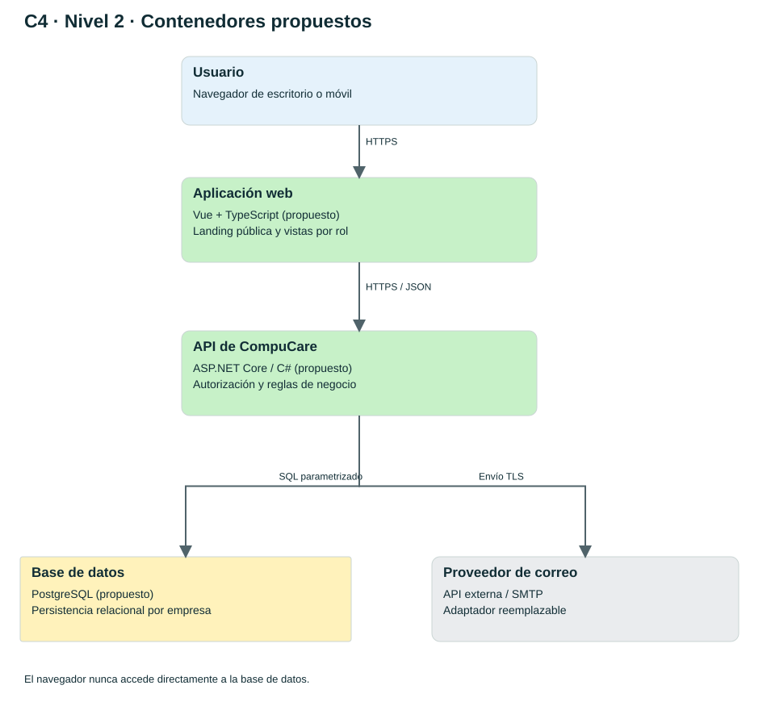
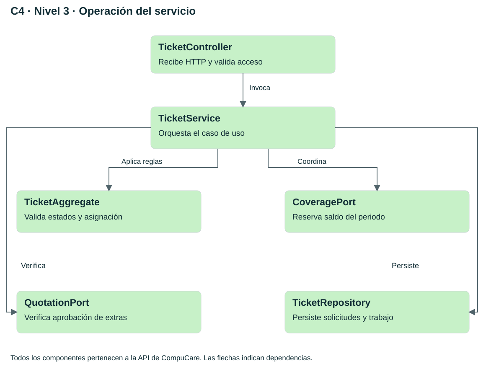
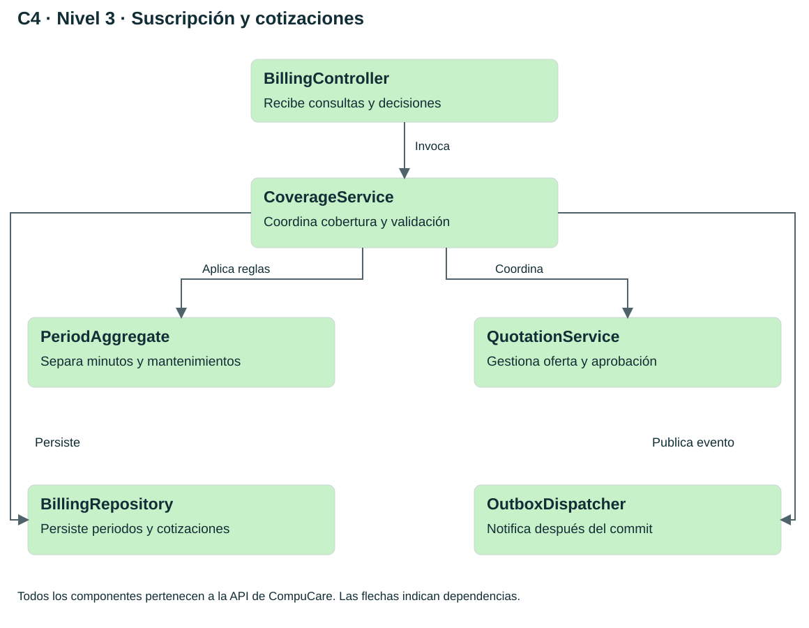
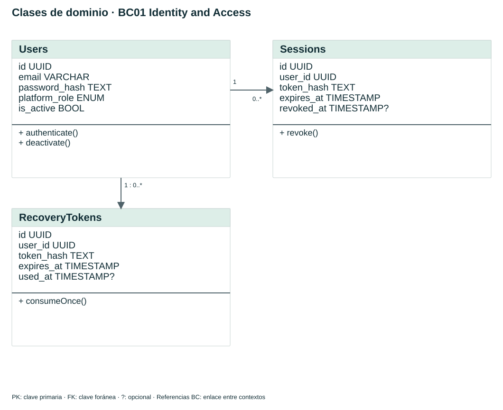
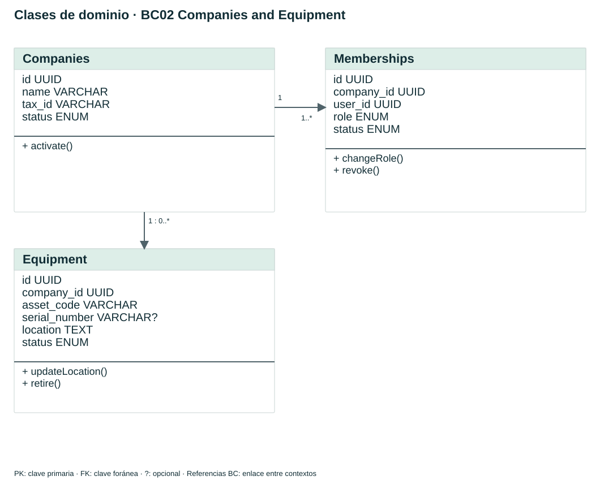
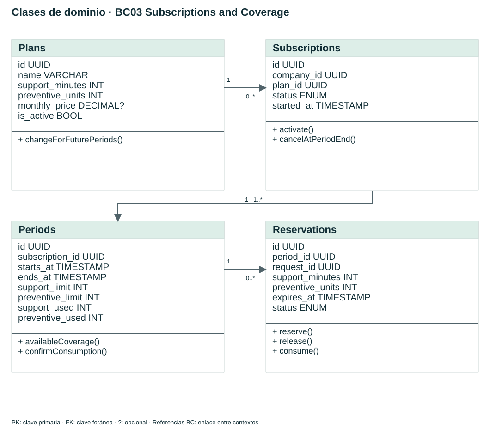
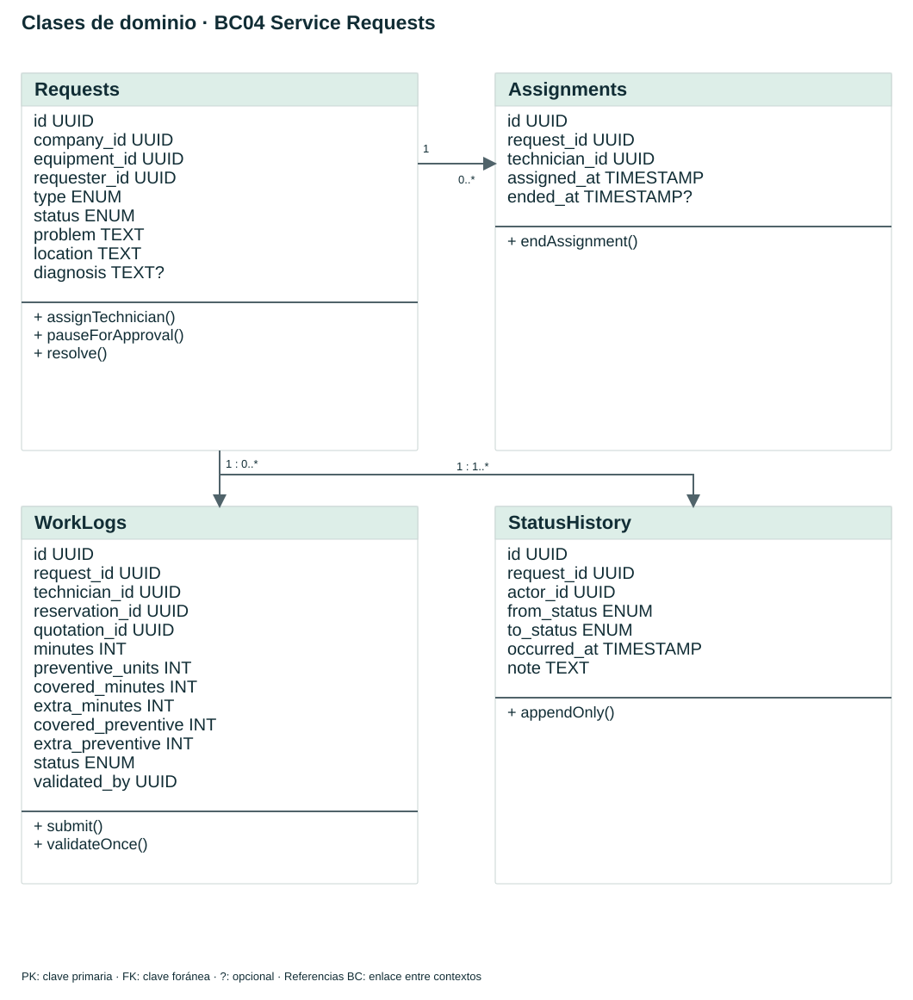
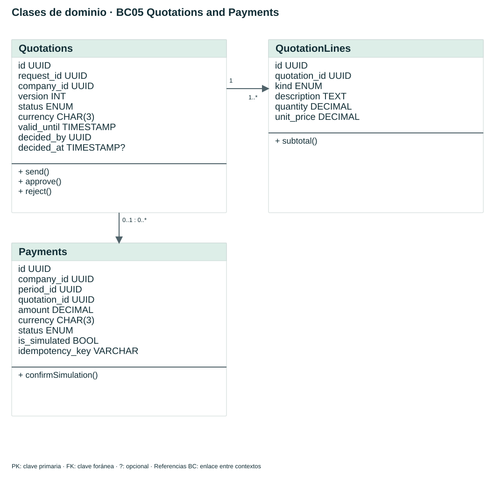

<div align="center">


Universidad Peruana de Ciencias Aplicadas

Carrera de Ingeniería de Software

### **1ASI0730**

### **Aplicaciones Web**

NRC

**1ASI0730**

### **Informe del Trabajo Final**

Docente

**Bautista Ubillús, Efrain Ricardo**

Equipo

### **UniLink**

Proyecto

### **CompuCare**
<br>

#### **Integrantes**

</div>

<div align="center">
<table align="center" style="all: unset;">
<tr style="background: none !important; border: none !important;">
<td align="left" style="border: none !important; padding: 0 40px 0 0 !important; background: none !important;"><strong>Código</strong></td>
<td align="left" style="border: none !important; padding: 0 !important; background: none !important;"><strong>Apellidos y Nombres</strong></td>
</tr>
<tr style="background: none !important; border: none !important;">
<td align="left" style="border: none !important; padding: 0 40px 0 0 !important; background: none !important;">[U202419311]</td>
<td align="left" style="border: none !important; padding: 0 !important; background: none !important;">Matthew Shinko Okuhama Diaz</td>
</tr>
<tr style="background: none !important; border: none !important;">
<td align="left" style="border: none !important; padding: 0 40px 0 0 !important; background: none !important;">U202214499</td>
<td align="left" style="border: none !important; padding: 0 !important; background: none !important;">Yauri Barrios, Antony David</td>
</tr>
<tr style="background: none !important; border: none !important;">
<td align="left" style="border: none !important; padding: 0 40px 0 0 !important; background: none !important;">U202411324</td>
<td align="left" style="border: none !important; padding: 0 !important; background: none !important;">Condezo Pacheco, Fernando André</td>
</tr>
<tr style="background: none !important; border: none !important;">
<td align="left" style="border: none !important; padding: 0 40px 0 0 !important; background: none !important;">U20231B331</td>
<td align="left" style="border: none !important; padding: 0 !important; background: none !important;">Miranda Romero, Sergio Luis</td>
</tr>
<tr style="background: none !important; border: none !important;">
<td align="left" style="border: none !important; padding: 0 40px 0 0 !important; background: none !important;">U20201F051</td>
<td align="left" style="border: none !important; padding: 0 !important; background: none !important;">Ramos Aguirre, Aldair Joaquin</td>
</tr>
</table>
</div>

<div align="center">

<br>

**Período 202620**

**Septiembre 2026**

</div>

---

# Registro de Versiones del Informe

| Versión | Fecha | Autor | Descripción de modificación |
| :---: | :---: | :--- | :--- |
| **1.0** | 20/09/2026 | Ramos, Aldair | Elaboración de la sección 1.2.1 (Antecedentes y problemática, 5W2H, Objetivos y Restricciones) enfocada exclusivamente en la aplicación web.  Desarrollo de la sección 1.2.2 (Lean UX Process: Problem Statements, Assumptions, Hypothesis y Canvas v2). Definición de la sección 1.3 (Segmentos objetivo) sintetizando los roles clave del proyecto. Elaboración de la matriz de evaluación del Student Outcome 5 de ABET para el Avance 1 (AV1).|
| **1.0** | 20/09/2026 | Condezo, Fernando | Elaboración del Capítulo 5 (Product Implementation, Validation & Deployment). Configuración de la Gestión de Configuración de Software (SCM), definición de repositorios en GitHub con GitFlow y Conventional Commits. Documentación técnica del Sprint 1, incluyendo Sprint Planning, configuración inicial del backend en ASP.NET Core mediante JetBrains Rider, y evidencias de despliegue y colaboración de equipo. |
| **1.0**     | 09/10/2026 | Yauri, Antony | Elaboración del Capítulo II (Requirements Elicitation & Analysis), incluyendo la sección 2.1 (Competidores), con el análisis competitivo y la definición de estrategias y tácticas frente a competidores. Desarrollo de la sección 2.2 (Entrevistas), abarcando el diseño, registro y análisis de entrevistas a los segmentos objetivo. Asimismo, desarrollo de la sección 2.3 (Needfinding), incluyendo User Personas, User Task Matrix, User Journey Mapping y Empathy Mapping. |

---

# Project Report Collaboration Insights

[Contenido correspondiente a Project Report Collaboration Insights]

---

# Contenido

## Tabla de Contenidos

- [Student Outcome](#student-outcome)

- [Capítulo I: Introducción](#capítulo-i-introducción)
    - [1.1. Startup Profile](#11-startup-profile)
        - [1.1.1. Descripción de la Startup](#111-descripción-de-la-startup)
        - [1.1.2. Perfiles de integrantes del equipo](#112-perfiles-de-integrantes-del-equipo)
    - [1.2. Solution Profile](#12-solution-profile)
        - [1.2.1. Antecedentes y problemática](#121-antecedentes-y-problemática)
        - [1.2.2. Lean UX Process](#122-lean-ux-process)
            - [1.2.2.1. Lean UX Problem Statements](#1221-lean-ux-problem-statements)
            - [1.2.2.2. Lean UX Assumptions](#1222-lean-ux-assumptions)
            - [1.2.2.3. Lean UX Hypothesis Statements](#1223-lean-ux-hypothesis-statements)
            - [1.2.2.4. Lean UX Canvas](#1224-lean-ux-canvas)
    - [1.3. Segmentos objetivo](#13-segmentos-objetivo)

- [Capítulo II: Requirements Elicitation & Analysis](#capítulo-ii-requirements-elicitation--analysis)
    - [2.1. Competidores](#21-competidores)
        - [2.1.1. Análisis competitivo](#211-análisis-competitivo)
        - [2.1.2. Estrategias y tácticas frente a competidores](#212-estrategias-y-tácticas-frente-a-competidores)
    - [2.2. Entrevistas](#22-entrevistas)
        - [2.2.1. Diseño de entrevistas](#221-diseño-de-entrevistas)
        - [2.2.2. Registro de entrevistas](#222-registro-de-entrevistas)
        - [2.2.3. Análisis de entrevistas](#223-análisis-de-entrevistas)
    - [2.3. Needfinding](#23-needfinding)
        - [2.3.1. User Personas](#231-user-personas)
        - [2.3.2. User Task Matrix](#232-user-task-matrix)
        - [2.3.3. User Journey Mapping](#233-user-journey-mapping)
        - [2.3.4. Empathy Mapping](#234-empathy-mapping)
    - [2.4. Big Picture Event Storming](#24-big-picture-event-storming)
    - [2.5. Ubiquitous Language](#25-ubiquitous-language)

- [Capítulo III: Requirements Specification](#capítulo-iii-requirements-specification)
    - [3.1. User Stories](#31-user-stories)
    - [3.2. Impact Mapping](#32-impact-mapping)
    - [3.3. Product Backlog](#33-product-backlog)

- [Capítulo IV: Product Design](#capítulo-iv-product-design)
    - [4.1. Style Guidelines](#41-style-guidelines)
        - [4.1.1. General Style Guidelines](#411-general-style-guidelines)
        - [4.1.2. Web Style Guidelines](#412-web-style-guidelines)
    - [4.2. Information Architecture](#42-information-architecture)
        - [4.2.1. Organization Systems](#421-organization-systems)
        - [4.2.2. Labeling Systems](#422-labeling-systems)
        - [4.2.3. SEO Tags and Meta Tags](#423-seo-tags-and-meta-tags)
        - [4.2.4. Searching Systems](#424-searching-systems)
        - [4.2.5. Navigation Systems](#425-navigation-systems)
    - [4.3. Landing Page UI Design](#43-landing-page-ui-design)
        - [4.3.1. Landing Page Wireframe](#431-landing-page-wireframe)
        - [4.3.2. Landing Page Mock-up](#432-landing-page-mock-up)
    - [4.4. Web Applications UX/UI Design](#44-web-applications-uxui-design)
        - [4.4.1. Web Applications Wireframes](#441-web-applications-wireframes)
        - [4.4.2. Web Applications Wireflow Diagrams](#442-web-applications-wireflow-diagrams)
        - [4.4.3. Web Applications Mock-ups](#443-web-applications-mock-ups)
        - [4.4.4. Web Applications User Flow Diagrams](#444-web-applications-user-flow-diagrams)
    - [4.5. Web Applications Prototyping](#45-web-applications-prototyping)
    - [4.6. Domain-Driven Software Architecture](#46-domain-driven-software-architecture)
        - [4.6.1. Design-Level Event Storming](#461-design-level-event-storming)
        - [4.6.2. Software Architecture Context Diagram](#462-software-architecture-context-diagram)
        - [4.6.3. Software Architecture Container Diagrams](#463-software-architecture-container-diagrams)
        - [4.6.4. Software Architecture Components Diagrams](#464-software-architecture-components-diagrams)
    - [4.7. Software Object-Oriented Design](#47-software-object-oriented-design)
        - [4.7.1. Class Diagrams](#471-class-diagrams)
    - [4.8. Database Design](#48-database-design)
        - [4.8.1. Database Diagrams](#481-database-diagrams)

- [Capítulo V: Product Implementation, Validation & Deployment](#capítulo-v-product-implementation-validation--deployment)
    - [5.1. Software Configuration Management](#51-software-configuration-management)
        - [5.1.1. Software Development Environment Configuration](#511-software-development-environment-configuration)
        - [5.1.2. Source Code Management](#512-source-code-management)
        - [5.1.3. Source Code Style Guide & Conventions](#513-source-code-style-guide--conventions)
        - [5.1.4. Software Deployment Configuration](#514-software-deployment-configuration)
    - [5.2. Landing Page, Services & Applications Implementation](#52-landing-page-services--applications-implementation)
        - [5.2.1. Sprint 1](#521-sprint-1)
            - [5.2.1.1. Sprint Planning 1](#5211-sprint-planning-1)
            - [5.2.1.2. Aspect Leaders and Collaborators](#5212-aspect-leaders-and-collaborators)
            - [5.2.1.3. Sprint Backlog 1](#5213-sprint-backlog-1)
            - [5.2.1.4. Development Evidence for Sprint Review](#5214-development-evidence-for-sprint-review)
            - [5.2.1.5. Execution Evidence for Sprint Review](#5215-execution-evidence-for-sprint-review)
            - [5.2.1.6. Services Documentation Evidence for Sprint Review](#5216-services-documentation-evidence-for-sprint-review)
            - [5.2.1.7. Software Deployment Evidence for Sprint Review](#5217-software-deployment-evidence-for-sprint-review)
            - [5.2.1.8. Team Collaboration Insights during Sprint](#5218-team-collaboration-insights-during-sprint)
        - [5.2.2. Sprint 2](#522-sprint-2)
            - [5.2.2.1. Sprint Planning 2](#5221-sprint-planning-2)
            - [5.2.2.2. Aspect Leaders and Collaborators](#5222-aspect-leaders-and-collaborators)
            - [5.2.2.3. Sprint Backlog 2](#5223-sprint-backlog-2)
            - [5.2.2.4. Development Evidence for Sprint Review](#5224-development-evidence-for-sprint-review)
            - [5.2.2.5. Execution Evidence for Sprint Review](#5225-execution-evidence-for-sprint-review)
            - [5.2.2.6. Services Documentation Evidence for Sprint Review](#5226-services-documentation-evidence-for-sprint-review)
            - [5.2.2.7. Software Deployment Evidence for Sprint Review](#5227-software-deployment-evidence-for-sprint-review)
            - [5.2.2.8. Team Collaboration Insights during Sprint](#5228-team-collaboration-insights-during-sprint)
    - [5.3. Validation Interviews](#53-validation-interviews)
        - [5.3.1. Diseño de Entrevistas](#531-diseño-de-entrevistas)
        - [5.3.2. Registro de Entrevistas](#532-registro-de-entrevistas)
        - [5.3.3. Evaluaciones según heurísticas](#533-evaluaciones-según-heurísticas)
    - [5.4. Video About-the-Product](#54-video-about-the-product)

- [Conclusiones](#conclusiones)
- [Conclusiones y recomendaciones](#conclusiones-y-recomendaciones)
- [Video About-the-Team](#video-about-the-team)
- [Bibliografía](#bibliografía)
- [Anexos](#anexos)

---

# Student Outcome

El curso contribuye al cumplimiento del Student Outcome ABET:

**ABET – EAC - Student Outcome 5**

**Criterio:** La capacidad de funcionar efectivamente en un equipo cuyos miembros juntos proporcionan liderazgo, crean un entorno de colaboración e inclusivo, establecen objetivos, planifican tareas y cumplen objetivos. En el siguiente cuadro se describe las acciones realizadas y enunciados de conclusiones por parte del grupo, que permiten sustentar el haber alcanzado el logro del ABET – EAC - Student Outcome 5.

| Criterio específico | Acciones realizadas | Conclusiones |
| :--- | :--- | :--- |
| **Trabaja en equipo para proporcionar liderazgo en forma conjunta** | **Ramos, Aldair**<br>*AV1*<br>• Coordinó la definición del problema de TI en PYMEs y redactó el análisis 5W2H.<br>• Delimitó el alcance exclusivo para la aplicación web eliminando componentes móviles o pasarelas.<br><br>**Yauri, Antony**<br>*AV1*<br>• Participó en la definición y organización del análisis de competidores.<br>• Contribuyó en la elaboración de los apartados de entrevistas, needfinding y herramientas de análisis UX.<br>• Coordinó con el equipo la organización de la información y evidencias del Capítulo 2.<br><br>**Condezo, Fernando**<br>*AV1*<br>• Asumió el rol de Aspect Leader en la configuración de repositorios y automatización de despliegues del Sprint 1.<br>• Lideró la definición de convenciones de control de versiones y la estructura arquitectónica inicial del API en JetBrains Rider. | • El liderazgo compartido permitió acotar el proyecto a un MVP web enfocado y viable.<br><br>• La distribución de responsabilidades técnicas aseguró una base de integración continua sólida desde el primer Sprint. |
| **Crea un entorno colaborativo e inclusivo, establece metas, planifica tareas y cumple objetivos.** | **Ramos, Aldair**<br>*AV1*<br>• Planificó las entregas del Cap 1 y guió la elaboración de los supuestos e hipótesis Lean UX.<br>• Consolidó el Lean UX Canvas v2 priorizando los 2 segmentos de usuario clave.<br><br>**Yauri, Antony**<br>*AV1*<br>• Organizó y desarrolló contenido correspondiente a competidores, entrevistas y needfinding.<br>• Elaboró herramientas de análisis como User Personas, User Task Matrix, User Journey Mapping y Empathy Mapping.<br>• Coordinó la integración de los resultados obtenidos en las diferentes actividades del Capítulo 2.<br><br>**Condezo, Fernando**<br>*AV1*<br>• Estructuró y documentó las tareas del Sprint Backlog 1, organizando las evidencias de ejecución y colaboración.<br>• Facilitó el trabajo paralelo del equipo mediante la correcta implementación de GitFlow y la gestión de permisos en GitHub. | • La gestión de tareas garantizó el cumplimiento total de los entregables del Avance 1.<br><br>• La estandarización temprana de los entornos de desarrollo facilitó el cumplimiento de las metas técnicas sin conflictos de código. |

---

# Capítulo I: Introducción

## 1.1. Startup Profile

### 1.1.1. Descripción de la Startup

UniLink es una startup académica orientada al desarrollo de soluciones digitales que faciliten la gestión de servicios
para empresas. Su propuesta actual se enfoca en el mantenimiento y reparación de computadoras mediante un modelo de
suscripción mensual.

La startup propone centralizar la contratación y organización del soporte técnico a través de una aplicación web. Desde
esta plataforma, las empresas podrán registrar solicitudes, consultar al técnico asignado, conocer el estado de las
atenciones y acceder al historial de sus equipos.

UniLink se encargará de seleccionar, capacitar y coordinar a los técnicos responsables de brindar el servicio. Asimismo,
gestionará su pago mediante los ingresos provenientes de las suscripciones y los servicios adicionales aprobados por las
empresas.

* **Misión:** Brindar a las empresas una forma organizada y accesible de gestionar el mantenimiento y reparación de sus
  computadoras, mediante una plataforma web que permita solicitar soporte técnico, dar seguimiento a las atenciones y
  conocer la cobertura de su suscripción.


* **Visión:** Consolidarnos como una alternativa de soporte técnico empresarial que destaque por la transparencia de sus
  planes, la organización de sus atenciones y el seguimiento del estado de los equipos informáticos.

### 1.1.2. Perfiles de integrantes del equipo

<div align="left">
  
</div>

**Matthew Shinko Okuhama Diaz**

* **Código de estudiante:** U202419311
* **Carrera:** Ingeniería de Software

Estudiante de pregrado de la carrera de Ingeniería de Software en la Universidad Peruana de Ciencias Aplicadas (UPC). Posee conocimientos en programación con C++, desarrollo web, bases de datos y herramientas de diseño y documentación como Figma, GitHub y PlantUML. Cuenta con experiencia en atención al cliente y trabajo en equipos, además de manejo del idioma inglés. En el proyecto CompuCare, participa en el diseño UX/UI, elaboración de wireframes, mockups, diagramas de arquitectura y documentación técnica del producto.

<br>

<div align="left">
  
</div>

**Condezo Pacheco, Fernando André**

* **Código de estudiante:** U202411324
* **Carrera:** Ingeniería de Software

Estudiante de pregrado de la carrera de Ingeniería de Software en la Universidad Peruana de Ciencias Aplicadas (UPC), que equilibra su formación académica con experiencia laboral a tiempo parcial, demostrando una alta capacidad de organización y compromiso. Posee sólidos conocimientos en el desarrollo de software y lenguajes como C++ y TypeScript, así como en el modelado de arquitecturas limpias basadas en Domain-Driven Design (DDD). Cuenta con experiencia práctica utilizando herramientas profesionales como JetBrains Rider, Visual Studio Code, Figma, PlantUML, Hackolade y MongoDB Compass para el diseño y construcción de productos digitales. Al igual que otros miembros del equipo, posee la credencial Scrum Fundamentals Certified otorgada por SCRUMstudy, lo que le permite colaborar eficientemente bajo marcos de trabajo ágiles. En el proyecto, aporta liderando la configuración del entorno de desarrollo y control de versiones (SCM, GitFlow), la automatización de despliegues y la construcción técnica del RESTful API backend.
<br>
<div align="left">
  
</div>

**Yauri Barrios, Antony David**

* **Código de estudiante:** U202214499
* **Carrera:** Ingeniería de Software

Estudiante de Ingeniería de Software en la Universidad Peruana de Ciencias Aplicadas (UPC), Tiene 22 años y trabaja con
los stacks MERN y PERN. Le gusta trabajar en equipo, compartir conocimientos y seguir aprendiendo de sus compañeros para
mejorar constantemente.
<br>

<div align="left">
  
</div>

**Aldair Joaquin Ramos Aguirre**
* **Código de estudiante:U20201F051**
* **Carrera:** Ingeniería de Software

Estudiante de pregrado de la carrera de Ingeniería de Software en la Universidad Peruana de Ciencias Aplicadas (UPC), con formación complementaria en finanzas. Posee conocimientos en desarrollo de software utilizando lenguajes de programación como Java, Python, JavaScript y TypeScript, así como en el desarrollo de aplicaciones backend con Spring Boot y Spring Security (JWT) y de interfaces web con React, Angular y Vue. Maneja bases de datos relacionales mediante SQL, además de herramientas como Git, Docker y Jira para el control de versiones, la contenerización y la gestión de tareas del equipo. Aporta en el desarrollo de la solución, la construcción de APIs seguras y la organización del trabajo colaborativo, con interés en incorporarse como Junior Software Engineer en equipos remotos internacionales.

<br>

<div align="left">
  
</div>

**Miranda Romero, Sergio Luis**

* **Código de estudiante:** U20231B331
* **Carrera:** Ingeniería de Software

Estudiante de pregrado de la carrera de Ingeniería de Software en la Universidad Peruana de Ciencias Aplicadas (UPC).
Posee conocimientos en desarrollo de software utilizando lenguajes de programación como C++, C# y JavaScript, así como
en la gestión de bases de datos relacionales y no relacionales mediante MySQL y MongoDB. Cuenta con la certificación
Scrum Fundamentals Certified, lo que le permite aplicar marcos de trabajo ágiles y gestionar el flujo de tareas del
equipo. Aporta en el desarrollo de la solución, la estructuración de la base de datos y la organización del trabajo bajo
metodologías ágiles.

<br>

<div align="left">
  
</div>


## 1.2. Solution Profile

### 1.2.1. Antecedentes y problemática

#### Análisis 5W2H

* **Who? (¿Quién?):** Pequeñas y medianas empresas en sectores administrativos, contables y de servicios que cuentan con entre 5 y 50 estaciones de trabajo informáticas  y que carecen de un departamento o personal interno dedicado a la gestión de infraestructura TI.
* **What? (¿Qué?):** Interrupción prolongada de las operaciones empresariales derivada de fallas no planificadas de hardware y software, acompañada de una falta de trazabilidad sobre las intervenciones realizadas, opacidad en la facturación de servicios/repuestos e ineficiencia en el mantenimiento preventivo de los equipos.
* **Where? (¿Dónde?):** En las sedes u oficinas operativas de las PYMEs donde se ubican los equipos físicos, gestionando todo el flujo de interacción de manera centralizada mediante una plataforma web.
* **When? (¿Cuándo?):** Ocurre de forma reactiva ante incidencias críticas que paralizan las funciones de un empleado, y de forma programada al requerir mantenimientos preventivos periódicos para mitigar el deterioro del hardware.
* **Why? (¿Por qué?):** Por la alta dependencia de servicios técnicos informales o eventuales, los cuales operan sin Acuerdos de Nivel de Servicio definidos, carecen de un registro histórico unificado por equipo y aplican esquemas de cobro no estandarizados ni auditables.
* **How? (¿Cómo?):** La gestión actual se realiza mediante canales desestructurados hacia técnicos independientes, lo que imposibilita monitorear el estado de la atención, validar las horas de trabajo reales o fiscalizar la necesidad de reemplazo de componentes.
* **How much? (¿Cuánto?):** Incurrimiento en sobrecostos directos por reparaciones no estandarizadas, gastos imprevistos en repuestos sin cotización previa y pérdidas económicas indirectas asociadas a las horas de inactividad laboral del personal afectado.

<br>

**Enunciado del problema:**

Las pequeñas y medianas empresas (PYMEs) que dependen de infraestructura informática sufren pérdidas de productividad y sobrecostos debido a la ausencia de un sistema centralizado e integral para gestionar el soporte técnico y mantenimiento de sus computadoras. Actualmente, la falta de visibilidad sobre los estados de atención, la ausencia de un historial por equipo y la informalidad en la cotización de repuestos generan desconfianza e ineficiencia operativa.

**Objetivo general:**

Desarrollar e implementar una aplicación web multi-rol que permita a las PYMEs gestionar el mantenimiento preventivo y correctivo de sus computadoras bajo un modelo de suscripción mensual, garantizando el seguimiento en tiempo real de las solicitudes, la transparencia en el consumo de bolsa de horas y la validación de cotizaciones adicionales.

**Restricciones de alcance:**

* **Exclusividad del Canal Web:** La solución tecnológica del proyecto se limita de forma estricta al desarrollo de una aplicación web responsiva accesible desde navegadores modernos. Se excluye el desarrollo de aplicaciones móviles nativas (Android/iOS) o de escritorio.
* **Atención en Horario Operativo:** No se ofrecerá soporte técnico ininterrumpido 24/7 en la versión inicial.
* **Delimitación Geográfica:** El soporte presencial estará restringido a una zona urbana de cobertura predefinida por la startup.
* **Procesamiento de Planillas:** La automatización de pagos salariales internos a los técnicos queda fuera del alcance funcional del software web.


### 1.2.2. Lean UX Process
#### 1.2.2.1. Lean UX Problem Statements

Las pequeñas y medianas empresas enfrentan una baja productividad y costos imprevistos debido a la falta de trazabilidad y organización en el soporte técnico de sus computadoras. Hemos observado que los administradores no cuentan con visibilidad sobre el estado de sus reparaciones ni sobre el consumo exacto del plan contratado.

#### 1.2.2.2. Lean UX Assumptions

##### Business Assumptions
* Las PYMEs prefieren pagar una tarifa fija mensual por soporte técnico en lugar de asumir costos variables e imprevistos por emergencias.
* El modelo de bolsa de horas y mantenimientos preventivos empaquetados operado mediante una aplicación web permite mantener la rentabilidad del negocio.
* Las empresas están dispuestas a aprobar cotizaciones adicionales a través de la web si se les detalla con transparencia el diagnóstico y costo de componentes.

##### Business Outcome Assumptions
* Incrementar en un 25% la tasa de renovación mensual de suscripciones.
* Reducir en un 40% el tiempo promedio entre la emisión de una cotización adicional y su aprobación o rechazo por parte del cliente a través del panel web.

##### User Assumptions
* Los administradores de las empresas necesitan conocer con exactitud desde un panel web cuántas horas de soporte e intervenciones preventivas les quedan en el mes.
* Los empleados necesitan un portal web accesible y simple para reportar fallas en sus equipos indicando su ubicación y el problema observado.
* Los técnicos de soporte requieren una interfaz web clara para revisar solicitudes asignadas, registrar tiempos de trabajo y emitir diagnósticos técnicos.

##### User Outcome and Benefit Assumptions
* Los administradores reducen el tiempo dedicado a coordinar reparaciones con técnicos independientes gracias al autocontrol que ofrece la plataforma web.
* Los empleados minimizan el tiempo de inactividad de sus estaciones de trabajo al agilizar los reportes desde su navegador web.

##### Feature Assumptions
* **Landing Page y Panel de presentación:** Informa sobre los planes y permite el registro e inicio de sesión de las empresas.
* **Panel de control de consumo (Web Dashboard):** Muestra dinámicamente en tiempo real las horas y mantenimientos disponibles del plan contratado.
* **Módulo web de cotizaciones adicionales:** Permite revisar, aprobar o rechazar gastos de repuestos antes de ejecutar el trabajo.
* **Historial por equipo en entorno web:** Permite consultar las intervenciones pasadas asociadas al código o serie de cada computadora.

#### 1.2.2.3. Lean UX Hypothesis Statements

* **Hypothesis 1 :**
  * <b> We </b>  believe we will achieve a 25% increase in the monthly subscription renewal rate.   
  * <b> If </b> company administrators   
  * <b> Attain</b>  the ability to learn about the support plans and complete their registration and login processes seamlessly
  * <b>With</b> a Landing Page and Presentation Panel.
* **Hypothesis 2:**
  * <b> We </b> believe we will achieve higher customer retention and maintain business profitability through service transparency.
  * <b>If</b> company administrators   
  * <b>Attain</b> exact, real-time knowledge of how many support hours and preventive maintenance sessions they have left in their month 
  * <b>With</b> a Consumption Control Panel (Web Dashboard).
* **Hypothesis 3:**
  * <b>We</b> believe we will achieve a 40% reduction in the average time between the issuance of an additional quote and its approval or rejection by the client.   
  * <b>If</b> company administrators   
  * <b>Attain</b> the ability to transparently review, approve, or reject spare parts expenses before the technical work is executed   
  * <b>With</b> an additional quotes web module.
* **Hypothesis 4:**
    * <b>We</b> believe we will achieve faster technical support and higher satisfaction to drive monthly renewals.   
    * <b>If</b> support technicians and company administrators   
    * <b>Attain</b> the ability to consult past interventions associated with the code or serial number of each computer without having to explain the issues from scratch   
    * <b>With</b> a Web-based per-equipment history.
#### 1.2.2.4. Lean UX Canvas


## 1.3. Segmentos objetivo

1. **Empresas Suscriptoras (Clientes - Rol Responsable/Administrador):**
   * **Perfil:** Pequeñas y medianas empresas (estudios contables, agencias de marketing, consultoras, oficinas administrativas) que disponen de entre 5 y 50 computadoras o laptops y no poseen departamento de TI propio.
   * **Necesidad:** Garantizar la operatividad de sus equipos con un costo mensual predecible y soporte técnico confiable, gestionando todo desde el panel web de su empresa.

2. **Empleados de las Empresas (Usuarios Finales):**
   * **Perfil:** Personal operativo de las empresas suscritas que utiliza diariamente un equipo informático para cumplir con sus funciones.
   * **Necesidad:** Reportar fallas de hardware o software de manera rápida ingresando a la aplicación web de UniLink para retomar sus labores lo antes posible.

3. **Técnicos de soporte independientes:**
    * **Perfil:** Técnicos informáticos que ofrecen servicios de mantenimiento y reparación de computadoras por cuenta propia o que trabajan en pequeñas organizaciones que no cuentan con una empresa especializada ni con una aplicación para gestionar las solicitudes de soporte técnico.
    * **Necesidad:** Organizar y gestionar sus solicitudes de servicio, registrar las atenciones realizadas, hacer seguimiento al estado de cada soporte y mantener un historial de los equipos atendidos desde una plataforma web centralizada.


# Capítulo II: Requirements Elicitation & Analysis

## 2.1. Competidores

Para validar nuestra propuesta de valor enfocada en la tercerización y gestión de soporte técnico B2B, hemos
identificado a tres competidores (directos e indirectos) que resuelven parcial o totalmente el problema del
mantenimiento informático para las empresas.

1. Zendesk / Plataformas SaaS de HelpDesk (Competidor Indirecto): Es un software de gestión de tickets a nivel mundial.
   Representa a los competidores puramente de software que ofrecen la plataforma tecnológica, pero no proveen el
   personal técnico físico para realizar las reparaciones.
2. Agencias Tradicionales de Outsourcing TI (Competidor Directo): Empresas locales consolidadas que proveen técnicos y
   contratos de soporte a otras empresas. Su principal debilidad es la carencia de un producto digital transparente
   (SaaS) para que el cliente final autogestione sus horas.
3. HelloTech / Plataformas On-Demand (Competidor Indirecto): Plataformas digitales tipo Uber para técnicos informáticos.
   Se enfocan principalmente en el consumidor final (B2C) o en reparaciones por evento único, careciendo de un modelo
   robusto de suscripciones mensuales y mantenimientos preventivos para empresas.

### 2.1.1. Análisis competitivo

A continuación, presentamos el Landscape Competitivo siguiendo la estructura exigida para analizar el posicionamiento de
nuestra startup UniLink (producto TechSustain) frente al mercado.
<table>
  <tr>
    <th colspan="6">Competitive Analysis Landscape</th>
  </tr>
  <tr>
    <th>¿Por qué llevar acabo este análisis?</th>
    <td colspan="5">Entender cómo las MYPES solucionan actualmente sus problemas informáticos, identificando brechas entre la oferta de software puro (SaaS) y el servicio técnico tradicional, para posicionar a TechSustain como la solución híbrida ideal.</td>
  </tr>
  <tr>
    <th colspan="2"></th>
    <td align="center"></td>
    <td align="center"></td>
    <td align="center"></td>
    <td align="center"></td>
  </tr>
 <tr>
    <th rowspan="2">Perfil</th>
    <th>Overview</th>
    <td align="center"><b>TechSustain (Nuestra Startup)</b><br>Es una startup académica orientada al desarrollo de soluciones digitales para facilitar la gestión de servicios empresariales, enfocándose actualmente en el mantenimiento y reparación de computadoras mediante una plataforma web y un modelo de suscripción mensual.</td>
    <td align="center"><b>Zendesk (HelpDesk SaaS)</b><br>Plataforma SaaS de atención al cliente que permite gestionar tickets, consultas, agentes y canales de soporte desde un solo lugar.</td>
    <td align="center"><b>Agencias Tradicionales de Outsourcing TI</b><br>Empresas que brindan servicios tecnológicos a otras organizaciones, como desarrollo de software, soporte técnico, infraestructura y mantenimiento, mediante equipos especializados externos.</td>
    <td align="center"><b>HelloTech / Apps On-Demand</b><br>Plataformas que conectan clientes con técnicos de TI disponibles bajo demanda para realizar servicios como soporte, reparación, instalación y mantenimiento tecnológico.</td>
</tr>
<tr>
    <th>Ventaja competitiva ¿Qué valor ofrece a los clientes?</th>
    <td align="center">Solución híbrida: Plataforma web transparente integrada con una red de técnicos calificados. Centralizar la solicitud de soporte, el control de horas consumidas y la aprobación de cotizaciones en un solo portal web.</td>
    <td align="center">Software de clase mundial, altamente personalizable e integrado con múltiples canales. Ordenar las solicitudes internas de soporte mediante la creación de tickets digitales.</td>
    <td align="center">Cuentan con personal técnico en planilla y atienden problemas físicos de hardware. Delegar completamente la responsabilidad del área de TI a una empresa externa.</td>
    <td align="center">Red amplia de técnicos independientes disponibles inmediatamente. Encontrar un técnico rápido para resolver una emergencia informática puntual.</td>
</tr>
<tr>
    <th rowspan="2">Perfil de Marketing</th>
    <th>Mercado objetivo</th>
    <td align="center">Oficinas, estudios y agencias (MYPES) que usan computadoras, pero no tienen área de TI.</td>
    <td align="center">Desde MYPES hasta corporaciones transnacionales con departamento de TI propio.</td>
    <td align="center">Medianas y grandes empresas con presupuesto para contratos corporativos anuales.</td>
    <td align="center">Consumidores domésticos (B2C) y microempresarios.</td>
</tr>
<tr>
    <th>Estrategias de marketing</th>
    <td align="center">Ventas B2B consultivas, demostrando el ahorro de costos al prevenir paralizaciones operativas.</td>
    <td align="center">Inbound marketing corporativo, webinars, y pruebas gratuitas del software.</td>
    <td align="center">Ventas relacionales B2B, recomendaciones de boca a boca y contratos a largo plazo.</td>
    <td align="center">Publicidad en redes sociales, cupones de descuento y marketing digital enfocado en emergencias.</td>

</tr>
<tr>
    <th rowspan="3">Perfil de Producto</th>
    <th>Productos & Servicios</th>
    <td align="center">Aplicación web B2B de suscripción mensual con bolsas de horas y mantenimientos preventivos.</td>
    <td align="center">Sistema SaaS de ticketing, base de conocimientos y atención omnicanal.</td>
    <td align="center">Contratos de pólizas de soporte, visitas presenciales y mesa de ayuda telefónica.</td>
    <td align="center">Aplicación móvil/web para agendar la visita de un técnico a domicilio.</td>
</tr>
<tr>
    <th>Precios & Costos</th>
    <td align="center">Suscripción mensual escalonada (Planes Básico, Empresarial, Integral) con costos claros.</td>
    <td align="center">Pago mensual o anual por "agente" (usuario que atiende tickets).</td>
    <td align="center">Contratos fijos mensuales muy elevados, generalmente opacos en el conteo de horas.</td>
    <td align="center">Pago único por intervención (Pay-as-you-go), tarifas variables.</td>
</tr>
<tr>
    <th>Canales de distribución(Web y/o Móvil)</th>
    <td align="center">Aplicación Web (Cloud) responsiva, accesible para administradores y empleados.</td>
    <td align="center">Plataforma Web (Cloud) y aplicaciones móviles para agentes.</td>
    <td align="center">Canal tradicional (teléfono, correo electrónico, visitas presenciales).</td>
    <td align="center">Aplicación web y app móvil nativa.</td>
</tr>
<tr>
    <th rowspan="4">Análisis SWOT</th>
    <th>Fortalezas</th>
    <td align="center">Modelo transparente: el cliente sabe exactamente qué consume y aprueba repuestos antes de pagar.</td>
    <td align="center">Ecosistema maduro, escalable y con una interfaz de usuario impecable.</td>
    <td align="center">Experiencia técnica comprobada y resolución física de problemas de hardware.</td>
    <td align="center">Rapidez de atención y cobertura geográfica amplia debido al modelo gig economy.</td>
</tr>
<tr>
    <th>Debilidades</th>
    <td align="center">Al ser una startup nueva, existe el reto de reclutar, capacitar y fidelizar a la flota de técnicos.</td>
    <td align="center">No proveen técnicos. La empresa cliente debe contratar a su propio personal para usar el software.</td>
    <td align="center">Procesos manuales. El cliente no tiene un portal para ver su saldo de horas en tiempo real.</td>
    <td align="center">Ausencia de un historial clínico a largo plazo del hardware. No ofrecen mantenimiento preventivo continuo.</td>
</tr>
<tr>
    <th>Oportunidades</th>
    <td align="center">La gran mayoría de MYPES terceriza el soporte de forma informal y busca formalizarlo a bajo costo.</td>
    <td align="center">Transformación digital corporativa que exige a las empresas formalizar su mesa de ayuda.</td>
    <td align="center">Demanda constante de soporte presencial ante fallas físicas que no se pueden resolver remoto.</td>
    <td align="center">El auge del teletrabajo incrementa la necesidad de soporte técnico descentralizado.</td>
</tr>
<tr>
    <th>Amenazas</th>
    <td align="center">Resistencia al cambio tecnológico por parte de dueños de empresas acostumbrados a llamar técnicos informales.</td>
    <td align="center">Surgimiento de software de tickets gratuito u open-source.</td>
    <td align="center">Pérdida de clientes frente a alternativas más económicas y tecnológicas.</td>
    <td align="center">Riesgo legal y de calidad al depender de técnicos independientes sin capacitación estandarizada.</td>
</tr>
</table>

### 2.1.2. Estrategias y tácticas frente a competidores

Frente a la competencia actual en el sector de soporte y mantenimiento informático, TechSustain implementará las siguientes estrategias para capitalizar las debilidades del mercado:
1. Frente al software puro (Zendesk) - Estrategia de Servicio Integral: Mientras que las plataformas SaaS tradicionales solo otorgan la herramienta digital, obligando a la MYPE a contratar a sus propios ingenieros, TechSustain ofrecerá la solución completa. Nuestra táctica será promocionarnos como un "Departamento de TI as a Service", donde la plataforma web ya viene integrada con nuestra red de técnicos listos para ser asignados, ahorrándole a la empresa el costo de planillas de personal tecnológico.


2. Frente a las Agencias Tradicionales - Estrategia de Transparencia Absoluta: El mayor dolor al contratar una agencia de outsourcing tradicional es la falta de visibilidad ("¿Cuántas horas de soporte me quedan?" o "¿Por qué me facturan este repuesto?"). Nuestra táctica será convertir esta debilidad en nuestra mayor fortaleza: el panel del administrador en nuestra aplicación web mostrará el consumo de la bolsa de horas en tiempo real y bloqueará cualquier reparación extra hasta que el cliente apruebe explícitamente la cotización del repuesto en la plataforma.


3. Frente al mercado on-demand e informal - Estrategia de Prevención e Historial: A diferencia de contratar a un técnico informal solo cuando la computadora "ya no prende", TechSustain fomenta una cultura preventiva. Nuestra táctica será ofrecer mantenimientos preventivos fijos mensuales incluidos en los planes de suscripción (ej. Plan Empresarial incluye 2 equipos al mes). Además, la plataforma registrará el historial de intervenciones de cada máquina, agregando un valor corporativo a largo plazo que las apps on-demand no ofrecen.


## 2.2. Entrevistas

### 2.2.1. Diseño de entrevistas

Para asegurar la recolección de información cualitativa de alto valor que nos permita construir nuestros User Personas (perfiles, comportamientos, frustraciones, habilidades, marcas e influencias) y validar nuestras hipótesis de negocio, hemos diseñado una batería de preguntas. Estas se dividen en un bloque general y bloques específicos adaptados a la realidad de nuestros dos segmentos objetivo (Responsables de Empresa y Empleados de Oficina).

**Preguntas Generales (Demografía, Tecnología, Marcas y Contexto): Estas preguntas aplican a los dos segmentos para perfilar el arquetipo del usuario.**
1. Demografía y Familia: ¿Cuál es tu nombre, edad, distrito de residencia, y con quién vives actualmente?


2. Perfil y Ocupación: ¿Cuál es tu rol actual en la empresa, cuánto tiempo llevas en él y cuál es tu formación profesional?


3. Tecnología y Canales: ¿Qué dispositivos utilizas más en tu trabajo diario (laptop, desktop, smartphone), y cuáles son tus canales favoritos para comunicarte y buscar servicios?


4. Marcas e Influencias: En tu vida profesional o personal, ¿qué marcas de tecnología o servicios admiras por su eficiencia y por qué?


5. Contexto: Descríbeme brevemente cómo es un día normal de trabajo para ti y qué tan indispensable es tu computadora para lograr tus metas.

**Preguntas de Problema y Competencia (Core del Negocio): Estas preguntas buscan validar la necesidad de soporte técnico centralizado.**


6. Dolor: Actualmente, cuando una computadora o equipo falla en la oficina, ¿cuál es el proceso exacto que siguen para repararlo?


7. Dolor: ¿Cuál es el mayor dolor de cabeza o problema que enfrentan al tratar con técnicos informáticos independientes o al no tener un área de TI?


8. Competencia: ¿Alguna vez han contratado pólizas de soporte mensuales o plataformas de tickets? Si es así, ¿qué les funcionó y qué no?


9. Expectativa ("Varita Mágica"): Si pudieras tener una solución ideal para gestionar las fallas informáticas de la oficina, ¿cómo te gustaría que funcionara?


10. Validación: Si te presentamos una plataforma web donde pagas una suscripción mensual fija, ves tus horas de soporte disponibles en tiempo real y gestionas mantenimientos preventivos, ¿estarías dispuesto a probarla?

**Preguntas Específicas por Segmento (Enfoque en Roles):**

**Para el Segmento 1 (Responsables de la Empresa: Dueños, Administradores, Gerentes):**


11. (Finanzas y Control): ¿Te ha pasado que apruebas la reparación de un equipo y al final te cobran repuestos o sobrecostos que no esperabas?


12. (Trazabilidad): ¿Llevas algún registro o historial clínico de cuántas veces se ha malogrado una misma laptop en el año para decidir si es mejor comprar una nueva?


13. (Productividad): ¿Cuánto dinero o tiempo calculas que pierde tu empresa cuando un empleado se queda sin computadora por varios días?

**Para el Segmento 2 (Empleados / Usuarios Afectados):**

14. (Carga operativa): Cuando tu equipo falla, ¿te resulta frustrante o burocrático tener que avisarle a tu jefe y esperar a que él consiga un técnico?


15. (Trazabilidad): ¿Sientes que cuando el técnico finalmente llega, tienes que volver a explicarle todo el problema desde cero porque la información se perdió en el camino?

**Para el Segmento 3 (Técnicos de Soporte Independientes)**

16. (Experiencia y especialización): ¿Qué tipo de equipos informáticos sueles reparar y qué tipos de fallas atiendes con mayor frecuencia?

17. (Organización de atenciones): Cuando una empresa te contacta para reportar una falla en uno de sus equipos, ¿cómo organizas la atención y haces seguimiento hasta resolver el problema?

18. (Dificultades operativas): ¿Cuál es la principal dificultad que encuentras al atender solicitudes de soporte técnico de empresas?

19. (Repuestos y costos): Cuando una reparación requiere un repuesto o accesorio adicional, ¿cómo coordinas su aprobación con el cliente y registras el costo?

20. (Registro e historial): ¿Cómo registras actualmente las reparaciones que realizas y la información de los equipos atendidos? ¿Puedes consultar fácilmente el historial de reparaciones anteriores?

21. (Necesidades tecnológicas): Si tuvieras una plataforma web para gestionar tus servicios de soporte técnico, ¿qué funcionalidades necesitarías para organizar tus atenciones y facilitar tu trabajo?

#### 2.2.2. Registro de entrevistas

<table>
    <thead>
        <tr>
            <th colspan="2">URL global de las entrevistas</th>
        </tr>
        <tr>
            <td colspan="2">
                <a href="https://upcedupe-my.sharepoint.com/:v:/g/personal/u202214499_upc_edu_pe/IQB_PpBP_KTJT6zFJaaVAW6ZAXopCF5K6xOX1tb9g9idoN4?nav=eyJyZWZlcnJhbEluZm8iOnsicmVmZXJyYWxBcHAiOiJPbmVEcml2ZUZvckJ1c2luZXNzIiwicmVmZXJyYWxBcHBQbGF0Zm9ybSI6IldlYiIsInJlZmVycmFsTW9kZSI6InZpZXciLCJyZWZlcnJhbFZpZXciOiJNeUZpbGVzTGlua0NvcHkifX0&e=3cxzUN" target="_blank">Link de entrevista</a>
            </td>
        </tr>
    </thead>
    <tbody>
        <tr>
            <th colspan="2">Entrevista N.° 1 - Segmento 3</th>
        </tr>
        <tr>
            <th>Nombre</th>
            <td>Hikari</td>
        </tr>
        <tr>
            <th>Apellido</th>
            <td>Yamaguchi</td>
        </tr>
        <tr>
            <th>Edad</th>
            <td>21 años</td>
        </tr>
        <tr>
            <th>Distrito</th>
            <td>La Molina</td>
        </tr>
        <tr>
            <th>Screenshot del cuadro de video</th>
            <td></td>
        </tr>
        <tr>
            <th>Inicio de la entrevista</th>
            <td>00:22</td>
        </tr>
        <tr>
            <th>Fin de la entrevista</th>
            <td>03:05</td>
        </tr>
        <tr>
            <th>Resumen de la entrevista</th>
            <td>Hikari, de 21 años, reside en el distrito de La Molina y se dedica al mantenimiento y reparación de laptops y computadoras de escritorio. Atiende problemas de lentitud, fallas del sistema y cambios de componentes. Generalmente, recibe solicitudes por WhatsApp, donde consulta sobre las fallas y realiza un diagnóstico. Sin embargo, algunos clientes describen los problemas de manera poco clara o se comunican mediante terceros, lo que dificulta la comprensión y coordinación del servicio. Después, explica el diagnóstico, envía una cotización y espera la aprobación del responsable, pero no cuenta con una herramienta para generar cotizaciones ni organizar sus servicios. Por ello, necesita una plataforma sencilla y accesible desde el celular que le permita registrar los problemas reportados, la ubicación del equipo, los datos de contacto, el diagnóstico, el tiempo trabajado y los repuestos necesarios, además de gestionar las cotizaciones y aprobaciones.</td>
        </tr>
        <tr>
            <th colspan="2">Entrevista N.° 2 - Segmento 2</th>
        </tr>
        <tr>
            <th>Nombre</th>
            <td>Camila</td>
        </tr>
        <tr>
            <th>Apellido</th>
            <td>Torres</td>
        </tr>
        <tr>
            <th>Edad</th>
            <td>28 años</td>
        </tr>
        <tr>
            <th>Distrito</th>
            <td>Surquillo</td>
        </tr>
        <tr>
            <th>Screenshot del cuadro de video</th>
            <td></td>
        </tr>
        <tr>
            <th>Inicio de la entrevista</th>
            <td>03:22</td>
        </tr>
        <tr>
            <th>Fin de la entrevista</th>
            <td>09:50</td>
        </tr>
        <tr>
            <th>Resumen de la entrevista</th>
            <td>Camila Torres, de 28 años, reside en Surquillo y trabaja como diseñadora gráfica en una agencia de publicidad desde hace dos años. Estudió Diseño con especialización en Artes Digitales y utiliza una computadora de escritorio Mac como herramienta principal, además de WhatsApp, Instagram y Google. Admira a Apple por su ecosistema y las herramientas que facilitan su productividad. Su trabajo consiste en diseñar piezas gráficas para clientes y participar en reuniones de seguimiento; por ello, depende completamente de su computadora para cumplir con sus entregas. Cuando presenta fallas, intenta solucionarlas por su cuenta y, si no puede, informa al administrador para que contacte al área de soporte o a un técnico freelance. El principal problema es la lentitud del proceso, la pérdida de información durante la comunicación y la falta de seguimiento, llegando a pasar hasta tres días sin respuesta y recibiendo técnicos que desconocen el historial de la falla. Actualmente, su empresa no cuenta con una suscripción mensual de soporte ni un sistema formal para gestionar solicitudes. Por ello, considera ideal una plataforma web intuitiva y rápida que permita reportar fallas fácilmente, consultar el estado de las solicitudes y mantener organizada la información del soporte técnico. Además, está dispuesta a probar una suscripción si ofrece las funcionalidades que necesita.</td>
        </tr>
        <tr>
            <th colspan="2">Entrevista N.° 3 - Segmento 2</th>
        </tr>
        <tr>
            <th>Nombre</th>
            <td>Erick</td>
        </tr>
        <tr>
            <th>Apellido</th>
            <td>Huallullo</td>
        </tr>
        <tr>
            <th>Edad</th>
            <td>24 años</td>
        </tr>
        <tr>
            <th>Distrito</th>
            <td>San Isidro</td>
        </tr>
        <tr>
            <th>Screenshot del cuadro de video</th>
            <td></td>
        </tr>
        <tr>
            <th>Inicio de la entrevista</th>
            <td>10:07</td>
        </tr>
        <tr>
            <th>Fin de la entrevista</th>
            <td>13:15</td>
        </tr>
        <tr>
            <th>Resumen de la entrevista</th>
            <td>Erick Huallulo, de 24 años, reside en San Isidro y trabaja como QA en una empresa de software desde hace poco más de dos años. Es bachiller en Ingeniería de Software y utiliza principalmente su laptop y celular para trabajar, comunicándose mediante Teams, WhatsApp y correo electrónico. Valora marcas como Apple, Microsoft y Lenovo por su confiabilidad y calidad de soporte técnico. En su día a día, revisa tareas, realiza pruebas de software e identifica errores para reportarlos al equipo de desarrollo, por lo que su laptop es indispensable para cumplir sus funciones. Cuando presenta fallas que no puede resolver por su cuenta, debe comunicar el problema y esperar a que alguien gestione la asistencia técnica, lo que retrasa sus actividades. Además, en ocasiones debe explicar nuevamente la falla al técnico, aunque ya la haya reportado por otros canales. Por ello, considera importante contar con una plataforma que centralice los reportes y registre el historial de cada incidencia, permitiendo al técnico revisar la información previamente y agilizar la atención.</td>
        </tr>
    </tbody>
</table>

#### 2.2.3. Análisis de entrevistas

A partir de las entrevistas realizadas a técnicos de soporte y usuarios que dependen de sus equipos informáticos para desarrollar sus actividades laborales, se identificaron dificultades recurrentes en la gestión de incidencias, la comunicación entre las partes involucradas y el seguimiento de las solicitudes de soporte. Los testimonios evidencian que los procesos actuales, basados principalmente en herramientas de comunicación informales y coordinaciones manuales, pueden ocasionar pérdida de información, demoras en la atención y dificultades para organizar los servicios técnicos.

**Hallazgos principales:**

1. **Centralización de las solicitudes de soporte:** Los entrevistados señalaron que las incidencias suelen reportarse mediante WhatsApp, correo electrónico o a través de intermediarios, lo que dificulta la comunicación y puede ocasionar que la información se pierda o deba explicarse nuevamente. Frente a esta problemática, CompuCare propone un sistema de gestión de tickets que permita registrar cada incidencia con su descripción, datos de contacto y demás información relevante, facilitando la comunicación directa y organizada entre los usuarios y el personal de soporte.

2. **Gestión y aprobación de cotizaciones:** Desde la perspectiva del técnico de soporte, la elaboración y comunicación de cotizaciones, así como la espera de aprobación para realizar reparaciones o adquirir repuestos, representan dificultades para organizar y completar los servicios. Por ello, CompuCare busca incorporar funcionalidades para generar cotizaciones adicionales y gestionar su aprobación, permitiendo mantener un registro de los costos propuestos y de las decisiones tomadas por los responsables.

3. **Registro del historial de equipos e incidencias:** La ausencia de un registro centralizado dificulta consultar los problemas anteriores, los diagnósticos realizados y las acciones ejecutadas en cada equipo. Esta situación puede obligar a los técnicos a solicitar nuevamente información que ya había sido comunicada. Como respuesta, CompuCare permitirá mantener un historial de incidencias y servicios por equipo, facilitando el acceso a los antecedentes técnicos y contribuyendo a una atención más informada.

4. **Seguimiento y trazabilidad de las solicitudes:** Los usuarios entrevistados manifestaron dificultades para conocer el estado de sus solicitudes y los avances de la atención técnica. La dependencia de coordinaciones manuales con administradores o responsables retrasa la comunicación y genera incertidumbre durante la resolución de las incidencias. En consecuencia, CompuCare contempla el seguimiento del estado de los tickets para que los usuarios puedan consultar el progreso de sus solicitudes y los responsables tengan mayor visibilidad de los servicios pendientes.

5. **Reducción del tiempo improductivo:** Las fallas informáticas afectan directamente las actividades laborales de los usuarios, especialmente cuando dependen de sus computadoras para cumplir tareas y entregas. Las demoras en la coordinación y atención técnica pueden interrumpir su productividad durante periodos prolongados. Por ello, CompuCare busca organizar el flujo de atención desde el registro de la incidencia hasta su resolución, facilitando la coordinación entre usuarios, responsables y técnicos.

6. **Usabilidad y accesibilidad de la plataforma:** Los entrevistados destacaron la importancia de contar con herramientas fáciles de utilizar y accesibles desde sus dispositivos habituales. En particular, el técnico entrevistado manifestó la necesidad de una solución sencilla desde el celular, mientras que los usuarios valoraron la posibilidad de reportar problemas y consultar su estado sin depender de comunicaciones constantes con terceros. Esto respalda la necesidad de diseñar una plataforma web intuitiva, que simplifique el registro de incidencias y el acceso a la información.

En conclusión, las entrevistas permitieron identificar oportunidades de mejora en la gestión del soporte técnico, tanto desde la perspectiva de quienes brindan el servicio como de quienes dependen de los equipos informáticos para trabajar. Los principales problemas identificados se relacionan con la dispersión de la información, la falta de trazabilidad, las demoras en las aprobaciones y la dificultad para conocer el estado de las solicitudes. En respuesta, CompuCare propone centralizar la gestión de incidencias, facilitar el seguimiento de los servicios, registrar el historial de los equipos y organizar las cotizaciones y sus aprobaciones. Estas funcionalidades buscan mejorar la coordinación entre los involucrados y proporcionar una gestión del soporte técnico más ordenada y transparente.


## 2.3. Needfinding

En esta fase de Needfinding, hemos traducido los datos crudos y estadísticos obtenidos en nuestras entrevistas en artefactos de empatía y mapeo. Esto nos permite visualizar a nuestros usuarios objetivo, entender su día a día y alinear las funcionalidades de TechSustain con sus necesidades reales antes de iniciar el diseño de interfaces o la programación de la plataforma.

A continuación, presentamos nuestros User Personas, el User Task Matrix, los User Journey Maps y los Empathy Maps.


### 2.3.1. User Personas

Con base en el análisis de las 6 entrevistas, hemos construido dos arquetipos (User Personas) que representan fielmente a nuestros dos segmentos objetivo. Hemos considerado características demográficas, personalidad, canales digitales, frustraciones y metas. Estos perfiles serán el centro de todas las decisiones de diseño y arquitectura de información de CompuCare.

**User Persona 1: Martín Cárdenas - El "Administrador Sin Control" (Segmento 1: Responsables de Empresa)**
* UXPressia:


* **Quote (Frase):** "Pagaría lo que sea por un servicio que me diga exactamente en qué se gastan las horas de soporte técnico de mi oficina."


* **Demografía:** 45 años, casado, 2 hijos. Reside en San Isidro, Lima. 


* **Ocupación:** Administrador de un estudio contable (MYPE). 


* **Personalidad y Habilidades:** Pragmático, orientado a los números y al control de presupuestos. Nivel tecnológico medio-alto (gestiona software contable y plataformas bancarias). 


* **Tecnología y Dispositivos:** Laptop Lenovo con Windows (trabajo pesado) y Smartphone Android (comunicación ágil). 


* **Canales y Marcas:** Se informa por LinkedIn y diarios financieros (Gestión). Admira marcas de software corporativo seguro como Microsoft y SAP. 


* **Gains (Metas/Objetivos):** Quiere tener visibilidad de su bolsa de horas de soporte, asegurar que todos los equipos reciban mantenimiento preventivo y aprobar digitalmente la compra de cualquier repuesto extra. 


* **Pains (Frustraciones):** Sufre cuando llegan facturas sorpresa de técnicos informales. Le frustra perder tiempo buscando un técnico de confianza cada vez que falla una computadora.

**User Persona 2: Camila Torres - La "Empleada Paralizada" (Segmento 2: Empleados / Usuarios Afectados)**
* UXPressia:


* **Quote (Frase):** "Mi computadora es mi única herramienta de trabajo. Si se malogra y el técnico tarda tres días, mi semana se arruina."


* **Demografía:** 28 años, convive con su pareja, sin hijos. Reside en Surquillo, Lima.


* **Ocupación:** Diseñadora Gráfica / Empleada de agencia.


* **Personalidad y Habilidades:** Creativa, visual e impaciente ante la burocracia. Nivel tecnológico alto (nativa digital).


* **Tecnología y Dispositivos:** Utiliza una iMac en la oficina y un iPhone personal.


* **Canales y Marcas:** Consume contenido en Instagram y Behance. Confía en el ecosistema Apple y Adobe.


* **Gains (Metas/Objetivos):** Desea un sistema simple donde pueda reportar el problema de su computadora, indicar su ubicación en la oficina y ver en qué estado está su solicitud sin tener que preguntarle a su jefe.


* **Pains (Frustraciones):** La burocracia de la empresa para llamar a un técnico. Tener que volver a explicar el problema técnico desde cero cuando el reparador llega a su escritorio.


### 2.3.2. User Task Matrix

A continuación, presentamos la matriz de tareas de los usuarios. Aquí evaluamos las tareas clave que nuestros User Personas (Martín y Camila) realizan actualmente cuando enfrentan problemas informáticos en su empresa, independientemente de la existencia de CompuCare.

<table>
  <tr>
    <th colspan="1" rowspan="2">Tareas(User Tasks)</th>
    <th colspan="2">User Persona 1: Martín (Administrador)</th>
    <th colspan="2">User Persona 2: Camila (Empleada)</th>
  </tr>
  <tr>
    <th>Frecuencia</th>
    <th>Importancia</th>
    <th>Frecuencia</th>
    <th>Importancia</th>
  </tr>
  <tr>
    <th>1. Reportar falla de un equipo informático</th>
    <td align="center">Baja (Solo de su equipo)</td>
    <td align="center">Alta</td>
    <td align="center">Alta</td>
    <td align="center">Alta</td>
  </tr>
  <tr>
    <th>2. Buscar un técnico de confianza disponible</th>
    <td align="center">Media (Ante emergencias)</td>
    <td align="center">Alta</td>
    <td align="center">Rara vez (Depende de su jefe)</td>
    <td align="center">Baja</td>
  </tr>
  <tr>
    <th>3. Autorizar/Aprobar gastos de repuestos</th>
    <td align="center">Alta</td>
    <td align="center">Alta</td>
    <td align="center">Nula</td>
    <td align="center">Nula</td>
  </tr>
  <tr>
    <th>4. Preguntar por el estado de una reparación</th>
    <td align="center">Media</td>
    <td align="center">Media</td>
    <td align="center">Alta</td>
    <td align="center">Alta</td>
  </tr>
  <tr>
    <th>5. Programar mantenimientos preventivos</th>
    <td align="center">Baja (Suele olvidarlo)</td>
    <td align="center">Alta</td>
    <td align="center">Nula</td>
    <td align="center">Baja</td>
  </tr>
  <tr>
    <th>6. Revisar el presupuesto de gastos TI</th>
    <td align="center">Alta (Mensual)</td>
    <td align="center">Alta</td>
    <td align="center">Nula</td>
    <td align="center">Nula</td>
  </tr>
</table>

**Análisis del User Task Matrix:**

Al analizar la matriz, resaltan diferencias marcadas que guiarán la arquitectura de CompuCare:
* **Diferencias operativas:** La tarea más crítica y frecuente para Camila es "Reportar la falla" y "Preguntar por el estado de la reparación". Para Martín, estas tareas son de baja frecuencia; sin embargo, las tareas de "Buscar técnico", "Autorizar gastos" y "Revisar presupuestos" son de altísima importancia para él. Esto justifica interfaces radicalmente distintas: Camila necesita un formulario de tickets rápido e intuitivo, mientras que Martín requiere un Dashboard financiero donde vea su suscripción, sus horas y un panel de aprobación de cotizaciones.


* **Oportunidad de Mantenimiento Preventivo:** Ambos coinciden en que programar mantenimientos preventivos es importante, pero actualmente la frecuencia de esta tarea es bajísima (se olvida). Nuestra plataforma automatizará esta tarea consumiendo los cupos del plan mensual contratado.


### 2.3.3. User Journey Mapping

En esta sección presentamos los User Journey Maps en su versión "As-Is" (situación actual) para nuestros dos User Personas. El objetivo de estos diagramas es ilustrar el viaje de extremo a extremo que experimentan actualmente al enfrentar un problema informático sin CompuCare.

**User Journey Map 1: Martín Cárdenas (El "Administrador Sin Control")**
* **Escenario:** Una laptop importante de su equipo de contabilidad falla en pleno cierre de fin de mes.


* **Captura EXPressia:**


* **Fases del Journey (Para UXPressia):**
> 1. **Reporte del problema (Ansiedad):** Su empleada le avisa que la laptop no enciende. Martín se estresa porque tiene que detener su propio trabajo administrativo.

> 2. **Búsqueda (Frustración):** Revisa sus contactos de WhatsApp buscando a un técnico informal. El técnico demora en contestar y dice que recién puede ir mañana.

> 3. **Reparación y Cotización (Desconfianza):** El técnico llega, revisa y le dice verbalmente que tiene que comprar un disco duro nuevo. Martín no sabe si el precio es justo y no tiene cómo llevar un registro.

> 4. **Pago (Enojo):** Paga la mano de obra y el repuesto sin recibir una factura detallada. Siente que perdió dinero y tiempo valioso.


* **Oportunidad para TechSustain:** Un plan mensual fijo. Si una laptop falla, el técnico ya está asignado. Si necesita un disco duro, la plataforma genera una cotización digital clara que Martín aprueba con un clic.


**User Journey Map 2: Camila Torres (La "Empleada Paralizada")**
* **Escenario:** Su programa de diseño se cierra inesperadamente repetidas veces por falta de mantenimiento en su computadora.


* **Captura EXPressia:**


* **Fases del Journey (Para UXPressia):**
> 1. **La Falla (Bloqueo):** La computadora se congela. Camila se siente impotente porque tiene entregas urgentes para clientes.

> 2. **El Reporte (Burocracia):** Tiene que ir físicamente a la oficina del administrador para avisarle del problema.

> 3. **La Espera (Improductividad):** Pasan dos días hasta que llega un técnico. Durante ese tiempo, Camila no puede trabajar y se atrasa.

> 4. **La Explicación (Agotamiento):** Llega el técnico y Camila tiene que explicarle desde cero todo lo que pasó, repitiendo información.


* **Oportunidad para TechSustain:** Un panel donde Camila crea un ticket indicando su ubicación (ej. Escritorio 4) y el software que falla. El técnico llega con el contexto claro y ella puede ver el estado de su solicitud en tiempo real.


### 2.3.4. Empathy Mapping

Para profundizar en la psique de nuestros usuarios, realizamos una sesión de análisis basada en las entrevistas. Colocamos a cada User Persona al centro y respondimos preguntas clave sobre su entorno. A continuación, presentamos los Mapas de Empatía "As-Is".

**Empathy Map 1: Martín Cárdenas (Responsable de la Empresa)**
* **UXPressia:**


* **¿Con quién empatizamos y qué necesita hacer?:** Martín, 45 años. Necesita que los equipos de su empresa funcionen sin que esto se vuelva un hoyo negro financiero.


* **¿Qué ve?:** Ve facturas de técnicos informales, computadoras viejas que fallan constantemente y empleados inactivos.


* **¿Qué escucha?:** "Jefe, mi compu está lenta", "El técnico dice que va a costar el doble", "Se borró el archivo del cliente".


* **¿Qué dice y hace?:** "Busca en Google algún técnico que venga hoy mismo". Delega la reparación de forma informal porque no tiene área de TI.


* **¿Qué piensa y siente?:** "Siento que me estafan cuando compran repuestos". Siente desconfianza y estrés por la falta de un soporte formal.


* **Pains (Dolores):** Sobrecostos imprevistos, falta de facturación clara, interrupción de la productividad de su oficina.


* **Gains (Beneficios esperados):** Un presupuesto fijo mensual para TI, control total sobre las cotizaciones adicionales y técnicos pre-filtrados y confiables.


**Empathy Map 2: Camila Torres (Empleada de la Empresa)**
* **UXPressia:**


* **¿Con quién empatizamos y qué necesita hacer?:** Camila, 28 años. Necesita una computadora rápida para terminar su trabajo a tiempo.


* **¿Qué ve?:** Ve herramientas de diseño modernas, pero un hardware en su oficina que no recibe mantenimiento y se llena de polvo.


* **¿Qué escucha?:** "El técnico viene mañana, ten paciencia", "Trata de no abrir muchos programas a la vez".


* **¿Qué dice y hace?:** "Reiniciaré la máquina otra vez a ver si funciona". Se queja con sus compañeros por la lentitud tecnológica de su empresa.


* **¿Qué piensa y siente?:** "La empresa no valora mi tiempo si no me dan herramientas que sirvan". Siente frustración y atraso profesional.


* **Pains (Dolores):** Estar inactiva por fallas técnicas, la burocracia de tener que rogar por soporte, explicar la misma falla varias veces.


* **Gains (Beneficios esperados):** Poder reportar incidentes directamente desde un portal intuitivo y recibir mantenimientos preventivos constantes para no llegar al punto de quiebre.


## 2.4. Big Picture Event Storming

[contenido]

### 2.4.1. Fase 1: Generación Abierta de Eventos (Open Space)

[contenido]

### 2.4.2. Fase 2: Exploración y Línea de Tiempo (Explore)

[contenido]

### 2.4.3. Fase 3: Consolidación y Definición de Triggers (Close Space)

[contenido]

### 2.4.4. Fase 4: Modelo Final del Dominio (Final Landscape)

[contenido]

### 2.5. Ubiquitous Language

[contenido]

# Capítulo III: Requirements Specification

## 3.1. User Stories

### Epics del Proyecto (9 Epics)

| Epic ID | Título del Epic | Descripción (Business Value) | Bounded Context Relacionado |
| :---: | :--- | :--- | :--- |
| **EP-01** | **Gestión de Identidad y Accesos** | Autenticación, autorización y seguridad para Administradores, Empleados y Técnicos. | Identity and Access |
| **EP-02** | **Gestión de Suscripciones y Planes** | Selección de planes, control de periodos de facturación y límites mensuales. | Subscriptions and Coverage |
| **EP-03** | **Gestión de Empresas y Empleados** | Registro de clientes (PYMEs) y configuración de las cuentas de su personal. | Companies and Equipment |
| **EP-04** | **Inventario y Mapeo de Equipos** | Registro del hardware de la empresa, ubicaciones y trazabilidad de los dispositivos. | Companies and Equipment |
| **EP-05** | **Mesa de Ayuda y Tickets de Soporte** | Flujo completo de reporte de fallas por parte de los empleados y seguimiento. | Service Requests |
| **EP-06** | **Operaciones de Técnicos y Diagnósticos** | Recepción de tickets, registro de horas trabajadas y emisión de diagnósticos. | Service Requests |
| **EP-07** | **Mantenimiento Preventivo** | Agendamiento y consumo de visitas preventivas de la suscripción. | Subscriptions and Coverage |
| **EP-08** | **Cotizaciones y Pagos Adicionales** | Flujo de aprobación de repuestos no cubiertos y simulación de pagos. | Quotations and Payments |
| **EP-09** | **Dashboards y Analíticas** | Visualización de consumo de horas, historial y métricas clave para el cliente. | Transversal |

### User Stories - Product Backlog (30 US)

| Epic / Story ID | Título | Descripción | Criterios de Aceptación | Relacionado con |
| :--- | :--- | :--- | :--- | :--- |
| **US-01** | Registro de Admin MYPE | **Como** Admin MYPE,<br>**quiero** registrarme con mi correo corporativo,<br>**para** crear la cuenta de mi empresa. | **Escenario 1 (Éxito):**<br>- **Dado** un formulario válido,<br>- **Cuando** el usuario envía los datos,<br>- **Entonces** se crea la cuenta y recibe un correo de confirmación.<br><br>**Escenario 2 (Fallo):**<br>- **Dado** un correo ya registrado,<br>- **Cuando** intenta registrarse,<br>- **Entonces** el sistema muestra el error "El correo ya está en uso". | EP-01 |
| **US-02** | Inicio de Sesión | **Como** Usuario,<br>**quiero** iniciar sesión con credenciales,<br>**para** acceder a mi panel según mi rol. | **Escenario 1 (Éxito):**<br>- **Dado** credenciales correctas,<br>- **Cuando** presiona "Ingresar",<br>- **Entonces** es redirigido al dashboard correspondiente a su rol.<br><br>**Escenario 2 (Fallo):**<br>- **Dado** una contraseña incorrecta,<br>- **Cuando** intenta ingresar,<br>- **Entonces** ve el mensaje "Credenciales inválidas". | EP-01 |
| **US-03** | Recuperación de Password | **Como** Usuario,<br>**quiero** restablecer mi contraseña con un token al correo,<br>**para** recuperar mi acceso. | **Escenario 1 (Envío de enlace):**<br>- **Dado** un correo válido en el sistema,<br>- **Cuando** solicita recuperación,<br>- **Entonces** recibe un link seguro con vigencia de 15 min.<br><br>**Escenario 2 (Token expirado):**<br>- **Dado** un enlace de recuperación antiguo,<br>- **Cuando** intenta cambiar la clave,<br>- **Entonces** el sistema deniega el cambio por caducidad. | EP-01 |
| **US-04** | Visualizar Planes | **Como** Visitante,<br>**quiero** ver los planes en el Landing Page,<br>**para** evaluar costos y coberturas. | **Escenario 1 (Vista Desktop):**<br>- **Dado** que navega a la sección de precios,<br>- **Cuando** la pantalla carga,<br>- **Entonces** visualiza 3 tarjetas comparativas en paralelo.<br><br>**Escenario 2 (Interacción):**<br>- **Dado** un plan elegido,<br>- **Cuando** hace clic en "Comenzar",<br>- **Entonces** es redirigido al registro preseleccionando el plan. | EP-02 |
| **US-05** | Contratar Plan Mensual | **Como** Admin MYPE,<br>**quiero** suscribirme a un plan,<br>**para** iniciar la cobertura de mis equipos. | **Escenario 1 (Pago exitoso):**<br>- **Dado** un método de pago válido,<br>- **Cuando** confirma la suscripción,<br>- **Entonces** su estado cambia a "Activo" y se habilitan sus horas.<br><br>**Escenario 2 (Pago fallido):**<br>- **Dado** una tarjeta sin fondos,<br>- **Cuando** intenta pagar,<br>- **Entonces** la suscripción queda en estado "Pendiente de Pago". | EP-02 |
| **US-06** | Cancelar Suscripción | **Como** Admin MYPE,<br>**quiero** cancelar la renovación automática,<br>**para** dar de baja el servicio. | **Escenario 1 (Cancelación confirmada):**<br>- **Dado** una suscripción activa,<br>- **Cuando** solicita cancelar y confirma,<br>- **Entonces** el plan no se renueva el siguiente mes.<br><br>**Escenario 2 (Servicio remanente):**<br>- **Dado** una cancelación en curso,<br>- **Cuando** revisa su cuenta,<br>- **Entonces** aún puede usar el saldo de horas hasta el fin del ciclo. | EP-02 |
| **US-07** | Completar Perfil Empresa | **Como** Admin MYPE,<br>**quiero** registrar el RUC y dirección,<br>**para** formalizar los datos de facturación. | **Escenario 1 (Guardado exitoso):**<br>- **Dado** un RUC válido de 11 dígitos,<br>- **Cuando** actualiza el perfil,<br>- **Entonces** los datos se guardan en el sistema.<br><br>**Escenario 2 (Validación RUC):**<br>- **Dado** un RUC de 10 dígitos,<br>- **Cuando** intenta guardar,<br>- **Entonces** el formulario bloquea la acción indicando error. | EP-03 |
| **US-08** | Invitar Empleados | **Como** Admin MYPE,<br>**quiero** enviar invitaciones a mis empleados,<br>**para** que puedan crear sus propios tickets. | **Escenario 1 (Envío masivo):**<br>- **Dado** una lista de 3 correos,<br>- **Cuando** presiona invitar,<br>- **Entonces** se envían 3 enlaces de creación de cuenta.<br><br>**Escenario 2 (Límite de plan):**<br>- **Dado** un plan que permite 10 empleados,<br>- **Cuando** intenta invitar al número 11,<br>- **Entonces** el sistema bloquea la invitación sugiriendo un upgrade. | EP-03 |
| **US-09** | Desactivar Empleado | **Como** Admin MYPE,<br>**quiero** desactivar el acceso de un empleado,<br>**para** mantener la seguridad si es despedido. | **Escenario 1 (Desactivación):**<br>- **Dado** un empleado activo,<br>- **Cuando** el admin cambia su estado a inactivo,<br>- **Entonces** el empleado pierde acceso al portal inmediatamente.<br><br>**Escenario 2 (Historial intacto):**<br>- **Dado** un empleado desactivado,<br>- **Cuando** se revisan los tickets antiguos,<br>- **Entonces** el nombre del empleado sigue asociado a sus reportes. | EP-03 |
| **US-10** | Registrar Equipo (PC/Laptop) | **Como** Admin MYPE,<br>**quiero** registrar el número de serie de una PC,<br>**para** agregarla a la cobertura. | **Escenario 1 (Registro único):**<br>- **Dado** un número de serie no registrado,<br>- **Cuando** se guarda el equipo,<br>- **Entonces** aparece en el inventario activo de la empresa.<br><br>**Escenario 2 (Serie duplicada):**<br>- **Dado** un número de serie ya existente,<br>- **Cuando** intenta registrarlo,<br>- **Entonces** se muestra un mensaje de error por duplicidad. | EP-04 |
| **US-11** | Asignar Ubicación de Equipo | **Como** Admin MYPE,<br>**quiero** indicar en qué escritorio está cada PC,<br>**para** que el técnico la encuentre rápido. | **Escenario 1 (Ubicación descriptiva):**<br>- **Dado** el texto "Piso 2, Área Contabilidad",<br>- **Cuando** se actualiza el equipo,<br>- **Entonces** la ubicación se guarda y se muestra en futuros tickets.<br><br>**Escenario 2 (Edición de ubicación):**<br>- **Dado** un equipo reubicado,<br>- **Cuando** el admin edita el campo ubicación,<br>- **Entonces** el cambio se refleja inmediatamente en el inventario. | EP-04 |
| **US-12** | Ver Historial Clínico de PC | **Como** Admin MYPE,<br>**quiero** ver las reparaciones pasadas de un equipo,<br>**para** decidir si debo comprar uno nuevo. | **Escenario 1 (Lista de servicios):**<br>- **Dado** un equipo con 3 reparaciones previas,<br>- **Cuando** hace clic en "Historial",<br>- **Entonces** ve un listado cronológico de las 3 atenciones.<br><br>**Escenario 2 (Equipo nuevo):**<br>- **Dado** un equipo recién registrado,<br>- **Cuando** consulta el historial,<br>- **Entonces** ve un mensaje de "Sin atenciones previas". | EP-04 |
| **US-13** | Crear Ticket de Soporte | **Como** Empleado,<br>**quiero** reportar una falla describiendo el problema,<br>**para** solicitar a un técnico. | **Escenario 1 (Ticket creado):**<br>- **Dado** un equipo seleccionado y descripción,<br>- **Cuando** envía el formulario,<br>- **Entonces** el ticket pasa a estado "Pendiente" y recibe un ID.<br><br>**Escenario 2 (Faltan datos):**<br>- **Dado** que omite el campo descripción,<br>- **Cuando** intenta enviar,<br>- **Entonces** el formulario resalta en rojo el campo obligatorio. | EP-05 |
| **US-14** | Ver Estado del Ticket | **Como** Empleado,<br>**quiero** ver si mi ticket está "Pendiente" o "En curso",<br>**para** saber cuándo seré atendido. | **Escenario 1 (Visualización de pipeline):**<br>- **Dado** un ticket asignado a un técnico,<br>- **Cuando** el empleado entra al detalle,<br>- **Entonces** ve el estado "Técnico Asignado" en una barra de progreso.<br><br>**Escenario 2 (Detalle del técnico):**<br>- **Dado** un estado "En camino",<br>- **Cuando** revisa el ticket,<br>- **Entonces** puede ver el nombre del técnico que lo atenderá. | EP-05 |
| **US-15** | Cancelar Ticket Propio | **Como** Empleado,<br>**quiero** cancelar un ticket no asignado,<br>**para** evitar la visita si solucioné el problema. | **Escenario 1 (Cancelación permitida):**<br>- **Dado** un ticket en estado "Pendiente",<br>- **Cuando** presiona cancelar,<br>- **Entonces** el ticket cambia a "Cancelado".<br><br>**Escenario 2 (Cancelación bloqueada):**<br>- **Dado** un ticket en estado "Técnico Asignado",<br>- **Cuando** intenta cancelar,<br>- **Entonces** el botón se deshabilita y pide contactar a soporte. | EP-05 |
| **US-16** | Filtrar Tickets Anteriores | **Como** Empleado,<br>**quiero** ver el historial de mis solicitudes,<br>**para** tener constancia de mis reportes. | **Escenario 1 (Filtro por estado):**<br>- **Dado** el selector de filtro en "Cerrados",<br>- **Cuando** aplica la búsqueda,<br>- **Entonces** solo ve los tickets que ya fueron resueltos.<br><br>**Escenario 2 (Filtro por fecha):**<br>- **Dado** la selección del último mes,<br>- **Cuando** aplica el filtro,<br>- **Entonces** el listado oculta solicitudes antiguas. | EP-05 |
| **US-17** | Ver Tickets Asignados | **Como** Técnico,<br>**quiero** ver mi lista de visitas programadas,<br>**para** organizar mi ruta del día. | **Escenario 1 (Lista ordenada):**<br>- **Dado** que inicia sesión en su panel,<br>- **Cuando** accede a "Mis asignaciones",<br>- **Entonces** ve una lista ordenada por urgencia y fecha.<br><br>**Escenario 2 (Sin asignaciones):**<br>- **Dado** un día sin tickets,<br>- **Cuando** revisa su lista,<br>- **Entonces** ve el mensaje "No tienes tickets asignados hoy". | EP-06 |
| **US-18** | Iniciar Diagnóstico | **Como** Técnico,<br>**quiero** cambiar el estado del ticket a "En diagnóstico",<br>**para** informar que inicié el trabajo. | **Escenario 1 (Transición correcta):**<br>- **Dado** un ticket en estado "Asignado",<br>- **Cuando** presiona "Iniciar Trabajo",<br>- **Entonces** el estado cambia a "En Diagnóstico" y notifica al cliente.<br><br>**Escenario 2 (Transición inválida):**<br>- **Dado** un ticket ya cerrado,<br>- **Cuando** intenta reiniciarlo,<br>- **Entonces** el sistema bloquea la acción. | EP-06 |
| **US-19** | Registrar Falla Encontrada | **Como** Técnico,<br>**quiero** escribir el diagnóstico técnico en el sistema,<br>**para** dejar constancia del problema real. | **Escenario 1 (Diagnóstico guardado):**<br>- **Dado** que terminó de revisar el equipo,<br>- **Cuando** ingresa el texto del diagnóstico y guarda,<br>- **Entonces** el texto se anexa permanentemente al historial del ticket.<br><br>**Escenario 2 (Campo vacío):**<br>- **Dado** que intenta avanzar de estado,<br>- **Cuando** el diagnóstico está vacío,<br>- **Entonces** se exige llenar el campo antes de continuar. | EP-06 |
| **US-20** | Cerrar Ticket y Registrar Horas | **Como** Técnico,<br>**quiero** finalizar el ticket ingresando las horas invertidas,<br>**para** que se descuenten de la bolsa del cliente. | **Escenario 1 (Cierre normal):**<br>- **Dado** un ingreso de "2 horas",<br>- **Cuando** confirma el cierre,<br>- **Entonces** el ticket pasa a "Resuelto" y deduce 2h del saldo de la MYPE.<br><br>**Escenario 2 (Horas excesivas):**<br>- **Dado** que el cliente solo tiene 1h de saldo,<br>- **Cuando** el técnico intenta registrar 2h,<br>- **Entonces** el sistema alerta que se facturará 1h como "Exceso fuera de plan". | EP-06 |
| **US-21** | Agendar Mantenimiento Preventivo | **Como** Admin MYPE,<br>**quiero** seleccionar una fecha en el calendario,<br>**para** programar la limpieza de los equipos. | **Escenario 1 (Agendamiento exitoso):**<br>- **Dado** que tiene cupos preventivos disponibles,<br>- **Cuando** selecciona fecha, hora y equipos,<br>- **Entonces** se crea la visita y se descuenta el cupo.<br><br>**Escenario 2 (Sin cupos):**<br>- **Dado** que ya gastó sus preventivos mensuales,<br>- **Cuando** intenta agendar uno nuevo,<br>- **Entonces** el sistema le informa que tendrá un costo adicional. | EP-07 |
| **US-22** | Finalizar Mantenimiento | **Como** Técnico,<br>**quiero** marcar el mantenimiento como realizado,<br>**para** consumir las unidades preventivas del plan. | **Escenario 1 (Cierre de mantenimiento):**<br>- **Dado** una visita preventiva en curso,<br>- **Cuando** marca los checks de limpieza y finaliza,<br>- **Entonces** la visita se cierra y se genera el reporte.<br><br>**Escenario 2 (Cierre parcial):**<br>- **Dado** que un equipo no estaba disponible,<br>- **Cuando** cierra la visita,<br>- **Entonces** puede desmarcar ese equipo para no cobrarlo. | EP-07 |
| **US-23** | Generar Cotización de Repuesto | **Como** Técnico,<br>**quiero** enviar un costo extra por cambio de piezas,<br>**para** solicitar la aprobación de la empresa. | **Escenario 1 (Envío de cotización):**<br>- **Dado** un ticket "En Diagnóstico",<br>- **Cuando** el técnico agrega el ítem "Disco SSD 1TB - $50" y envía,<br>- **Entonces** el ticket pasa a "Esperando Aprobación".<br><br>**Escenario 2 (Validación de precio):**<br>- **Dado** que intenta enviar un ítem con precio 0,<br>- **Cuando** presiona enviar,<br>- **Entonces** el sistema exige que el valor sea mayor a 0. | EP-08 |
| **US-24** | Ver Cotización Pendiente | **Como** Admin MYPE,<br>**quiero** recibir una alerta de cotización,<br>**para** revisar el detalle del repuesto necesario. | **Escenario 1 (Visualización de alerta):**<br>- **Dado** que hay una nueva cotización,<br>- **Cuando** el Admin entra al Dashboard,<br>- **Entonces** ve una alerta roja de "Cotización Pendiente de Aprobación".<br><br>**Escenario 2 (Detalle del monto):**<br>- **Dado** que hace clic en la alerta,<br>- **Cuando** carga la vista,<br>- **Entonces** ve el desglose de piezas, IGV y total a pagar. | EP-08 |
| **US-25** | Aprobar Cotización | **Como** Admin MYPE,<br>**quiero** hacer clic en "Aprobar",<br>**para** autorizar el gasto y que el técnico proceda. | **Escenario 1 (Aprobación simple):**<br>- **Dado** una cotización en revisión,<br>- **Cuando** hace clic en "Aprobar y Continuar",<br>- **Entonces** el técnico es notificado para reanudar la reparación.<br><br>**Escenario 2 (Firma digital simulada):**<br>- **Dado** la aprobación de un monto alto,<br>- **Cuando** confirma,<br>- **Entonces** el sistema registra el ID del admin y la fecha/hora de la autorización (Auditoría). | EP-08 |
| **US-26** | Rechazar Cotización | **Como** Admin MYPE,<br>**quiero** rechazar el presupuesto,<br>**para** detener la reparación si excede mis fondos. | **Escenario 1 (Rechazo con motivo):**<br>- **Dado** una cotización inaceptable,<br>- **Cuando** hace clic en rechazar y escribe "Muy caro",<br>- **Entonces** el técnico es notificado para cerrar el ticket sin reparación.<br><br>**Escenario 2 (Cierre automático):**<br>- **Dado** el rechazo,<br>- **Cuando** se procesa la acción,<br>- **Entonces** el ticket pasa al estado "Resuelto sin cambios". | EP-08 |
| **US-27** | Pagar Cotización | **Como** Admin MYPE,<br>**quiero** simular el pago del repuesto aprobado,<br>**para** liquidar la deuda en la plataforma. | **Escenario 1 (Pago simulado exitoso):**<br>- **Dado** una cotización aprobada,<br>- **Cuando** ingresa una tarjeta de prueba y paga,<br>- **Entonces** la deuda se marca como "Pagada" y se emite recibo.<br><br>**Escenario 2 (Error en pago):**<br>- **Dado** datos de tarjeta erróneos,<br>- **Cuando** procesa el pago,<br>- **Entonces** el sistema muestra "Transacción rechazada". | EP-08 |
| **US-28** | Dashboard: Saldo de Horas | **Como** Admin MYPE,<br>**quiero** ver un gráfico con mis horas consumidas y restantes,<br>**para** controlar el uso de mi plan. | **Escenario 1 (Gráfico de barras/dona):**<br>- **Dado** que tiene 5h usadas de 10h totales,<br>- **Cuando** carga el dashboard,<br>- **Entonces** ve un gráfico circular marcando el 50% de consumo.<br><br>**Escenario 2 (Alerta de escasez):**<br>- **Dado** que le queda menos del 10% de horas,<br>- **Cuando** ingresa al panel,<br>- **Entonces** aparece un banner amarillo sugiriendo un Upgrade de plan. | EP-09 |
| **US-29** | Ver Top Problemas Frecuentes | **Como** Admin MYPE,<br>**quiero** ver qué tipo de fallas ocurren más,<br>**para** tomar acciones correctivas con el personal. | **Escenario 1 (Estadísticas por categoría):**<br>- **Dado** que tiene 10 tickets cerrados este mes,<br>- **Cuando** revisa las analíticas,<br>- **Entonces** ve un ranking (ej. 1º Hardware, 2º Software).<br><br>**Escenario 2 (Sin datos suficientes):**<br>- **Dado** una empresa recién registrada,<br>- **Cuando** va a analíticas,<br>- **Entonces** ve un *empty state* indicando "No hay data suficiente". | EP-09 |
| **US-30** | Calificar Servicio | **Como** Empleado,<br>**quiero** calificar del 1 al 5 al técnico,<br>**para** brindar feedback sobre la atención recibida. | **Escenario 1 (Calificación exitosa):**<br>- **Dado** un ticket en estado "Cerrado",<br>- **Cuando** el empleado marca 5 estrellas y envía,<br>- **Entonces** la calificación se asocia al perfil del técnico.<br><br>**Escenario 2 (Calificación única):**<br>- **Dado** un ticket ya calificado,<br>- **Cuando** intenta volver a calificar,<br>- **Entonces** el panel oculta las estrellas y muestra "Gracias por tu feedback". | EP-09 |


### Technical Stories - Engineering Backlog (27 TS)

| ID | Epic | Título de la Tarea Técnica | Descripción & Criterios de Aceptación | SP |
| :--- | :--- | :--- | :--- | :--- |
| **TSK-01** | Todos | Setup de Repositorios y GitFlow | **Descripción:** Configurar estructura de control de versiones.<br>**Escenario 1:** Un *push* directo a `main` es rechazado por políticas de protección.<br>**Escenario 2:** Un PR hacia `develop` requiere aprobación de al menos 1 reviewer para hacer merge. | 3 |
| **TSK-02** | Todos | Configurar CI/CD Pipeline | **Descripción:** Implementar GitHub Actions para automatización.<br>**Escenario 1:** Si el *build* en C# pasa sin errores, se ejecuta el despliegue automático.<br>**Escenario 2:** Si falla una prueba unitaria, la acción se detiene y notifica fallo. | 5 |
| **TSK-03** | Todos | Init ASP.NET Core Project | **Descripción:** Estructurar capas de DDD (API, Application, Domain, Infrastructure).<br>**Escenario 1:** El proyecto compila y levanta en `localhost`.<br>**Escenario 2:** El compilador arroja error si la capa `Domain` intenta referenciar a `Infrastructure` (Inversión de dependencias). | 5 |
| **TSK-04** | Todos | Init Vue 3 Project | **Descripción:** Crear andamiaje con Vite y PrimeVue.<br>**Escenario 1:** El comando `npm run dev` carga la aplicación base en el puerto 5173.<br>**Escenario 2:** El linter estricto de ESLint bloquea compilación si hay variables sin usar. | 3 |
| **TSK-05** | Todos | Configuración Base de Datos | **Descripción:** Conectar Azure SQL mediante Environment Variables.<br>**Escenario 1:** En modo *Development*, la app se conecta a la BD local o de pruebas.<br>**Escenario 2:** En modo *Production*, extrae las credenciales ocultas desde el App Service. | 3 |
| **TSK-06** | Todos | Setup Entity Framework Core | **Descripción:** Configurar el ORM y generar esquema inicial.<br>**Escenario 1:** El comando `dotnet ef database update` aplica las tablas exitosamente.<br>**Escenario 2:** Si hay un error de sintaxis en el ModelBuilder, la migración aborta y no ensucia la base de datos. | 5 |
| **TSK-07** | EP-01 | Configurar JWT Bearer | **Descripción:** Generar y validar tokens de sesión.<br>**Escenario 1:** Tras un login válido, el servidor retorna un JWT codificado con el rol del usuario.<br>**Escenario 2:** Peticiones HTTP con tokens expirados reciben un código 401. | 5 |
| **TSK-08** | EP-01 | Implementar RBAC Authorization | **Descripción:** Proteger endpoints por roles.<br>**Escenario 1:** Un Admin intenta acceder a `/api/reports` y el sistema le da un 200 OK.<br>**Escenario 2:** Un Empleado intenta acceder a `/api/reports` y el sistema le da un 403 Forbidden. | 3 |
| **TSK-09** | EP-01 | Encriptación de Contraseñas | **Descripción:** Configurar BCrypt.Net para proteger datos sensibles.<br>**Escenario 1:** Al registrar un usuario, la BD guarda un Hash salteado, no la contraseña plana.<br>**Escenario 2:** El método de verificación confirma correctamente la clave plana contra el Hash almacenado. | 2 |
| **TSK-10** | Todos | Configurar Swagger / OpenAPI | **Descripción:** Generar interfaz de pruebas del API.<br>**Escenario 1:** Navegar a `/swagger` muestra la UI interactiva.<br>**Escenario 2:** Los endpoints exigen inyectar el token JWT en el candado de seguridad superior para probarlos. | 2 |
| **TSK-11** | Todos | Global Exception Handling | **Descripción:** Middleware para captura de errores.<br>**Escenario 1:** Una entidad no encontrada en BD devuelve 404 estructurado.<br>**Escenario 2:** Un error de sintaxis (NullReference) devuelve un 500 limpio en formato ProblemDetails RFC 7807, ocultando el StackTrace en Producción. | 3 |
| **TSK-12** | Todos | Implementar Logging | **Descripción:** Integrar Serilog.<br>**Escenario 1:** Eventos HTTP se guardan en la consola indicando método y tiempo de respuesta.<br>**Escenario 2:** Excepciones críticas se guardan en un archivo `.txt` diario para trazabilidad. | 2 |
| **TSK-13** | EP-01 | Domain BC: Identity & Access | **Descripción:** Mapear clases de autenticación.<br>**Escenario 1:** La entidad `User` instancia correctamente con UUID/Int.<br>**Escenario 2:** Instanciar un correo inválido lanza un `DomainException`. | 5 |
| **TSK-14** | EP-03 | Domain BC: Companies & Equipment | **Descripción:** Mapear clases de clientes e inventario.<br>**Escenario 1:** Se crea una `Company` validando su RUC.<br>**Escenario 2:** Intentar asignar un equipo sin `CompanyId` válido arroja error. | 5 |
| **TSK-15** | EP-05 | Domain BC: Service Requests | **Descripción:** Mapear clase `Ticket` y lógica de estado.<br>**Escenario 1:** Un ticket "Nuevo" transita a "Asignado" exitosamente.<br>**Escenario 2:** Un ticket "Cerrado" rechaza el método `.AssignTechnician()`. | 8 |
| **TSK-16** | EP-02 | Domain BC: Subscriptions | **Descripción:** Lógica matemática de horas.<br>**Escenario 1:** Restar 2 horas de una bolsa de 10h deja el `Saldo` en 8h.<br>**Escenario 2:** Restar 5 horas de una bolsa de 2h lanza excepción de "Límite excedido". | 5 |
| **TSK-17** | EP-08 | Domain BC: Quotations | **Descripción:** Lógica de presupuestos.<br>**Escenario 1:** Cotización aprobada cambia su estado de enum y setea el `ApprovedDate`.<br>**Escenario 2:** Cotización caducada bloquea cambios. | 5 |
| **TSK-18** | Todos | Implementar Repository Pattern | **Descripción:** Interfaces e inyección de dependencias.<br>**Escenario 1:** `GetByIdAsync` retorna la entidad correspondiente de la BD.<br>**Escenario 2:** `AddAsync` inserta un nuevo registro usando Entity Framework Core. | 5 |
| **TSK-19** | EP-08 | Mock Integración de Pagos | **Descripción:** Adaptador para simular tarjeta de crédito.<br>**Escenario 1:** Si se envía tarjeta "4242...", responde "Transacción Exitosa 200".<br>**Escenario 2:** Tarjeta distinta falla con "Fondos Insuficientes 400". | 5 |
| **TSK-20** | EP-05 | Configurar Pinia Store | **Descripción:** Estado global en Vue.<br>**Escenario 1:** El store almacena el JWT en memoria.<br>**Escenario 2:** Al cerrar pestaña y volver, persiste mediante `localStorage`. | 3 |
| **TSK-21** | Todos | Configurar Vue Router Guards | **Descripción:** Bloqueo de rutas en Front.<br>**Escenario 1:** Usuario sin token intentando entrar a `/dashboard` es pateado a `/login`.<br>**Escenario 2:** Usuario con token entra a `/dashboard` exitosamente. | 3 |
| **TSK-22** | Todos | Implementar Interceptores Axios | **Descripción:** Adjuntar token HTTP.<br>**Escenario 1:** Toda petición GET/POST lleva `Authorization: Bearer xyz`.<br>**Escenario 2:** Si el Backend responde 401, Axios dispara función de cierre de sesión local. | 2 |
| **TSK-23** | Todos | Setup i18n (Internacionalización) | **Descripción:** Implementar `vue-i18n`.<br>**Escenario 1:** Seleccionar "EN" cambia todos los textos clave al inglés.<br>**Escenario 2:** Seleccionar "ES" retorna los textos al español usando los archivos JSON respectivos. | 5 |
| **TSK-24** | Todos | Layout Base del Sistema | **Descripción:** Crear Wrapper/Sidebar de Vue.<br>**Escenario 1:** Al achicar la pantalla (Mobile), el sidebar colapsa y muestra menú hamburguesa.<br>**Escenario 2:** Al navegar entre secciones, el header no parpadea gracias a `router-view`. | 5 |
| **TSK-25** | Todos | Configurar CORS | **Descripción:** Permitir tráfico entre Front/Back.<br>**Escenario 1:** Peticiones desde el dominio de Vercel son autorizadas.<br>**Escenario 2:** Peticiones desde dominios desconocidos son bloqueadas por política CORS. | 2 |
| **TSK-26** | Todos | Unit Testing de Dominio | **Descripción:** Pruebas con xUnit/Jest.<br>**Escenario 1:** Se ejecutan los test y el runner marca "Pass" en verde.<br>**Escenario 2:** El Code Coverage Analysis demuestra un cubrimiento > 70% en la capa de Domain. | 8 |
| **TSK-27** | EP-09 | Optimización de Consultas LINQ | **Descripción:** Mejorar performance de DB.<br>**Escenario 1:** Las consultas de solo lectura para el Dashboard usan `AsNoTracking()` para no cargar la memoria.<br>**Escenario 2:** La consulta devuelve DTOs en lugar de entidades complejas evitando bucles infinitos. | 3 |

## 3.2. Impact Mapping

**Segmento 1: Empresas Suscriptoras**


**Segmento 2: Empleados de las Empresas**


## 3.3. Product Backlog

La siguiente tabla consolida el Product Backlog del proyecto CompuCare, priorizado según el valor de negocio y las dependencias técnicas. Las historias técnicas (TSK) se ubican en los primeros niveles de prioridad para asegurar la base arquitectónica y la infraestructura antes de desarrollar las historias de usuario (US).

| # Orden | ID (US/TSK) | Título | Descripción | Story Points |
| :---: | :---: | :--- | :--- | :---: |
| 1 | **TSK-01** | Setup de Repositorios y GitFlow | Configurar repositorios en GitHub para Frontend y Backend, estableciendo ramas `main`, `develop` y políticas de protección de ramas. | 3 |
| 2 | **TSK-02** | Configurar CI/CD Pipeline | Integrar GitHub Actions para automatizar el despliegue del API en Azure/Render y la Web App en Vercel. | 5 |
| 3 | **TSK-03** | Init ASP.NET Core Project | Inicializar solución Backend aplicando arquitectura en 4 capas (API, Application, Domain, Infrastructure). | 5 |
| 4 | **TSK-04** | Init Vue 3 Project | Crear andamiaje del Frontend con Vite, Vue 3, Composition API y PrimeVue. | 3 |
| 5 | **TSK-05** | Configuración Base de Datos | Crear la instancia de Azure SQL / PostgreSQL y enlazarla mediante connection strings seguros (Environment Variables). | 3 |
| 6 | **TSK-06** | Setup Entity Framework Core | Configurar el ORM, DbContext y generar la primera migración de esquema hacia la base de datos. | 5 |
| 7 | **TSK-10** | Configurar Swagger / OpenAPI | Configurar la interfaz de documentación interactiva para los endpoints del RESTful API. | 2 |
| 8 | **TSK-24** | Layout Base del Sistema | Construir los componentes estructurales reutilizables de Vue (Sidebar dinámico, Header, Footer). | 5 |
| 9 | **US-04** | Visualizar Planes | Como Visitante, quiero ver los planes en el Landing Page, para evaluar costos y coberturas. | 2 |
| 10 | **US-05** | Contratar Plan Mensual | Como Admin MYPE, quiero suscribirme a un plan, para iniciar la cobertura de mis equipos. | 5 |
| 11 | **TSK-07** | Configurar JWT Bearer | Implementar la generación y validación de JSON Web Tokens en el pipeline de ASP.NET Core. | 5 |
| 12 | **TSK-08** | Implementar RBAC Authorization | Configurar políticas de autorización basadas en roles (Admin, Employee, Tech) en los controladores. | 3 |
| 13 | **TSK-09** | Encriptación de Contraseñas | Implementar BCrypt.Net para el hasheo seguro de contraseñas antes de almacenarlas en DB. | 2 |
| 14 | **TSK-13** | Domain BC: Identity & Access | Mapear las entidades `User`, `Session` y Value Objects en código de C# según el diagrama de clases. | 5 |
| 15 | **US-01** | Registro de Admin MYPE | Como Admin MYPE, quiero registrarme con mi correo corporativo, para crear la cuenta de mi empresa. | 3 |
| 16 | **US-02** | Inicio de Sesión | Como Usuario, quiero iniciar sesión con credenciales, para acceder a mi panel según mi rol. | 3 |
| 17 | **US-03** | Recuperación de Password | Como Usuario, quiero restablecer mi contraseña con un token al correo, para recuperar mi acceso. | 5 |
| 18 | **TSK-14** | Domain BC: Companies & Equipment | Mapear entidades `Company`, `Equipment`, `Employee` en la capa de Domain. | 5 |
| 19 | **US-07** | Completar Perfil Empresa | Como Admin MYPE, quiero registrar el RUC y dirección, para formalizar los datos de facturación. | 2 |
| 20 | **US-08** | Invitar Empleados | Como Admin MYPE, quiero enviar invitaciones a mis empleados, para que puedan crear sus propios tickets. | 5 |
| 21 | **US-09** | Desactivar Empleado | Como Admin MYPE, quiero desactivar el acceso de un empleado, para mantener la seguridad si es despedido. | 3 |
| 22 | **US-10** | Registrar Equipo (PC/Laptop) | Como Admin MYPE, quiero registrar el número de serie de una PC, para agregarla a la cobertura. | 3 |
| 23 | **US-11** | Asignar Ubicación de Equipo | Como Admin MYPE, quiero indicar en qué escritorio está cada PC, para que el técnico la encuentre rápido. | 2 |
| 24 | **US-12** | Ver Historial Clínico de PC | Como Admin MYPE, quiero ver las reparaciones pasadas de un equipo, para decidir si debo comprar uno nuevo. | 5 |
| 25 | **TSK-15** | Domain BC: Service Requests | Mapear el Aggregate Root `Ticket` y la lógica de transición de estados (`TicketStatus`). | 8 |
| 26 | **TSK-20** | Configurar Pinia Store | Instalar y estructurar stores globales en Vue 3 para manejar el estado de autenticación y carga de tickets. | 3 |
| 27 | **US-13** | Crear Ticket de Soporte | Como Empleado, quiero reportar una falla describiendo el problema, para solicitar a un técnico. | 5 |
| 28 | **US-14** | Ver Estado del Ticket | Como Empleado, quiero ver si mi ticket está "Pendiente" o "En curso", para saber cuándo seré atendido. | 3 |
| 29 | **US-15** | Cancelar Ticket Propio | Como Empleado, quiero cancelar un ticket no asignado, para evitar la visita si solucioné el problema. | 2 |
| 30 | **US-16** | Filtrar Tickets Anteriores | Como Empleado, quiero ver el historial de mis solicitudes, para tener constancia de mis reportes. | 3 |
| 31 | **US-17** | Ver Tickets Asignados | Como Técnico, quiero ver mi lista de visitas programadas, para organizar mi ruta del día. | 5 |
| 32 | **US-18** | Iniciar Diagnóstico | Como Técnico, quiero cambiar el estado del ticket a "En diagnóstico", para informar que inicié el trabajo. | 2 |
| 33 | **US-19** | Registrar Falla Encontrada | Como Técnico, quiero escribir el diagnóstico técnico en el sistema, para dejar constancia del problema real. | 3 |
| 34 | **US-20** | Cerrar Ticket y Registrar Horas | Como Técnico, quiero finalizar el ticket ingresando las horas invertidas, para que se descuenten de la bolsa del cliente. | 5 |
| 35 | **TSK-16** | Domain BC: Subscriptions | Mapear entidades `Subscription`, `Plan`, `Period` y lógica de deducción de horas. | 5 |
| 36 | **US-06** | Cancelar Suscripción | Como Admin MYPE, quiero cancelar la renovación automática, para dar de baja el servicio. | 3 |
| 37 | **US-21** | Agendar Mantenimiento Preventivo | Como Admin MYPE, quiero seleccionar una fecha en el calendario, para programar la limpieza de los equipos. | 8 |
| 38 | **US-22** | Finalizar Mantenimiento | Como Técnico, quiero marcar el mantenimiento como realizado, para consumir las unidades preventivas del plan. | 3 |
| 39 | **TSK-17** | Domain BC: Quotations | Mapear entidades `Quotation`, `Payment` y estados de facturación. | 5 |
| 40 | **US-23** | Generar Cotización de Repuesto | Como Técnico, quiero enviar un costo extra por cambio de piezas, para solicitar la aprobación de la empresa. | 5 |
| 41 | **US-24** | Ver Cotización Pendiente | Como Admin MYPE, quiero recibir una alerta de cotización, para revisar el detalle del repuesto necesario. | 3 |
| 42 | **US-25** | Aprobar Cotización | Como Admin MYPE, quiero hacer clic en "Aprobar", para autorizar el gasto y que el técnico proceda. | 3 |
| 43 | **US-26** | Rechazar Cotización | Como Admin MYPE, quiero rechazar el presupuesto, para detener la reparación si excede mis fondos. | 2 |
| 44 | **TSK-19** | Mock Integración de Pagos | Crear un servicio adaptador simulado (Mock) para procesar pagos con tarjeta sin tocar una pasarela real. | 5 |
| 45 | **US-27** | Pagar Cotización | Como Admin MYPE, quiero simular el pago del repuesto aprobado, para liquidar la deuda en la plataforma. | 8 |
| 46 | **TSK-27** | Optimización de Consultas LINQ | Aplicar `AsNoTracking()` y proyecciones explícitas en Entity Framework para agilizar la carga del Dashboard. | 3 |
| 47 | **US-28** | Dashboard: Saldo de Horas | Como Admin MYPE, quiero ver un gráfico con mis horas consumidas y restantes, para controlar el uso de mi plan. | 5 |
| 48 | **US-29** | Ver Top Problemas Frecuentes | Como Admin MYPE, quiero ver qué tipo de fallas ocurren más, para tomar acciones correctivas con el personal. | 5 |
| 49 | **US-30** | Calificar Servicio | Como Empleado, quiero calificar del 1 al 5 al técnico, para brindar feedback sobre la atención recibida. | 3 |
| 50 | **TSK-11** | Global Exception Handling | Desarrollar un Middleware en C# para atrapar errores no controlados y estandarizar las respuestas HTTP (RFC 7807). | 3 |
| 51 | **TSK-12** | Implementar Logging | Integrar Serilog para escribir logs estructurados en consola y archivo durante la ejecución del API. | 2 |
| 52 | **TSK-18** | Implementar Repository Pattern | Programar las interfaces genéricas y sus implementaciones concretas en Entity Framework. | 5 |
| 53 | **TSK-21** | Configurar Vue Router Guards | Restringir el acceso a rutas del frontend verificando la existencia y validez del token JWT almacenado. | 3 |
| 54 | **TSK-22** | Implementar Interceptores Axios | Configurar Axios para inyectar automáticamente el header `Authorization: Bearer <token>` en cada petición. | 2 |
| 55 | **TSK-23** | Setup i18n (Internacionalización) | Configurar `vue-i18n` para soportar cambio de idioma en tiempo real (Español / Inglés) en la Web App. | 5 |
| 56 | **TSK-25** | Configurar CORS | Habilitar políticas de Cross-Origin Resource Sharing en el Backend para aceptar peticiones desde el dominio de Vercel. | 2 |
| 57 | **TSK-26** | Unit Testing de Dominio | Escribir pruebas unitarias (xUnit/NUnit) para verificar las validaciones del Aggregate Root de Tickets. | 8 |

# Capítulo IV: Product Design

En este capítulo se presenta el diseño del producto CompuCare, considerando los lineamientos visuales, la arquitectura de información, el diseño UX/UI de la Landing Page y la aplicación web, así como la arquitectura de software, diseño orientado a objetos y diseño de base de datos.

## 4.1. Style Guidelines

Los lineamientos de estilo de CompuCare permiten mantener una experiencia visual coherente entre la Landing Page y la aplicación web. Se busca transmitir confianza, claridad y profesionalismo, considerando que la solución está orientada principalmente a empresas que requieren gestionar el mantenimiento y soporte técnico de sus equipos.

### 4.1.1. General Style Guidelines

**Branding**

CompuCare es el producto desarrollado por UniLink para facilitar la gestión del mantenimiento y reparación de computadoras empresariales. Su identidad visual busca transmitir seguridad, organización y soporte tecnológico.

**Colors**

| Color | Código | Aplicación |
|---|---|---|
| Azul oscuro | `#112D35` | Encabezados, navegación y textos principales |
| Verde petróleo | `#087F75` | Botones principales y llamadas a la acción |
| Verde menta | `#C7F1C8` | Elementos secundarios y mensajes positivos |
| Blanco | `#FFFFFF` | Fondos y tarjetas |
| Gris claro | `#F6F8F7` | Fondos secundarios |
| Rojo oscuro | `#B42318` | Alertas y mensajes de error |

**Typography**

Se utiliza una tipografía sans-serif debido a su legibilidad en interfaces digitales. Los títulos presentan mayor tamaño y peso visual mientras que los textos secundarios mantienen una jerarquía clara.

| Elemento | Tamaño aproximado |
|---|---|
| Título principal | 48–56 px |
| Título de sección | 28–32 px |
| Subtítulo | 20–24 px |
| Texto general | 16 px |
| Texto secundario | 14 px |

**Spacing**

Se utiliza una escala de espaciado basada en múltiplos de 4 px y 8 px para mantener consistencia entre tarjetas, formularios, botones y secciones.

**Tone of Communication**

La comunicación de CompuCare es clara, profesional y directa. Se evita el uso innecesario de términos técnicos para que los usuarios puedan comprender fácilmente el estado de sus equipos y solicitudes.

### 4.1.2. Web Style Guidelines

La interfaz web de CompuCare se desarrolla bajo un enfoque responsive, permitiendo su correcta visualización tanto en computadoras como en dispositivos móviles.

Los principales criterios utilizados son:

- Diseño adaptable a diferentes tamaños de pantalla.
- Navegación simple y predecible.
- Botones claramente identificables.
- Formularios con etiquetas visibles.
- Uso consistente de colores y tipografía.
- Estados del sistema acompañados de texto y no únicamente de color.
- Contraste adecuado entre fondo y contenido.
- Retroalimentación visual después de realizar una acción.

Los botones principales se utilizan para acciones como solicitar soporte, registrar información o confirmar una operación, mientras que las acciones secundarias utilizan estilos menos destacados.

## 4.2. Information Architecture

La arquitectura de información de CompuCare organiza los contenidos y funcionalidades para que los usuarios puedan localizar rápidamente las acciones relacionadas con el soporte técnico, los equipos y las suscripciones.

### 4.2.1. Organization Systems

CompuCare utiliza principalmente una organización jerárquica y funcional.

En la Landing Page, la información se presenta de manera secuencial:

1. Presentación de CompuCare.
2. Propuesta de valor.
3. Beneficios.
4. Funcionamiento del servicio.
5. Planes disponibles.
6. Preguntas frecuentes.
7. Llamada a la acción.

En la aplicación web, el contenido se organiza mediante módulos como:

- Dashboard.
- Equipos.
- Solicitudes de soporte.
- Técnicos.
- Cotizaciones.
- Historial.
- Suscripción.
- Perfil.

### 4.2.2. Labeling Systems

Las etiquetas utilizadas buscan ser breves y fáciles de comprender.

Algunas de las etiquetas principales son:

- Inicio.
- Beneficios.
- Cómo funciona.
- Planes.
- Contacto.
- Mis equipos.
- Solicitudes.
- Técnicos.
- Cotizaciones.
- Historial.
- Suscripción.
- Perfil.

Para representar el estado de una solicitud se utilizan etiquetas como:

- Registrada.
- Asignada.
- En diagnóstico.
- Esperando aprobación.
- En atención.
- Resuelta.
- Cerrada.
- Cancelada.


### 4.2.3. SEO Tags and Meta Tags

La Landing Page utiliza etiquetas HTML orientadas a mejorar su identificación en motores de búsqueda y dispositivos.

Ejemplo:

```html
<title>CompuCare | Soporte técnico empresarial</title>

<meta
  name="description"
  content="CompuCare permite gestionar el mantenimiento y soporte técnico de computadoras empresariales."
>

<meta
  name="keywords"
  content="soporte técnico, mantenimiento de computadoras, soporte empresarial, CompuCare, UniLink"
>

<meta
  name="viewport"
  content="width=device-width, initial-scale=1.0"
>
```
  
### 4.2.4. Searching Systems
El sistema de búsqueda permite localizar información dentro de módulos que contienen varios registros.

Los principales criterios considerados son:

- Código de solicitud.
- Nombre o código del equipo.
- Estado de la solicitud.
- Técnico asignado.
- Fecha.
- Tipo de problema.

Cuando no existen coincidencias, el sistema informa al usuario y permite modificar los criterios utilizados.
  
### 4.2.5. Navigation Systems

La Landing Page utiliza una barra de navegación superior mediante la cual el usuario puede desplazarse entre las principales secciones.

La aplicación web utiliza una navegación lateral para acceder a los principales módulos.

En dispositivos móviles, esta navegación se adapta a un menú compacto.

También se utilizan botones de retorno y enlaces contextuales para facilitar el desplazamiento entre las diferentes pantallas.
## 4.3. Landing Page UI Design

La Landing Page de CompuCare tiene como objetivo presentar claramente la propuesta de valor del servicio y permitir que potenciales clientes conozcan sus principales características, beneficios y planes de suscripción.

La estructura visual busca guiar al usuario desde la presentación inicial del producto hasta una llamada a la acción, manteniendo una navegación simple y una jerarquía clara de información.
### 4.3.1. Landing Page Wireframe

El wireframe define la estructura inicial de la Landing Page antes de aplicar colores, imágenes y elementos visuales finales.

La estructura considera las siguientes secciones:

- Header con navegación principal.
- Hero Section con propuesta de valor.
- Beneficios principales.
- Explicación de cómo funciona el servicio.
- Planes disponibles.
- Preguntas frecuentes.
- Call to Action.
- Footer.

A continuación, se presenta el wireframe de escritorio elaborado para CompuCare.


### 4.3.2. Landing Page Mock-up

El mock-up representa la versión de alta fidelidad de la Landing Page de CompuCare.

En este diseño se aplican los colores, tipografía, botones, tarjetas y demás elementos visuales definidos en las Style Guidelines.

El mock-up permite visualizar la apariencia final de la página antes de iniciar su implementación.


**Landing Page desplegada:**  
https://upc-pre-202620-1asi0730-8093-unilink.github.io/landing/
## 4.4. Web Applications UX/UI Design

El diseño UX/UI de la aplicación web de CompuCare busca simplificar la gestión del soporte técnico y permitir que cada usuario encuentre rápidamente las funcionalidades relacionadas con su rol.

La interfaz prioriza la claridad de la información, la visibilidad de las acciones principales y la comprensión del estado de cada solicitud de soporte.
### 4.4.1. Web Applications Wireframes

Los wireframes de la aplicación web representan las principales pantallas y permiten definir la distribución de los elementos antes de desarrollar la versión visual definitiva.

Las principales vistas consideradas son:

- Inicio de sesión.
- Dashboard.
- Registro de equipos.
- Lista de equipos.
- Registro de solicitud de soporte.
- Seguimiento de solicitudes.
- Información del técnico.
- Cotizaciones.
- Historial de atención.
- Perfil del usuario.

Estos wireframes permiten validar la disposición de botones, formularios, tarjetas y elementos de navegación antes de aplicar el diseño visual definitivo.
### Dashboard Wireframe


### Support Requests Wireframe


### New Support Request Wireframe


### Support Request Detail Wireframe


### 4.4.2. Web Applications Wireflow Diagrams

Los Wireflow Diagrams representan la relación entre las diferentes pantallas y las acciones que realiza el usuario para completar una tarea.

Uno de los principales flujos corresponde al registro de una solicitud de soporte:

**Dashboard → Mis equipos → Seleccionar equipo → Solicitar soporte → Describir problema → Confirmar solicitud → Seguimiento.**

También se considera el flujo de revisión de una atención:

**Solicitudes → Seleccionar solicitud → Revisar estado → Ver técnico asignado → Revisar diagnóstico → Finalizar atención.**

Estos diagramas permiten identificar la secuencia de navegación y detectar posibles puntos de confusión antes de la implementación.
#### Responsible User Wireflow


#### Employee Wireflow


#### Technician Wireflow


#### Administrator Wireflow


### 4.4.3. Web Applications Mock-ups

Los mock-ups muestran las pantallas de CompuCare en alta fidelidad e incorporan los elementos definidos en las Style Guidelines.

Estos diseños permiten visualizar cómo será la experiencia final antes de iniciar la implementación de la aplicación web.

Los mock-ups mantienen una estructura consistente en navegación, tipografía, botones, formularios, tarjetas y estados visuales.
#### Dashboard Mock-up


#### Support Requests Mock-up


#### New Support Request Mock-up


#### Support Request Detail Mock-up


### 4.4.4. Web Applications User Flow Diagrams

Los User Flow Diagrams representan las decisiones que debe realizar el usuario para completar diferentes objetivos dentro de la plataforma.

Para solicitar soporte se considera el siguiente flujo:

**Inicio → Seleccionar equipo → Registrar problema → Validar información → Enviar solicitud → Confirmación → Seguimiento.**

Si la información ingresada es incorrecta o incompleta, el usuario permanece en el formulario hasta corregirla.

Otro flujo importante corresponde a la revisión de una solicitud:

**Inicio → Solicitudes → Seleccionar solicitud → Revisar estado → Revisar técnico asignado → Consultar diagnóstico → Finalizar proceso.**

Estos flujos ayudan a definir la lógica de navegación y las posibles decisiones del usuario.
#### Responsible User Flow


#### Employee User Flow


#### Technician User Flow


#### Administrator User Flow


## 4.5. Web Applications Prototyping

El prototipo de CompuCare fue desarrollado a partir de los wireframes y mock-ups elaborados previamente.

Su objetivo es representar de manera interactiva la navegación entre las principales pantallas de la aplicación antes de iniciar su implementación funcional.

El prototipo permite validar aspectos como:

- Comprensión de la navegación.
- Distribución de la información.
- Visibilidad de las acciones principales.
- Secuencia de los formularios.
- Comprensión de los estados de las solicitudes.
- Acceso a las funcionalidades principales según el rol del usuario.

Entre los principales flujos representados se encuentran el registro de equipos, creación de solicitudes de soporte, seguimiento de atenciones, revisión de técnicos asignados y consulta de cotizaciones.

La validación del prototipo permite detectar problemas de navegación o usabilidad antes de iniciar el desarrollo de la aplicación web.
**Prototipo desplegado:**  
https://upc-pre-202620-1asi0730-8093-unilink.github.io/landing/

## 4.6. Domain-Driven Software Architecture
La arquitectura de CompuCare se organiza tomando como referencia los principios de Domain-Driven Design (DDD).

Este enfoque permite separar las responsabilidades del sistema según los principales procesos de negocio y facilita la organización de las funcionalidades de la plataforma.

Los principales dominios identificados son:

- Gestión de usuarios.
- Gestión de empresas.
- Gestión de equipos.
- Gestión de solicitudes de soporte.
- Gestión de técnicos.
- Gestión de suscripciones.
- Gestión de cotizaciones.
- Gestión del historial de atenciones.

Cada dominio agrupa las entidades, reglas y operaciones relacionadas con una responsabilidad específica del sistema.
### 4.6.1. Design-Level Event Storming

El Design-Level Event Storming permite representar los principales eventos, comandos y actores que intervienen en los procesos de CompuCare.

A partir de los flujos principales de la plataforma se identificaron los siguientes comandos y eventos:

| Comando | Evento |
|---|---|
| Registrar empresa | Empresa registrada |
| Registrar usuario | Usuario registrado |
| Registrar equipo | Equipo registrado |
| Crear solicitud | Solicitud registrada |
| Asignar técnico | Técnico asignado |
| Registrar diagnóstico | Diagnóstico registrado |
| Generar cotización | Cotización generada |
| Aprobar cotización | Cotización aprobada |
| Actualizar estado | Estado de solicitud actualizado |
| Finalizar atención | Atención finalizada |

Por ejemplo, cuando un usuario registra una solicitud de soporte, el sistema genera el evento **Solicitud registrada**. Posteriormente, la asignación de un técnico genera el evento **Técnico asignado**.

Este modelado permite comprender la secuencia de acciones del sistema y las responsabilidades asociadas a cada proceso.
#### Company Registration Event Storming


#### Support Attention Event Storming


#### Additional Service Event Storming


### 4.6.2. Software Architecture Context Diagram
El Software Architecture Context Diagram representa a CompuCare como el sistema central y muestra su interacción con los principales actores externos.

Los actores identificados son:

- **Cliente empresarial:** administra la información de su empresa y consulta los servicios contratados.
- **Empleado:** registra solicitudes de soporte relacionadas con los equipos que utiliza.
- **Técnico:** revisa solicitudes asignadas, registra diagnósticos y actualiza el estado de las atenciones.
- **Administrador de CompuCare:** gestiona usuarios, técnicos, empresas, planes y operaciones generales del sistema.

Todos estos actores interactúan con la plataforma web de CompuCare para realizar las operaciones correspondientes a su rol.
The following context diagram represents the main external actors and systems that interact with CompuCare.


### 4.6.3. Software Architecture Container Diagrams

El Container Diagram divide la solución CompuCare en sus principales componentes tecnológicos.

Los contenedores considerados son:

- **Landing Page:** presenta la propuesta de valor, beneficios, funcionamiento y planes de CompuCare.
- **Web Application:** interfaz principal utilizada por clientes, empleados, técnicos y administradores.
- **Backend / REST API:** procesa las reglas de negocio y las solicitudes enviadas desde la aplicación web.
- **Database:** almacena la información persistente relacionada con usuarios, empresas, equipos, solicitudes, técnicos y suscripciones.

La Web Application se comunica con el Backend mediante solicitudes HTTP. El Backend procesa la lógica de negocio y consulta o modifica la información almacenada en la base de datos.

Esta separación facilita el mantenimiento, escalabilidad y evolución de la plataforma.
The following container diagram shows the main software containers that compose the CompuCare solution and how they interact with each other.



### 4.6.4. Software Architecture Components Diagrams

El Components Diagram representa con mayor detalle la organización interna del Backend de CompuCare.

Entre los principales componentes se consideran:

- **Controllers:** reciben las solicitudes provenientes de la aplicación web.
- **Application Services:** coordinan los casos de uso del sistema.
- **Domain Services:** contienen reglas relacionadas con el negocio.
- **Repositories:** gestionan el acceso a la información almacenada.
- **Entities:** representan los principales objetos del dominio.
- **Persistence:** permite almacenar y recuperar información de la base de datos.

Por ejemplo, una solicitud para registrar un nuevo soporte es recibida por un Controller, procesada por el servicio correspondiente y almacenada mediante un Repository.

Esta organización permite mantener separadas las responsabilidades del sistema y reducir el acoplamiento entre sus componentes.
The following component diagrams show the internal organization of the main CompuCare application components.

#### Operations Components



#### Subscription Components


## 4.7. Software Object-Oriented Design
El diseño orientado a objetos de CompuCare representa las principales entidades del dominio y las relaciones existentes entre ellas.

Este enfoque permite organizar la lógica del sistema mediante clases con responsabilidades claramente definidas, facilitando el mantenimiento, reutilización y extensión del software.

Las principales entidades identificadas están relacionadas con usuarios, empresas, equipos, solicitudes de soporte, técnicos, suscripciones, planes, cotizaciones e historial de servicios.

### 4.7.1. Class Diagrams

El Class Diagram representa la estructura principal del dominio de CompuCare.

Entre las clases consideradas se encuentran:

- **User:** representa a los usuarios registrados en la plataforma.
- **Company:** representa a las empresas que utilizan el servicio.
- **Equipment:** representa los equipos informáticos registrados por una empresa.
- **SupportRequest:** representa una solicitud de soporte técnico.
- **Technician:** representa al técnico encargado de una atención.
- **Subscription:** representa la suscripción activa de una empresa.
- **Plan:** representa los diferentes planes disponibles.
- **Quote:** representa una cotización adicional relacionada con una atención.
- **ServiceHistory:** almacena el historial de servicios realizados sobre un equipo.

Algunas relaciones principales son:

- Una empresa puede tener varios usuarios.
- Una empresa puede registrar varios equipos.
- Un equipo puede tener múltiples solicitudes de soporte.
- Una solicitud puede estar asociada a un técnico.
- Una empresa puede contar con una suscripción activa.
- Una solicitud puede generar una cotización.
- Cada atención finalizada puede formar parte del historial del equipo.

El diagrama permite visualizar las relaciones y responsabilidades principales antes de implementar las clases del sistema.
#### Identity and Access



#### Companies and Equipment



#### Subscriptions and Coverage



#### Service Requests



#### Quotations and Payments


## 4.8. Database Design

El diseño de la base de datos de CompuCare permite almacenar de forma estructurada la información necesaria para el funcionamiento de la plataforma.

Se utiliza un modelo relacional en el que las entidades principales se representan mediante tablas vinculadas por claves primarias y claves foráneas.

El diseño busca evitar duplicidad de información, mantener la integridad de los datos y facilitar las consultas relacionadas con empresas, equipos, solicitudes y servicios.
### 4.8.1. Database Diagrams

El Database Diagram representa las principales tablas y relaciones de la plataforma CompuCare.

Las tablas principales consideradas son:

- **Users**
- **Companies**
- **Equipments**
- **SupportRequests**
- **Technicians**
- **Subscriptions**
- **Plans**
- **Quotes**
- **ServiceHistories**

Entre las relaciones principales se consideran:

- Una empresa puede tener múltiples usuarios.
- Una empresa puede registrar múltiples equipos.
- Cada equipo pertenece a una empresa.
- Un equipo puede tener múltiples solicitudes de soporte.
- Cada solicitud pertenece a un equipo.
- Una solicitud puede tener un técnico asignado.
- Una empresa puede tener una suscripción.
- Una suscripción se encuentra asociada a un plan.
- Una solicitud puede generar una o más cotizaciones.
- Las atenciones realizadas forman parte del historial de servicio de cada equipo.

El uso de claves foráneas permite mantener la relación entre las tablas y asegurar la consistencia de la información almacenada.
#### Identity and Access Database


#### Companies and Equipment Database


#### Subscriptions and Coverage Database


#### Service Requests Database


#### Quotations and Payments Database


# Capítulo V: Product Implementation, Validation & Deployment

### 5.1. Software Configuration Management
La Gestión de Configuración de Software (SCM) comprende las prácticas utilizadas para identificar, controlar, versionar y mantener los diferentes componentes de software de **CompuCare** durante el ciclo de vida del proyecto. 

#### 5.1.1. Software Development Environment Configuration
Para el desarrollo de la solución se establecieron las siguientes herramientas orientadas a las actividades de gestión, diseño, desarrollo y despliegue:

| Herramienta / Producto | Propósito en el Proyecto |
| :--- | :--- |
| **UXPressia** | *Requirements Management & UX:* Elaboración de User Personas, Empathy Maps, Journey Maps e Impact Maps. |
| **Figma** | *Product UX/UI Design:* Creación de Wireframes, Mock-ups, Design Systems y prototipado interactivo. |
| **LucidChart / PlantUML** | *Software Architecture:* Elaboración de diagramas UML, C4 Model y Entity-Relationship Diagrams. |
| **YouTrack / Trello** | *Project Management:* Gestión del Product Backlog, Sprint Backlog y control de tareas (Kanban). |
| **GitHub** | *Source Code Management:* Alojamiento en la nube y control de versiones colaborativo. |
| **JetBrains Rider** | *Software Development:* IDE principal obligatorio del curso para el desarrollo de Backend y Frontend. |
| **ASP.NET Core & C#** | *Backend Development:* Framework y lenguaje de programación para el desarrollo del RESTful API. |
| **Vue.js & TypeScript** | *Frontend Development:* Framework utilizado para la Web Application (SPA) con PrimeVue. |
| **Swagger UI (OpenAPI)** | *Software Documentation:* Herramienta integrada en ASP.NET Core para la documentación automatizada de Endpoints. |

#### 5.1.2. Source Code Management
El equipo utiliza **GitHub** como plataforma de control de versiones. El proyecto mantiene repositorios independientes para los componentes principales:
*   **Landing Page:** (https://github.com/upc-pre-202620-1asi0730-8093-UniLink/landing)
*   **Web Application (Frontend):** `*(Placeholder: [URL del repositorio])*`
*   **RESTful API (Backend):** `*(Placeholder: [URL del repositorio])*`

**GitFlow Workflow:** Para gestionar la evolución del código sin interrupciones, aplicamos GitFlow:
*   `main`: Rama base que refleja el estado de producción.
*   `develop`: Rama de integración de los cambios durante el desarrollo.
*   `feature/*`: Ramas temporales para desarrollar funcionalidades aisladas (ej. `feature/ticket-registration`).

**Conventional Commits & Semantic Versioning:** Todo el equipo utiliza *Conventional Commits* (`feat:`, `fix:`, `docs:`, `style:`) en los mensajes de subida. Los lanzamientos en `main` se etiquetan bajo *Semantic Versioning*.

#### 5.1.3. Source Code Style Guide & Conventions
Para mantener un código legible y mantenible, aplicamos convenciones estrictas:
*   **C# & ASP.NET Core:** Se siguen las *C# Coding Conventions* y *Microsoft ASP.NET Core Coding Guidelines*[cite: 6]. Uso de PascalCase para clases y métodos, camelCase para variables locales.
*   **Vue.js & JavaScript/TypeScript:** Se sigue la *Vue Style Guide* y *Google JavaScript Style Guide*.
*   **HTML & CSS:** Se aplican los estándares de W3C, nombres de clases descriptivos y semántica web enfocada en accesibilidad (*a11y*).

#### 5.1.4. Software Deployment Configuration
El despliegue de CompuCare está automatizado de la siguiente manera:
1.  **Landing Page & Frontend Web App:** Desplegados en **Vercel** o **Netlify**. Conectado directamente a la rama `main` de GitHub para habilitar Integración Continua (CI/CD).
2.  **RESTful API & Base de Datos:** Backend publicado en **Azure** (o Render) utilizando contenedores. La base de datos relacional (MySQL/PostgreSQL) está alojada en la nube y conectada mediante variables de entorno seguras.

---

### 5.2. Landing Page, Services & Applications Implementation
Esta sección evidencia el trabajo iterativo e incremental del equipo organizado mediante la metodología Scrum.

#### 5.2.1. Sprint 1
El objetivo del Sprint 1 fue la construcción y despliegue del Landing Page para iniciar la validación comercial del modelo de suscripción, así como la configuración inicial de la arquitectura del Backend.

##### 5.2.1.1. Sprint Planning 1

| Sprint # | Sprint 1 |
| :--- | :--- |
| **Sprint Planning Background** | Durante esta reunión, el equipo revisó el Product Backlog y priorizó las historias de usuario relacionadas a la propuesta de valor y planes de suscripción. |
| **Date** | **2026-08-22** |
| **Time** | **09:30 AM** |
| **Location** | **Reunión Presencial UPC Monterrico** |
| **Prepared By** | Miranda Romero, Sergio Luis (Team Leader) |
| **Attendees (to planning meeting)** | Ramos Aguirre, Aldair / Condezo Pacheco, Fernando / Okuhama Diaz, Matthew / Miranda Romero, Sergio / Yauri Barrios, Antony |
| **Sprint 0 Review Summary** | N/A (Primer sprint). Se definieron los lineamientos iniciales de arquitectura en JetBrains Rider y configuración de repositorios. |
| **Sprint 0 Retrospective Summary** | N/A. Se establecieron acuerdos de comunicación interna y revisión de código (Pull Requests). |
| **Sprint 1 Goal** | **Our focus is on** launching the CompuCare Landing Page. <br>**We believe it delivers** a clear understanding of our B2B value proposition to SME administrators.<br>**This will be confirmed when** visitors can see our subscription plans and interact with the contact forms. |
| **Sprint 1 Velocity** | 15 Story Points |
| **Sum of Story Points** | 12 Story Points |

##### 5.2.1.2. Aspect Leaders and Collaborators
| Team Member (Last Name, First Name) | GitHub Username | Aspect: Landing Page UI/UX Leader (L) / Collaborator (C) | Aspect: Env & Repo Setup Leader (L) / Collaborator (C) | Aspect: API Setup Leader (L) / Collaborator (C) |
| :--- | :--- | :--- | :--- | :--- |
| Miranda Romero, Sergio Luis | @SergioM1r | L | C | C |
| Condezo Pacheco, Fernando André | @LEFEROX | C | L | C |
| Okuhama Diaz, Matthew Shinko | @okudiaz124 | C | C | L |
| Ramos Aguirre, Aldair Joaquin | @AldairRamos13 | C | C | C |
| Yauri Barrios, Antony David | @AntonyYauri | C | C | C |

##### 5.2.1.3. Sprint Backlog 1
| Sprint # | Sprint 1 | | | | | |
| :--- | :--- | :--- | :--- | :--- | :--- | :--- |
| **User Story Id** | **Story Title** | **Task Id** | **Task Title** | **Task Description** | **Estimation (Hours)** | **Assigned To** |
| US01 | Visualización de Planes | T01.1 | Maquetar HTML5/CSS3 | Estructurar Hero Section y Tabla de Planes. | 4 | Okuhama Diaz, Matthew |
| US01 | Visualización de Planes | T01.2 | Implementar Responsividad | Adaptar vistas a Mobile y Tablets. | 3 | Miranda Romero, Sergio |
| TSK01 | Configuración Backend | T00.1 | Init ASP.NET Core Project | Configurar arquitectura DDD en Rider. | 3 | Condezo Pacheco, Fernando |

##### 5.2.1.4. Development Evidence for Sprint Review
| Repository | Branch | Commit Id | Commit Message | Commit Message Body | Commited on (Date) |
| :--- | :--- | :--- | :--- | :--- | :--- |
| compucare-landing | feature/hero-section | 1a2b3c4 | feat: add hero section and plans | Estructura inicial del Landing y planes. | 2026-09-20 |
| compucare-api | chore/init-project | 5d6e7f8 | chore: init asp.net core web api | Estructura DDD creada en JetBrains Rider. | 2026-09-20 |

##### 5.2.1.5. Execution Evidence for Sprint Review
En este Sprint se logró una versión funcional y desplegada del Landing Page.
*   **Video del Landing Page:** `*(Placeholder: [Enlace a Microsoft Stream])*`.
*   *(Placeholder: [Insertar Capturas de pantalla del Landing Page funcionando en el navegador])*

##### 5.2.1.6. Services Documentation Evidence for Sprint Review
Se configuró **Swagger/OpenAPI** en el proyecto ASP.NET Core. El endpoint de estado de salud está documentado.
*   *(Placeholder: [Insertar Captura de pantalla de Swagger UI localhost])*

##### 5.2.1.7. Software Deployment Evidence for Sprint Review
El Landing Page se configuró para integración continua utilizando Vercel.
*   *(Placeholder: [Insertar Captura de Vercel mostrando el status "Ready" y el dominio en verde])*

##### 5.2.1.8. Team Collaboration Insights during Sprint
*(Placeholder: Insertar captura de los "Insights / Contributors" de GitHub mostrando el gráfico de commits del equipo)*.

---

### 5.2.2. Sprint 2

El Sprint 2 de **CompuCare**, proyecto de la startup **UniLink**, se enfocó en el desarrollo e integración de las funcionalidades principales de la aplicación web. El frontend se implementó con **Vue 3, Vite, JavaScript, Pinia, PrimeVue y Axios**, organizado por *Bounded Contexts*. Durante el periodo se incorporaron mecanismos de autenticación y autorización, vistas para distintos roles, gestión de solicitudes de soporte, asignación de técnicos, registro de intervenciones y conexión con cotizaciones.

El equipo utilizó GitHub para trabajar mediante ramas de funcionalidades, commits y *Pull Requests*, con integración de avances a `dev` y posteriormente a `main`. Las pruebas ejecutadas con una API de demostración permitieron verificar los principales flujos de solicitudes, así como detectar asuntos pendientes de integración y despliegue.

#### 5.2.2.1. Sprint Planning 2

| Campo | Descripción |
| :--- | :--- |
| **Sprint #** | Sprint 2 |
| **Sprint Planning Background** | Priorización de las historias de usuario para la aplicación web: autenticación, solicitudes de soporte, gestión de horas y coordinación de atenciones. |
| **Date** | 05/09/2026 (dato consignado en la planificación previa del informe; verificar con el equipo) |
| **Time** | 09:30 AM (según planificación previa) |
| **Location** | UPC Monterrico (según planificación previa) |
| **Prepared By** | Miranda Romero, Sergio Luis |
| **Attendees** | Ramos Aguirre, Aldair; Condezo Pacheco, Fernando; Okuhama Diaz, Matthew; Miranda Romero, Sergio; Yauri Barrios, Antony |
| **Sprint 1 Review Summary** | Revisión de la Landing Page, configuración inicial de los repositorios y bases de la arquitectura de la plataforma. |
| **Sprint 1 Retrospective Summary** | Necesidad de fortalecer las revisiones de código y la coordinación antes de integrar cambios compartidos. |
| **Sprint 2 Goal** | **Our focus is on** delivering the core ticketing, access control and company dashboard modules. **We believe it delivers** autonomy for employees to report issues and visibility for administrators over support operations. **This will be confirmed when** users can authenticate, submit tickets, assign technicians and register technical interventions. |
| **Sprint 2 Velocity** | 18 Story Points (planificación inicial, pendiente de conciliación) |
| **Sum of Story Points** | 16 Story Points (planificación inicial, pendiente de conciliación) |

#### 5.2.2.2. Aspect Leaders and Collaborators

La asignación de responsabilidades por aspectos de desarrollo, según la matriz de planificación incluida originalmente en el informe, fue la siguiente:

| Team Member (Last Name, First Name) | GitHub Username | Vue Frontend | API / Backend | Database Design |
| :--- | :--- | :---: | :---: | :---: |
| Miranda Romero, Sergio Luis | @SergioM1r | C | L | C |
| Condezo Pacheco, Fernando André | @LEFEROX | C | C | L |
| Okuhama Diaz, Matthew Shinko | @okudiaz124 | L | C | C |
| Ramos Aguirre, Aldair Joaquin | @AldairRamos13 | C | C | C |
| Yauri Barrios, Antony David | @AntonyYauri | C | C | C |

**Leyenda:** L = Leader; C = Collaborator.

Como aporte de desarrollo verificable, Matthew Okuhama integró **BC01 — Identity and Access** y **BC04 — Service Requests**, comprendiendo interfaces para diferentes roles, manejo de rutas protegidas, registro de tickets, asignación de técnicos e intervenciones técnicas. Los módulos se integraron mediante Pull Requests al repositorio compartido.

#### 5.2.2.3. Sprint Backlog 2

Se presenta el backlog inicial documentado y las tareas técnicas adicionales necesarias para registrar los avances implementados. Las estimaciones iniciales se mantienen como constan en el informe; las tareas adicionales no tienen una estimación validada en horas.

| User Story ID / Área | Task ID | Task Title | Task Description | Estimation (Hours) | Evidencia / Estado |
| :--- | :--- | :--- | :--- | :---: | :--- |
| US02 | T02.1 | Formulario Vue de solicitud | Formulario de creación de tickets para empleados con componentes de interfaz. | 5 | Implementado y probado |
| US05 | T05.1 | Endpoint de creación de ticket | Integración de solicitud de creación con la API. La referencia inicial a `TicketController` de C# debe verificarse contra el backend final. | 4 | Probado con API de demostración |
| US03 | T03.1 | Dashboard de horas | Vista de administración y visualización de información de suscripciones. | 5 | Vista incorporada; validar flujo completo |
| BC01 | T-IAM-01 | Autenticación y acceso | Registro, inicio de sesión, recuperación de acceso y gestión de empleados. | Por confirmar | Integrado |
| BC01 | T-IAM-02 | Control de rutas por roles | Restricción de rutas y navegación según rol de usuario. | Por confirmar | Integrado |
| BC04 | T-SR-01 | Solicitudes de soporte | Creación, consulta y seguimiento de tickets. | Por confirmar | Implementado y probado |
| BC04 | T-SR-02 | Asignación de técnicos | Gestión de tickets y asignación por administrador de UniLink. | Por confirmar | Implementado y probado |
| BC04 | T-SR-03 | Intervenciones | Inicio de diagnóstico, informe técnico y registro de horas. | Por confirmar | Implementado y probado |
| Integración BC04/BC05 | T-SR-04 | Cotizaciones | Creación de cotizaciones desde la vista técnica y visualización del estado. | Por confirmar | Envío probado; validación de aprobación pendiente |
| Internacionalización | T-I18N-01 | Selector ES/EN | Configuración de Vue I18n y cambio de idioma persistente. | Por confirmar | Selector y traducciones iniciales integrados; traducción total pendiente |

*Nota:* Las claves T-IAM, T-SR y T-I18N son identificadores de documentación; deben alinearse con el tablero oficial si este maneja otra nomenclatura.

#### 5.2.2.4. Development Evidence for Sprint Review

El control de versiones se realizó en GitHub mediante ramas de trabajo, commits descriptivos y solicitudes de incorporación de cambios a las ramas de integración.

| Repository | Branch / Pull Request | Commit ID | Commit Message / Evidence | Estado |
| :--- | :--- | :--- | :--- | :--- |
| `compucare-web-app` | Integración BC01 a `dev` | `9dbfca2` | Integración de Identity and Access | Integrado |
| `compucare-web-app` | `feature/bc01-route-guards` | `7dab54c` | Protección de rutas por roles | Integrado |
| `compucare-web-app` | `feature/bc04-service-requests` | `4fec95f` | `feat(bc04): implement service requests and ticket management` | Integrado |
| `compucare-web-app` | PR #3 hacia `dev` | `5ce54b2` | Integración de BC04 al equipo | Fusionado |
| `compucare-web-app` | PR #5 hacia `main` | `fce459d` | `feat(i18n): add Spanish and English language switcher` | Fusionado |

**Enlaces de evidencia:**

- Repositorio: https://github.com/upc-pre-202620-1asi0730-8093-UniLink/compucare-web-app
- PR #3 (Service Requests): https://github.com/upc-pre-202620-1asi0730-8093-UniLink/compucare-web-app/pull/3
- PR #5 (internacionalización): https://github.com/upc-pre-202620-1asi0730-8093-UniLink/compucare-web-app/pull/5

Se integraron archivos de módulos como `src/iam/`, `src/service-requests/`, `src/equipment/`, `src/quotations/`, `src/router/index.js`, `src/App.vue` y `src/i18n/`.

**Evidencia pendiente:** insertar capturas del historial de commits, PR #3, PR #5 y sus archivos modificados.

#### 5.2.2.5. Execution Evidence for Sprint Review

Las pruebas funcionales del incremento se realizaron en un entorno local con usuarios de demostración y la API bajo `/api/v1`.

| Prueba | Procedimiento | Resultado observado |
| :--- | :--- | :--- |
| Autenticación y navegación | Iniciar sesión con distintos roles | Visualización de opciones de navegación según el usuario |
| Creación de solicitud | Registrar incidencia de **PC Contabilidad** desde una cuenta de empleado | Ticket **#1** creado, inicialmente pendiente de asignación |
| Asignación técnica | Ingresar como administrador de UniLink y seleccionar un técnico | Asignación realizada correctamente |
| Gestión del técnico | Acceder a **Mis asignaciones** | Ticket asignado visible en la pantalla técnica |
| Cotización | Enviar cotización asociada al ticket | Estado **`PENDING`** visible |
| Informe técnico | Registrar intervención desde el perfil técnico | Ticket mostrado en estado **`Atendido`** |
| Compilación | Ejecutar `npm run build` | Compilación Vite exitosa |
| Idiomas | Alternar selector ES/EN | Selector operativo y preferencia conservada; traducciones de vistas aún incompletas |

**Incidencia detectada:** se observó que el ticket podía permanecer en estado `Atendido` a pesar de tener una cotización `PENDING`. Se requiere validar esta regla entre BC04 y BC05 antes de considerar cerrado el flujo de reparación con repuestos.

**Evidencias visuales por insertar:**

1. Captura del inicio de sesión y navegación por roles.
2. Captura de **Mis solicitudes** con ticket #1.
3. Captura de **Gestión de tickets** con asignación.
4. Captura de **Mis asignaciones** y cotización `PENDING`.
5. Captura del resultado de `npm run build`.
6. URL del video de ejecución de la aplicación, cuando el equipo lo proporcione.

#### 5.2.2.6. Services Documentation Evidence for Sprint Review

El frontend utiliza **Axios** y clases de infraestructura para comunicarse con una API REST. La lógica de consulta y actualización se encapsula en servicios y stores de **Pinia**.

Los siguientes endpoints se emplearon en las pruebas del módulo BC04:

| Method | Endpoint | Function |
| :---: | :--- | :--- |
| GET | `/api/v1/tickets` | Consultar tickets |
| POST | `/api/v1/tickets` | Registrar ticket |
| PUT | `/api/v1/tickets/:id/cancel` | Cancelar ticket |
| PUT | `/api/v1/tickets/:id/assign` | Asignar técnico |
| PUT | `/api/v1/tickets/:id/start` | Iniciar diagnóstico |
| PUT | `/api/v1/tickets/:id/diagnosis` | Registrar informe técnico y atención |

Estos endpoints fueron revisados en `src/service-requests/infrastructure/ticket-api.js` y probados con el servidor de demostración. El informe original menciona **ASP.NET Core y OpenAPI/Swagger**; debe confirmarse la disponibilidad de ese backend definitivo antes de afirmar que esos mismos servicios están publicados o documentados en Swagger.

**Evidencia pendiente:** capturas del contrato de servicios, ejemplos de request/response y Swagger UI si el equipo lo tiene implementado.

#### 5.2.2.7. Software Deployment Evidence for Sprint Review

El frontend de CompuCare se construye con **Vue 3 y Vite**, utilizando el comando `npm run build` y generando los archivos de producción en la carpeta `dist`. La publicación prevista parte del código integrado en `main`.

| Deployment Item | Value |
| :--- | :--- |
| Framework | Vue 3 |
| Build tool | Vite |
| Build command | `npm run build` |
| Publish directory | `dist` |
| Source branch | `main` |
| Frontend hosting revisado | Netlify |
| Estado del deploy | **Pendiente de validación de URL pública operativa** |

GitHub mostró comentarios automatizados de Netlify relativos a vistas previas de despliegue; no obstante, al abrir uno de esos enlaces apareció **`Site not found`**, de modo que no constituye evidencia de publicación funcional. Igualmente, es necesario verificar la disponibilidad del backend en internet, su dirección pública y la correcta configuración de variables de entorno.

**Evidencia pendiente:** URL definitiva, captura del panel de Netlify con estado publicado, pantalla de CompuCare accesible y pruebas de autenticación y tickets desde el dominio público.

#### 5.2.2.8. Team Collaboration Insights during Sprint

El Sprint 2 evidenció la utilidad del trabajo colaborativo mediante **GitHub Flow / ramas de funcionalidad y Pull Requests**. La integración de los Bounded Contexts exigió coordinar servicios, rutas, dependencias e interfaces compartidas, particularmente entre identidad, equipos, solicitudes y cotizaciones.

La revisión e integración de BC01 y BC04 permitieron consolidar una aplicación con navegación condicionada por roles y con procesos fundamentales de soporte técnico. Los avances fueron incorporados mediante Pull Requests y posteriormente compartidos en la rama principal para facilitar el trabajo del resto del equipo.

También se identificó una dificultad de integración derivada de repositorios y ramas con historiales no relacionados. El equipo de desarrollo evitó forzar la fusión: se creó una rama nueva desde el `main` actualizado y se recuperaron los archivos de internacionalización desde un respaldo de Git, sin sobrescribir el código de los compañeros.

Esta experiencia reforzó buenas prácticas de colaboración: mantener ramas actualizadas, preservar respaldos locales, hacer revisiones antes de fusionar, ejecutar pruebas de compilación y separar los cambios de desarrollo de las configuraciones y datos de demostración.

**Evidencia pendiente:** capturas del historial de Pull Requests, contribuciones por integrante y comentarios de revisión.

---


### 5.3. Validation Interviews
En esta sección se documenta el proceso de validación final con usuarios reales de nuestros dos segmentos objetivos: Responsables de la empresa y Empleados.

#### 5.3.1. Diseño de Entrevistas
El objetivo fue que los usuarios interactuaran con el Landing Page y la Web Application para identificar fricciones operativas.
*   **Tarea para Administradores:** Ingresar al sistema, revisar su bolsa de horas actual, ver una cotización pendiente de un repuesto y aprobarla.
*   **Tarea para Empleados:** Ingresar a la plataforma y reportar un problema con su computadora indicando la ubicación de su escritorio.

#### 5.3.2. Registro de Entrevistas

1. **Entrevista 1 (Técnica de Soporte - Hikari):** (https://drive.google.com/file/d/168aU_BrOYqF49c9xDDXBlJQ7F55Ue7dY/view?usp=drive_link)
   * **Resumen de Validación:** La usuaria validó positivamente la necesidad de CompuCare. Afirmó que una plataforma donde los clientes reporten la falla exacta y donde ella pueda registrar el diagnóstico, el tiempo trabajado y los repuestos, le ahorraría mucho tiempo. Destacó como crucial que la plataforma permita al cliente (Responsable de la empresa) aprobar las cotizaciones adicionales de manera formal, evitando malentendidos sobre los precios y agilizando la compra de componentes.
     
#### 5.3.3. Evaluaciones según heurísticas

Para evaluar la usabilidad de la plataforma Web de CompuCare durante las entrevistas de validación, hemos aplicado las 10 Heurísticas de Jakob Nielsen. Los problemas encontrados fueron clasificados según la siguiente escala de severidad:
* **0:** No es un problema de usabilidad.
* **1:** Problema cosmético (se soluciona si hay tiempo).
* **2:** Problema menor (baja prioridad).
* **3:** Problema mayor (alta prioridad, debe solucionarse).
* **4:** Catástrofe de usabilidad (imperativo solucionarlo antes del lanzamiento).

**Tabla de Evaluación de User Experience según Heurísticas (Anexo D):**

| ID | Problema de Usabilidad Encontrado (Fricción) | Heurística Violada | Nivel de Severidad (0-4) | Solución Propuesta (Acción a tomar) |
| :---: | :--- | :--- | :---: | :--- |
| **01** | Tras registrar un nuevo ticket de soporte, la pantalla se recargaba sin mostrar un mensaje claro de éxito, dejando al empleado con la duda de si se envió. | #1: Visibilidad del estado del sistema. | **3** | Implementar un componente *Toast* o *Snackbar* (Notificación flotante) de color verde que confirme: "Ticket #1042 creado con éxito". |
| **02** | Al momento de crear un ticket, si el empleado se equivocaba de equipo, no tenía un botón visible para "Cancelar" o retroceder sin perder todo el texto redactado. | #3: Control y libertad del usuario. | **3** | Agregar un botón secundario de "Cancelar" o "Descartar cambios" junto al botón principal de "Enviar Ticket". |
| **03** | En el dashboard del Administrador, el botón para "Aprobar" o "Rechazar" una cotización adicional era muy pequeño y del mismo color que el texto normal. | #8: Diseño estético y minimalista. | **2** | Cambiar el diseño de las acciones de cotización usando botones primarios (Verde para Aprobar, Rojo para Rechazar) según el *Style Guide*. |
| **04** | Algunos mensajes de error del formulario de tickets mostraban códigos técnicos (ej. "Error 400: Bad Request") en lugar de lenguaje claro. | #2: Relación entre el sistema y el mundo real. | **2** | Mapear las respuestas del API para mostrar alertas amigables al usuario final, como: "Por favor, completa la ubicación del equipo". |
| **05** | Los administradores tenían que recordar el número de serie exacto de la computadora para buscar su historial, lo cual era difícil de memorizar. | #6: Reconocimiento antes que recuerdo. | **2** | Implementar un menú desplegable con los nombres asignados a los equipos (ej. "Laptop de Camila - Diseño") además del número de serie. |
---

### 5.4. Video About-the-Product
El video **About-the-Product** es una presentación comercial dirigida a nuestros clientes objetivo. Explicamos de manera dinámica la propuesta de valor de CompuCare, mostrando escenarios reales donde las computadoras fallan y cómo nuestra plataforma soluciona el problema.

*   **Enlace YouTube/Stream:** `*(Placeholder: [Insertar URL del video promocional final])*`.
*   **Duración:** `*(Placeholder: 02:00 min)*`
*   *(Placeholder: [Insertar 1 o 2 capturas/screenshots representativas de su video promocional])*
---

# Avance de Conclusiones

El Sprint 2 permitió integrar las funcionalidades fundamentales de CompuCare para la gestión de soporte técnico empresarial. Las pruebas locales demostraron la viabilidad de registrar solicitudes, asignar técnicos y documentar intervenciones desde vistas adecuadas a cada rol de usuario.

La arquitectura por Bounded Contexts y el uso de GitHub facilitaron el desarrollo paralelo, aunque también hicieron evidente la necesidad de coordinar las dependencias compartidas y los contratos de API para evitar problemas al integrar módulos.

El proceso de validación funcional permitió detectar aspectos aún pendientes, en particular la relación entre cotizaciones sin aprobar y el cierre de tickets. Estas reglas deberán revisarse entre BC04 y BC05 para asegurar la consistencia de la información y de las operaciones.

La configuración inicial de internacionalización representa un avance en accesibilidad lingüística, al ofrecer la selección ES/EN. Para finalizarla será necesario conectar los textos de cada vista y verificar el comportamiento completo en ambas versiones.

Finalmente, aunque el frontend compila exitosamente, la entrega técnica requiere comprobar una URL pública funcional y la disponibilidad del backend para ejecutar las operaciones desde internet.

# Avance de Bibliografía

- GitHub. (s. f.). *GitHub Docs*. https://docs.github.com/
- Netlify. (s. f.). *Netlify Documentation*. https://docs.netlify.com/
- Pinia. (s. f.). *Pinia Documentation*. https://pinia.vuejs.org/
- PrimeVue. (s. f.). *PrimeVue Documentation*. https://primevue.org/
- Vite. (s. f.). *Vite Documentation*. https://vite.dev/
- Vue.js. (s. f.). *Vue.js Guide*. https://vuejs.org/
- Vue I18n. (s. f.). *Vue I18n Documentation*. https://vue-i18n.intlify.dev/
- Vue Router. (s. f.). *Vue Router Documentation*. https://router.vuejs.org/
- UniLink. (2026). *CompuCare Web Application* [Repositorio de software]. GitHub. https://github.com/upc-pre-202620-1asi0730-8093-UniLink/compucare-web-app
- UniLink. (2026). *CompuCare Project Report* [Repositorio de documentación]. GitHub. https://github.com/upc-pre-202620-1asi0730-8093-UniLink/report

# Avance de Anexos

**Anexo A. Repositorio de código**  
https://github.com/upc-pre-202620-1asi0730-8093-UniLink/compucare-web-app

**Anexo B. Pull Request de Service Requests (BC04)**  
https://github.com/upc-pre-202620-1asi0730-8093-UniLink/compucare-web-app/pull/3

**Anexo C. Pull Request de internacionalización ES/EN**  
https://github.com/upc-pre-202620-1asi0730-8093-UniLink/compucare-web-app/pull/5

**Anexo D. Pruebas funcionales**  
[Insertar capturas: creación de tickets, asignación, intervención, cotización y compilación]

**Anexo E. Despliegue**  
[Insertar URL pública verificada y capturas de Netlify y backend operativo]

**Anexo F. Colaboración**  
[Insertar capturas de commits, Pull Requests y actividad del equipo]
